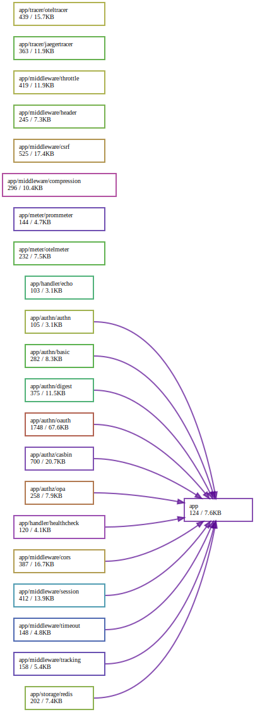
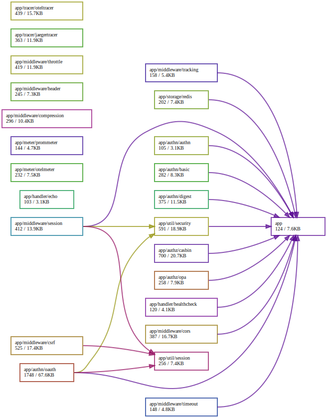

# Package `app`

## Summary

TODO: Write

## Packages

All packages provided under kernel are shown in this section.
Dependency graphs are generated by the [https://github.com/loov/goda](https://github.com/loov/goda).
It visualize the graph using [Graphviz](https://graphviz.org/).
Graphviz is also available at [Graphviz Online](https://dreampuf.github.io/GraphvizOnline/).

```bash
# Basic usage of goda.
go install github.com/loov/goda@latest
goda graph ./app/... | dot -Tsvg -o depenency-graph.svg
```

Each packages, or each features, are independent from each other.
They depends on the `app/util/`, `core/util/` and `kernel/` packages.
Of course they use `apis/app/v1/` , `apis/core/v1/` and `apis/kernel/` packages which is generated by proto files.

This dependency graph is the graph of `app/` excluding `app/util/`.

```bash
goda graph ./app/... - ./app/util/* \
  | sed 's/"github.com\/aileron-gateway\/aileron-dev\//"/g' \
  | dot -Tsvg -o depenency-graph.svg
```



This dependency graph includes `app/util/` and its sub packages.
Note `./app/util/register/` is excluded here again because it obviously uses all packages.

```bash
goda graph ./app/... - ./app/util/register/ \
  | sed 's/"github.com\/aileron-gateway\/aileron-dev\//"/g' \
  | dot -Tsvg -o depenency-graph-util.svg
```



## Errors

TODO: Write
