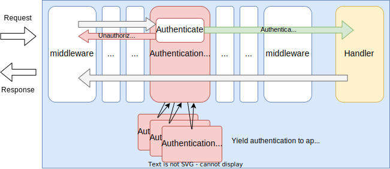
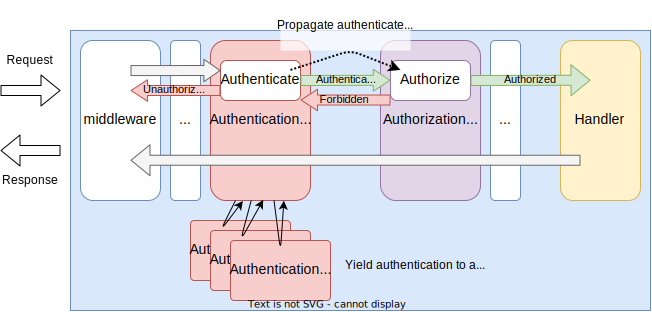

# Authentication middleware

## Summary

This is the design document of the app/authn package that provides AuthenticationMiddleware.
AuthenticationMiddleware enables API authentication.
AuthenticationMiddleware works with authentication handlers that are provided by sub packages.

## Motivation

API authentication is used for protecting APIs.
Basic authentication, form authentication or OAuth authentications are some examples.

### Goals

- AuthenticationMiddleware provides authentication for APIs.
- AuthenticationMiddleware can apply multiple authentication handlers

### Non-Goals

- Implement a specific authentication method.

## Technical Design

### Authentication framework

Authentication is designed to use two types of component, middleware and authentication handlers.
They works with together so the multiple authentication method can be applied at the same time for the same APIs.

When API requests reached to the AuthenticationMiddleware, it calls registered authentication handlers one by one.
Authentication handlers apply authentication for the incoming requests.



AuthenticationMiddleware implements `core.Middleware` interface to work as middleware.

```go
type Middleware interface {
  Middleware(http.Handler) http.Handler
}
```

Authentication handlers implements `app.AuthenticationHandler` interface.

```go
type AuthenticationHandler interface {
  ServeAuthn(http.ResponseWriter, *http.Request) (*http.Request, AuthResult, bool, error)
}
```

### Authentication with authorization

Authentication can be used with authorization.
Authentication middleware propagate authenticated client information via request context ([context.Context](https://pkg.go.dev/context#Context)).
As shown in the figure, authorization middleware can extract the stored information from the request context and can use it for authorization.



For example, authenticated client information can be saved in the context like this.
Key name may differ depending on the authentication handler.

```go
// r is *http.Request
ctx := context.WithValue(r.Context(), "__authn_claims", claims)
r = r.WithContext(ctx)
```

Authorization middleware can extract information from the context with the same key it was saved like below.
Then, it can be used for authorization.

```go
// r is *http.Request
claims := r.Context().Value("__authn_claims")
```

## Test Plan

### Unit Tests

Unit tests are implemented and passed.

- All functions and methods are covered.
- Coverage objective 98%.

### Integration Tests

Integration tests are implemented with these aspects.

- AuthenticationMiddleware works as middleware.
- AuthenticationMiddleware works with input configuration.
- AuthenticationMiddleware can provide authentication using authentication handlers.
- AuthenticationMiddleware accept/deny access based on authentication result.

### e2e Tests

e2e tests are implemented with these aspects.

- AuthenticationMiddleware works as middleware.
- AuthenticationMiddleware works with input configuration.
- AuthenticationMiddleware can provide authentication using authentication handlers.
- AuthenticationMiddleware accept/deny access based on authentication result.

### Fuzz Tests

Not planned.

### Benchmark Tests

Not planned.

### Chaos Tests

Not planned.

## Future works

None.

## References

None.
