# OAuth Authentication

## Summary

This is the design document of the app/authn/oauth package that provides OAuthAuthenticationHandler.
OAuthAuthenticationHandler is used with AuthenticationMiddleware.
OAuthAuthenticationHandler provides authentication using [OAuth 2.0](https://datatracker.ietf.org/doc/rfc6749/) and [OpenID Connect 1.0](https://openid.net/developers/specs/).

## Motivation

[OAuth 2.0](https://datatracker.ietf.org/doc/rfc6749/) and [OpenID Connect 1.0](https://openid.net/developers/specs/) are the de facto standard of client or user authentication.
It has been one of the main responsibilities for API gateways to work as a OAuth client.

### Goals

- OAuthAuthenticationHandler provides client/user authentication leveraging OAuth 2.0.
- OAuthAuthenticationHandler provides client/user authentication leveraging OpenID Connect 1.0.

### Non-Goals

- Full implementation of OAuth and OpenID Connect.

## Technical Design

### Authentication design

Authentication is designed to use two types of component, middleware and authentication handlers.
They works with together so the multiple authentication method can be used for the same APIs.

AuthenticationMiddleware call registered authentication handlers one by one.
Authentication handlers apply authentication for the incoming requests when necessary.
OAuthAuthenticationHandler which this package provides is one of the authentication handlers.

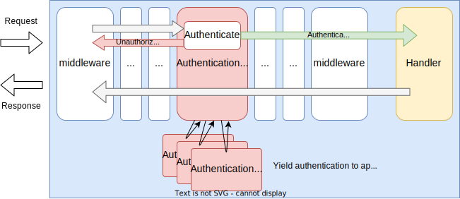

AuthenticationMiddleware implements `core.Middleware` interface to work as middleware.

```go
type Middleware interface {
  Middleware(http.Handler) http.Handler
}
```

Authentication handlers implements `app.AuthenticationHandler` interface.

```go
type AuthenticationHandler interface {
  ServeAuthn(http.ResponseWriter, *http.Request) (*http.Request, AuthResult, bool, error)
}
```

Authentication can be used with authorization.
Authentication middleware propagate authenticated client information via request context ([context.Context](https://pkg.go.dev/context#Context)).
As shown in the figure, authorization middleware can extract the stored information from the request context and can use it for authorization.

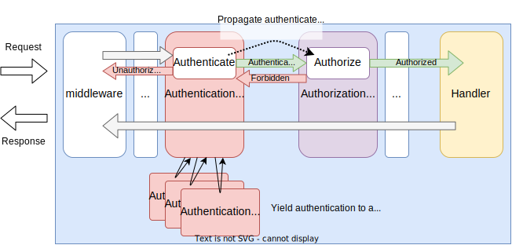

For example, authenticated client information can be saved in the context like this.
Key name may differ depending on the authentication handler.

```go
// r is *http.Request
ctx := context.WithValue(r.Context(), "__authn_claims", claims)
r = r.WithContext(ctx)
```

Authorization middleware can extract information from the context with the same key it was saved like below.
Then, it can be used for authorization.

```go
// r is *http.Request
claims := r.Context().Value("__authn_claims")
```

### OAuth authentication framework

OAuthAuthenticationHandler contains multiple authentication method.

- **authorizationCodeHandler**: Works as a client of authorization code flow of OpenID Connect.
- **resourceServerHandler**: Works as a resource server.

Authentication handlers use oauthContext through baseHandler.
oauthContext has provider metadata and client credentials.
An appropriate oauthContext will be chosen based on the request context.


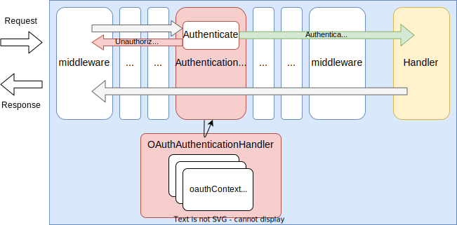

### Processing tokens

#### Access token

**Access token validation.**

Access tokens are credentials that serve as proof of authorization to access a protected resource.
AILERON Gateway supports the use of JSON Web Tokens (JWT) as defined in [RFC7515](https://datatracker.ietf.org/doc/html/rfc7515) for the format of access tokens.
AILERON Gateways supports two methods for validating access tokens: local validation and token introspection.

AILERON Gateway validates following claims by default besides the signature validation.
These are based on [golang-jwt/jwt/v5#Validator.Validate](https://pkg.go.dev/github.com/golang-jwt/jwt/v5#Validator.Validate).

| Claims | Position | Required | Valid when             | Validation policy     |
| ------ | -------- | -------- | ---------------------- | --------------------- |
| kid    | Header   | Yes      | Exists                 | Required              |
| alg    | Header   | Yes      | alg == alg of Key(kid) | Required              |
| exp    | Payload  | No       | now < exp + leeway     | Required ( Optional ) |
| nbf    | Payload  | No       | nbf - leeway < now     | Optional              |
| iat    | Payload  | No       | iat - leeway < now     | Optional ( Disabled ) |
| aud    | Payload  | No       | aud == client.id       | Required ( Disabled ) |
| iss    | Payload  | No       | iss == provider.issuer | Required ( Disabled ) |

- `Required` always validate the value. Validation failed if the key was not found in the claim.
- `Optional` validates the value if the key found in the claim.
- `Disabled` does not validate the value.

**Local validation of access token.**

Access token validation defined [RFC9068](https://www.rfc-editor.org/rfc/rfc9068.html#section-4).
AILERON supports the following validation of access token claims.

| Claim | Requirement Level | AILERON Support | Explain |
| ---- | ---- | ---- | ---- |
| iss | MUST | ✅ | Verify that the issuer identifier of the authorization server matches the value of the "iss" claim. |
| aud | MUST | ✅ | Verify that the "aud" claim contains a resource indicator value corresponding to the identifier that the resource server expects for itself. |
| exp | MUST | ✅ | Verify that the current time is before the time represented by the "exp" claim. |

**Token introspection.**

Access token verification using token introspection is performed in the following flow.

1. Request a token with the authorization server to obtain tokens.
2. Returns requested tokens to AILERON.
3. Sends a request to the authorization server's token introspection endpoint, including the access token, to perform token introspection and verify its validity.
4. After verifying the access token at the authorization server, the server sends an introspection response back to AILERON, indicating the result of the token verification process.

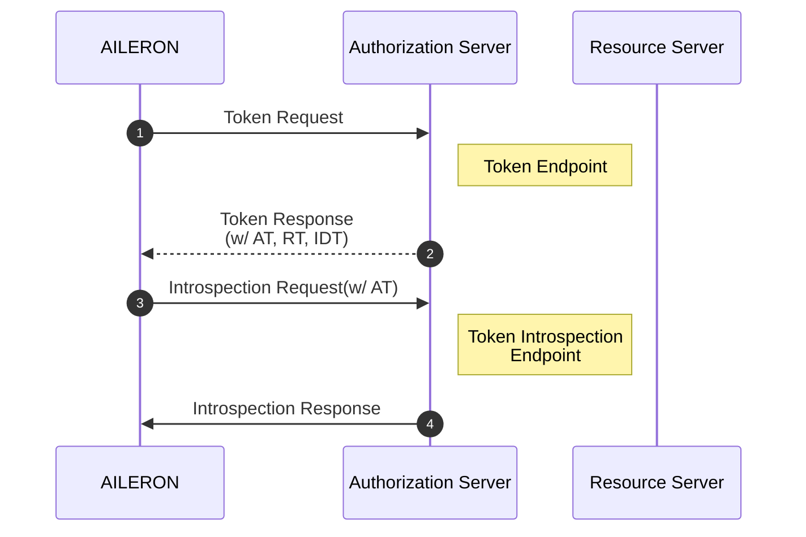

#### ID token

ID token is used to authenticate end users and is commonly used in OIDC (OpenID Connect).
If the authorization server returns the ID token in OAuth 2.0, AILERON Gateways can also utilize the ID token.

**ID token validation.**

ID token validation is defined in the [OpenID Connect Core 1.0](https://openid.net/specs/openid-connect-core-1_0-final.html#IDTokenValidation).
AILERON Gateways supports the following claim validation.

| Claim | Requirement Level | AILERON Support | Notes |
| ---- | ---- | ---- | ---- |
| iss | MUST | ✅ | Verify that the issuer identifier of the OpenID Provider matches the value of the "iss" claim. |
| aud | MUST | ✅ | Verify that the "aud" Claim contains client ID value registered at the Issuer identified by the "iss" Claim as an audience. |
| azp | SHOULD | ✅ | If an "azp" Claim is present, verify that client ID is the Claim Value. |
| exp | MUST | ✅ | Verify that the current time is before the time represented by the "exp" claim. |
| iat | MUST | - | The "iat" Claim can be used to reject tokens issued long ago. |
| nonce | MUST | ✅ | If a nonce value was sent in the authentication request, verify that it is the same value as the one that was sent in the authentication request.  |
| acr | SHOULD | - | If the "acr" Claim was requested, verify that the asserted Claim Value is appropriate.  |
| auth_time | SHOULD | ✅ | If the "auth_time" Claim is requested using the "max_age" parameter, the Client should check the auth_time Claim value. If it determines that too much time has passed since the last authentication of the End-User, it should request re-authentication. |

AILERON Gateway validates following claims by default besides the signature validation.
These are based on [golang-jwt/jwt/v5#Validator.Validate](https://pkg.go.dev/github.com/golang-jwt/jwt/v5#Validator.Validate).
All validation rules are the same as access tokens.

| Claims | Position | Required | Valid when             | Validation policy     |
| ------ | -------- | -------- | ---------------------- | --------------------- |
| kid    | Header   | Yes      | Exists                 | Required              |
| alg    | Header   | Yes      | alg == alg of Key(kid) | Required              |
| exp    | Payload  | No       | now < exp + leeway     | Required ( Optional ) |
| nbf    | Payload  | No       | nbf - leeway < now     | Optional              |
| iat    | Payload  | No       | iat - leeway < now     | Optional ( Disabled ) |
| aud    | Payload  | No       | aud == client.id       | Required ( Disabled ) |
| iss    | Payload  | No       | iss == provider.issuer | Required ( Disabled ) |

- `Required` always validate the value. Validation failed if the key was not found in the claim.
- `Optional` validates the value if the key found in the claim.
- `Disabled` does not validate the value.

#### Refresh token

Refresh tokens are used to obtain a new access token when the current access token becomes invalid or expires.

When the current access token becomes invalid or expires, AILERON can use the refresh token to refresh both the access token and the refresh token.
The following description outlines the process of token refresh in case of access token validation failure.

1. Requests resources from AILERON.
1. If tokens exists in the session, get tokens from the session.
1. Validates the access token but encounters a validation failure.
1. Sends refresh request to the authorization server, which includes the refresh token.
1. Responds to AILERON with the refreshed access token. Optionally, the refresh token and ID token may also be returned.
1. Validates the access token again.If the validation fails again, AILERON will return an error to the application.
1. Stores new tokens in the session.
1. Requests resources from the authorization server which includes the new access token and the new ID token.

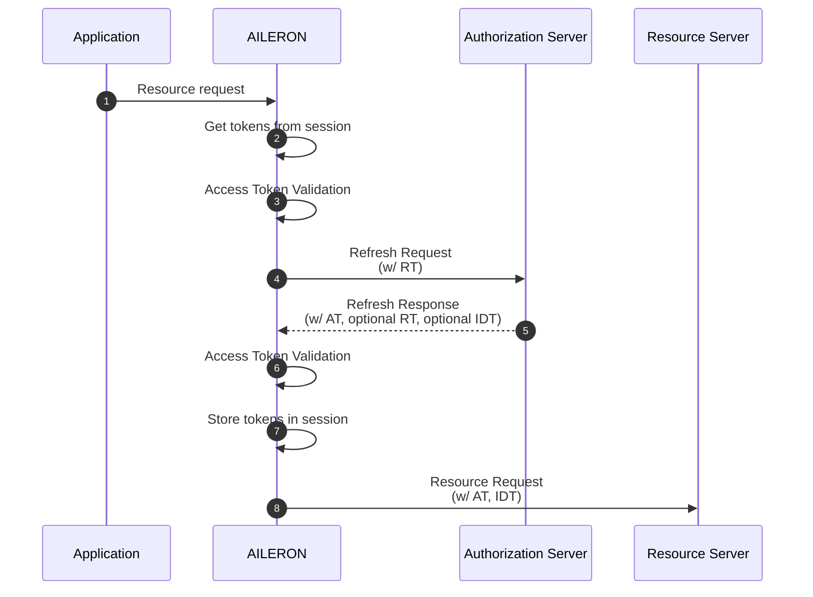

### Authentication flows

#### Authorization code flow

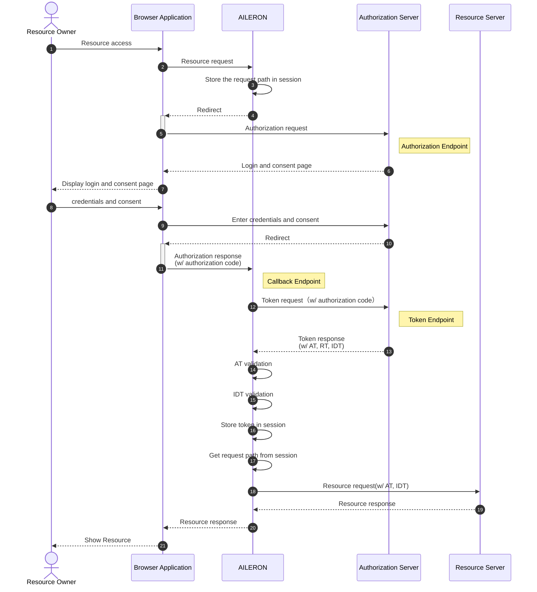

1. Accesses a resource.
1. Requests a protected resource from AILERON.
1. Stores the request path in the session in order to make a request to the resource path after authentication is completed.
1. Redirects to the authorization server.
1. Sends an authorization request to the authorization endpoint on the authorization server.
1. Returns a page for login and consent.
1. Displays a page to the user for login and consent.
1. Enters credentials and consent.
1. Sends credentials and consent to the authorized server
1. Redirects to AILERON.
1. Sends the authorization response which includes the authorization code to the callback endpoint on AILERON.
1. Requests tokens from the authorization server which includes the authorization code, client ID and client secret.
AILERON supports the HTTP Basic authentication scheme and uses the request body as the client authentication method.
1. Responds to AILERON with a response that includes the access token, refresh token, and ID token.
1. Validates the access token.
AILERON supports both local validation and token introspection as access token validation methods.
1. Validates the ID token.
1. Stores access token, refresh token and ID token in session.
1. Requests resource from the resource server, including the access token and ID token.
1. Returns the resource response to AILERON.
1. Returns the resource response to the application.
1. Shows the resource to the resource owner.

After authentication, AILERON utilizes the tokens stored in the session to request access to a resource from the server.

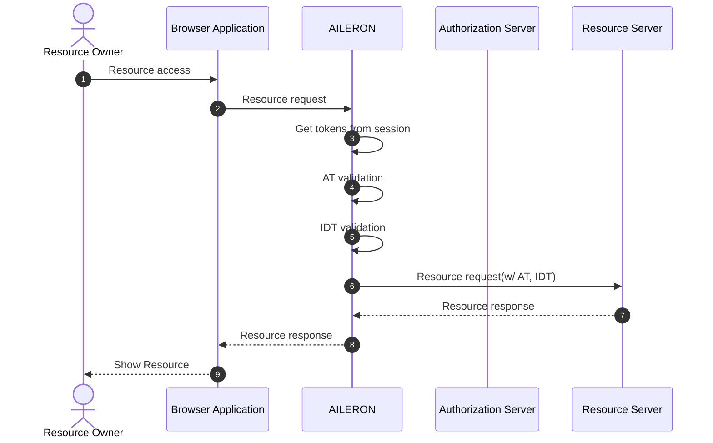

**Authentication using login path.**

AILERON enables to redirect to the resource server after authentication process is completed.
In order to redirect to the resource server, the login endpoint should be set up in AILERON and the redirect path should be set up in AILERON or be provided from the application.

The authentication flow via login path will be like this.

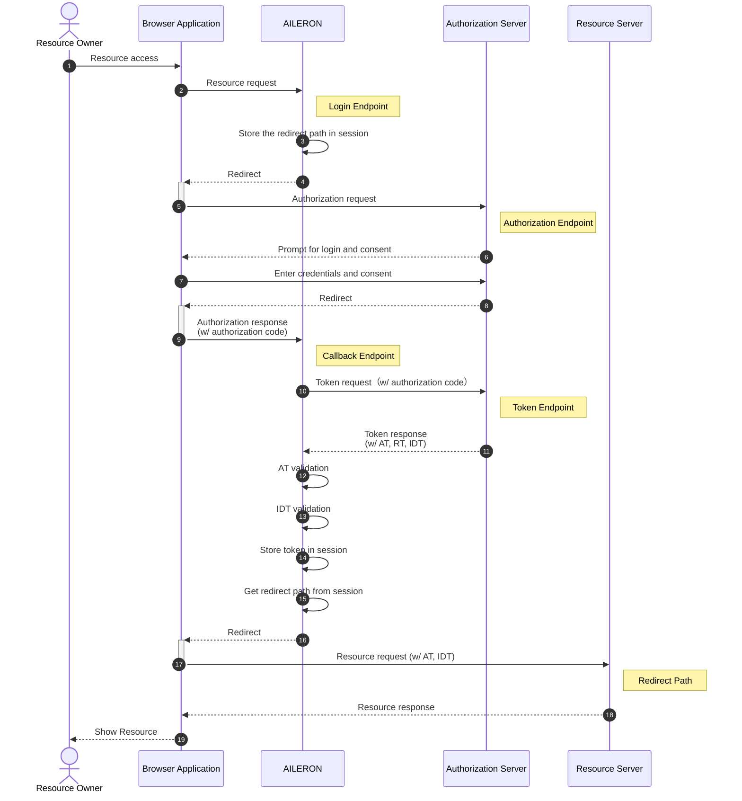

If the application sends a request the login endpoint after authentication,  AILERON will respond with an error response to the application.

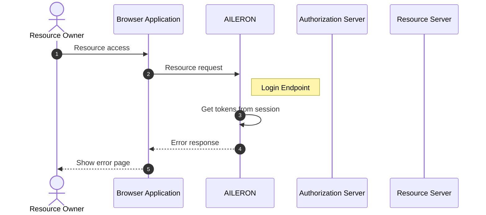

#### ROPC (Resource Owner Password Credentials)

TODO

#### Client Credentials

TODO

#### Resource server

OAuthAuthenticationHandler can work as a resource server.
Resource server which is mentioned in [The OAuth 2.0 Authorization Framework - RFC 6749](https://datatracker.ietf.org/doc/rfc6749/) authorize API requests by validation the access tokens given by the clients.
There are 2 ways to validate access tokens. one is the local validation and the other is validation using token introspection.
Token introspection will be done by following the [OAuth 2.0 Token Introspection - RFC 7662](https://datatracker.ietf.org/doc/rfc7662/).

**Locally validate access tokens.**

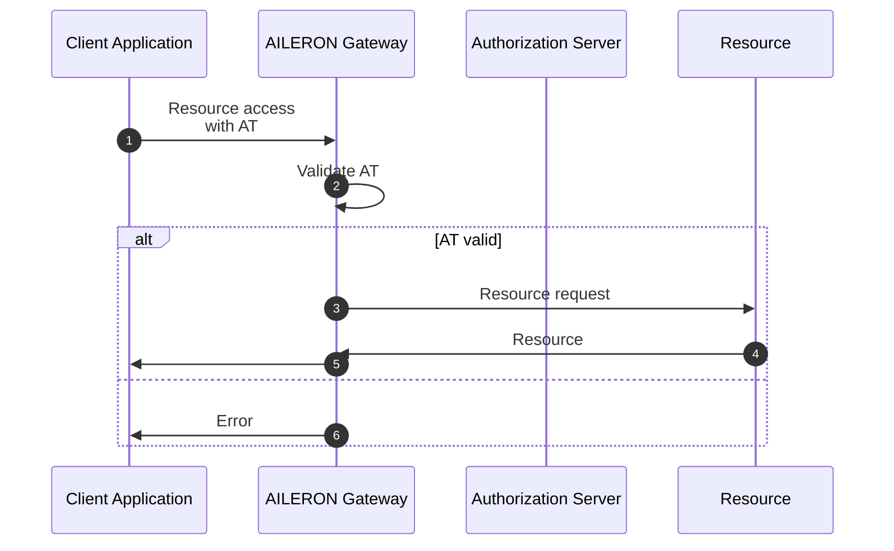

**Validate access tokens by token introspections.**

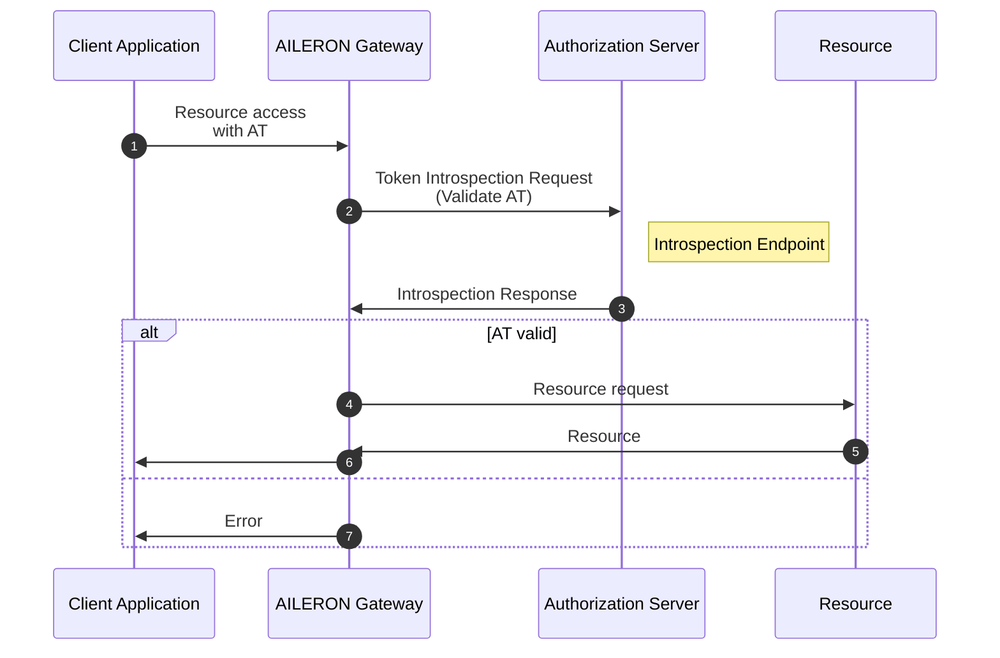

###  Financial-grade API (FAPI)

The Financial Grade API (FAPI) is a layer that sits on top of OAuth 2.0 and OpenID Connect 1.0, and aims to protect APIs that expose high-value, sensitive data. It enhances security by limiting or enforcing the options provided by OAuth/OpenID Connect.

AILERON provides various functions to support the following FAPI profiles.

* [Financial-grade API Security Profile 1.0 - Part 1: Baseline](https://openid.net/specs/openid-financial-api-part-1-1_0.html)
* [Financial-grade API Security Profile 1.0 - Part 2: Advanced](https://openid.net/specs/openid-financial-api-part-2-1_0.html)

The main features provided by AILERON are summarized in the following table.

| Category                                                     | Feature                                                      | Description                                                  | Profile         |
| ------------------------------------------------------------ | ------------------------------------------------------------ | ------------------------------------------------------------ | --------------- |
| Client spoofing prevention                                   | [Mutual TLS for OAuth Client Authentication](https://datatracker.ietf.org/doc/html/rfc8705#name-mutual-tls-for-oauth-client) | Client certificates are used to establish an mTLS connection with the authorization server and perform client authentication. It supports the` tls_client_auth`and` self_signed_tls_client_auth`client authentication methods. | FAPI 1 Baseline |
| Client spoofing prevention                                   | [JWT OAuth Client Authentication](https://openid.net/specs/openid-connect-core-1_0.html#ClientAuthentication) | Client authentication is performed by creating a JWT using the client secret or private key. It supports the` client_secret_jwt`and` private_key_jwt`client authentication methods. | FAPI 1 Baseline |
| Prevention of forgery and tampering of the sender of authorization requests and responses | [JWT-Secured Authorization Requests (JAR)](https://openid.net/specs/openid-connect-core-1_0-errata1.html#RequestObject) | The authorization request is expressed using JWT. AILERON supports both “Request Object by Value” and “Request Object by Reference”. | FAPI 1 Advanced |
| Prevention of forgery and tampering of the sender of authorization requests and responses | [JWT-Secured Authorization Response Mode (JARM)](https://openid.net/specs/openid-financial-api-jarm-ID1.html) | Requests that the authorization server return the authorization response parameters encoded in JWT. The following can be set for the `response_mode` parameter of the authorization request: `query.jwt`, `form_post.jwt`, `fragment.jwt`, `jwt`. | FAPI 1 Advanced |
| Preventing unauthorized use or disclosure of authorization codes | [Redirect URI (`redirect_uri`) verification](https://openid.net/specs/openid-financial-api-part-1-1_0.html#public-client) | The value of the redirect URI is stored in the session and compared with the redirect URI in the authorization response. | FAPI 1 Baseline |
| Preventing unauthorized use or disclosure of authorization codes | [Certificate-Bound Access Tokens](https://datatracker.ietf.org/doc/html/rfc8705#name-mutual-tls-client-certifica) | When acting as a resource server, it verifies the access token using the client certificate used in the mTLS connection with the client. | FAPI 1 Advanced |


## Test Plan

### Unit Tests

Unit tests are implemented and passed.

- All functions and methods are covered.
- Coverage objective 98%.

### Integration Tests

Integration tests are implemented with these aspects.

- OAuthAuthenticationHandler works as an AuthenticationHandler.
- OAuthAuthenticationHandler works with input configuration.
- OAuthAuthenticationHandler works as a OpenID RP.
- OAuthAuthenticationHandler works as a resource server.

### e2e Tests

e2e tests are implemented with these aspects.

- OAuthAuthenticationHandler works as an AuthenticationHandler.
- OAuthAuthenticationHandler works with input configuration.
- OAuthAuthenticationHandler works as a OpenID RP.
- OAuthAuthenticationHandler works as a resource server.

### Fuzz Tests

Not planned.

### Benchmark Tests

Not planned.

### Chaos Tests

Not planned.

## Future works

None.

## References

- [The OAuth 2.0 Authorization Framework - RFC 6749](https://datatracker.ietf.org/doc/rfc6749/)
- [OpenID Connect 1.0](https://openid.net/developers/specs/)
- [OAuth 2.0 Token Introspection - RFC 7662](https://datatracker.ietf.org/doc/rfc7662/)
