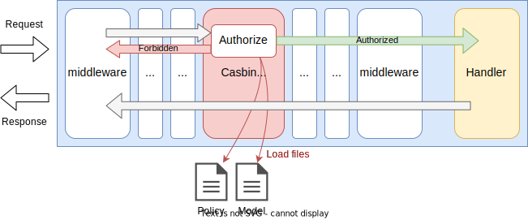
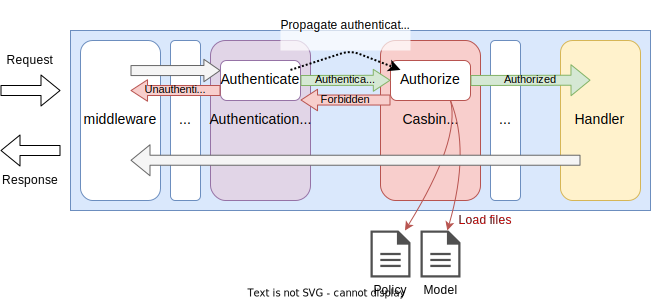

# Casbin Authorization

## Summary

This is the technical design document of the CasbinAuthorizationMiddleware.
CasbinAuthorizationMiddleware authorize the incoming requests using the attributes of HTTP requests including authenticated client information.

## Motivation

Protecting APIs with authorization is one of the fundamental gateway features.
AILERON Gateway also has to have a solution for authorization.
[Casbin](https://casbin.org/) authorization framework provides one solution for Go applications.

### Goals

- CasbinAuthorizationMiddleware provides authorization.
- CasbinAuthorizationMiddleware can authorize APIs called from unauthenticated client using JWT.
- CasbinAuthorizationMiddleware can authorize APIs called from authenticated client using JWT.

### Non-Goals

- Provide authorization intended for a specific use cases.

## Technical Design

### Authorizing APIs

CasbinAuthorizationMiddleware authorize API requests by leveraging [Casbin](https://casbin.org/) authorization framework.
It works as middleware.

This figure shows how the CasbinAuthorizationMiddleware works in the gateway.
Policy and model files which are documented at [models](https://casbin.org/docs/category/model) are used for authorization.
CasbinAuthorizationMiddleware just pass the policy and model files and request attributions for the framework and yield authorization to the framework.
An error will be returned to clients when they are unauthorized.

Following 3 information are passed to casbin with this order.
These information can be used for authorization in the policy file.

1. `claims`: Request information including authenticated client. See [Claims section](#claims).
2. `URL path`: Request path obtained by [http#Request.URL](https://pkg.go.dev/net/http#Request.URL).
3. `method`: Request method obtained by [http#Request.Method](https://pkg.go.dev/net/http#Request.Method).



CasbinAuthorizationMiddleware implements `core.Middleware` interface to work as middleware.

```go
type Middleware interface {
  Middleware(http.Handler) http.Handler
}
```

### Working with authentication

CasbinAuthorizationMiddleware can use authenticated clients' claims for authorization.

When the client was authenticated and obtained `claims`,
the claims are saved in the request context with a string key.
The claims can be extracted and can be used for authorization.

For example, authenticated client's claims are saved in the context like this.
The key name may differ depending on the authentication method.

```go
// Example of saving claims in a context.
// Here, r is *http.Request
ctx := context.WithValue(r.Context(), "AuthnClaims", claims)
r = r.WithContext(ctx)
```

CasbinAuthorizationMiddleware can extract claims from the context with the same key it was saved like below.
Then, authenticated client's claims can be used for authorization by passing it to the casbin framework.

```go
// Example of extracting claims from a context.
// Here, r is *http.Request
claims := r.Context().Value("AuthnClaims")
```

This figure shows the overview how the CasbinAuthorizationMiddleware works with authentication middleware.



### Claims

Claims or attributes that can be used for authorization are defined as follows.
Extra claims may be added in the future.

All claims are accessible from policy file, for example `r.sub.Auth`.
The `Auth`  field is filled only when the value was found in request context.
Authenticated client information is set in the `Auth` field.
To extract values and pass them to casbin, extra context keys can be set in configuration.

| Claim  | Meaning                     | Go Type                             | Policy       |
| ------ | --------------------------- | ----------------------------------- | ------------ |
| Auth   | Authenticated client claims | any (Obtained from context if any)  | r.sub.Auth   |
| Host   | Requested hostname          | string                              | r.sub.Host   |
| Remote | Client ip:port              | string                              | r.sub.Remote |
| Method | HTTP method                 | string                              | r.sub.Method |
| API    | URL path                    | string                              | r.sub.API    |
| Query  | URL queries                 | url.Values (`map[string][]string`)  | r.sub.Query  |
| Header | Request headers             | http.Header (`map[string][]string`) | r.sub.Header |

This is an example of Casbin policy.
When the Auth is a map data and contains 'scope' key, it will be available through `r.sub.Auth`.

```csv
// Example of casbin policy.
p, "contains(mapValue(r.sub.Auth, 'role'), 'admin')", /*, GET
```

### Adapters

Adapter is the component that load policy files from any policy sources,
sources can be files, key-value stores, RDBs or anything else.
AILERON Gateway provides file and http adapters as described below.

**File adapters** load policy files from local file system.

CSV files with `.csv` extension should have the following format.
10 value fields `v0 - v9` can be used, and others are ignored.  
An example is also shown.

```csv
// CSV policy format
pType,v0,v1,v2,v3,v4,v5,v6,v7,v8,v9
```

```csv
p, alice, /alice/*, GET
p, admin, /foo/*, POST
g, alice, admin
```

JSON files with `.json` extension should have the following format.
10 value fields `v0 - v9` can be used, and others are ignored.  
An example is also shown.

```json
// JSON policy format
[
  {
    "pType": "",
    "v0": "",
    "v1": "",
    "v2": "",
    "v3": "",
    "v4": "",
    "v5": "",
    "v6": "",
    "v7": "",
    "v8": "",
    "v9": ""
  }
]
```

```json
[
  {"pType":"p", "v0":"alice", "v1":"/alice/*", "v2":"GET"},
  {"pType":"p", "v0":"admin", "v1":"/foo/*", "v2":"POST"},
  {"pType":"g", "v0":"alice", "v1":"admin"}
]
```

Yaml files with `.yaml` or `.yml` extension should have the following format.
10 value fields `v0 - v9` can be used, and others are ignored.  
An example is also shown.

```yaml
// YAML policy format
- pType: ""
  v0: ""
  v1: ""
  v2: ""
  v3: ""
  v4: ""
  v5: ""
  v6: ""
  v7: ""
  v8: ""
  v9: ""
```

```yaml
- pType: p
  v0: alice
  v1: /alice/*
  v2: GET
- pType: p
  v0: admin
  v1: /foo/*
  v2: POST
- pType: g
  v0: alice
  v1: admin
```

Xml files with `.xml` extension should have the following format.
10 value fields `v0 - v9` can be used, and others are ignored.  
An example is also shown.

```xml
// XML policy format
<policies>
  <policy>
    <pType></pType>
    <v0></v0>
    <v1></v1>
    <v2></v2>
    <v3></v3>
    <v4></v4>
    <v5></v5>
    <v6></v6>
    <v7></v7>
    <v8></v8>
    <v9></v9>
  </policy>
</policies>
```

```xml
<policies>
  <policy>
    <pType>p</pType>
    <v0>alice</v0>
    <v1>/alice/*</v1>
    <v2>GET</v2>
  </policy>
  <policy>
    <pType>p</pType>
    <v0>admin</v0>
    <v1>/foo/*</v1>
    <v2>POST</v2>
  </policy>
  <policy>
    <pType>g</pType>
    <v0>alice</v0>
    <v1>admin</v1>
  </policy>
</policies>
```

**HTTP Adapter** get policy files from REST endpoint.

The endpoint response the policy content which can be accepted
by the file adapter described above.
Response should have one of following Content-Type header value and status code 200 OK.

- `application/csv`, `text/csv`
- `application/json`, `text/json`
- `application/yaml`, `text/yaml`, `application/yml`, `text/yml`
- `application/xml`, `text/xml`

To reduce network resource consumption, return `304 NotModified`
prevents error and keep using the current policy.
This is the same concept as OPA's [HTTP Polling](https://www.openpolicyagent.org/docs/latest/management-bundles/#http-long-polling).

## Test Plan

### Unit Tests

Unit tests are implemented and passed.

- All functions and methods are covered.
- Coverage objective 98%.

### Integration Tests

Integration tests are implemented with these aspects.

- CasbinAuthorizationMiddleware works as middleware.
- CasbinAuthorizationMiddleware works with input configuration.
- CasbinAuthorizationMiddleware can authorize APIs called from unauthenticated clients using JWT.
- CasbinAuthorizationMiddleware can authorize APIs called from authenticated clients using JWT.
- CasbinAuthorizationMiddleware can used defined claims for authorization.

### e2e Tests

e2e tests are implemented with these aspects.

- CasbinAuthorizationMiddleware works as middleware.
- CasbinAuthorizationMiddleware works with input configuration.
- CasbinAuthorizationMiddleware can authorize APIs called from unauthenticated clients using JWT.
- CasbinAuthorizationMiddleware can authorize APIs called from authenticated clients using JWT.
- CasbinAuthorizationMiddleware can used defined claims for authorization.

### Fuzz Tests

Not planned.

### Benchmark Tests

Not planned.

### Chaos Tests

Not planned.

## Future works

None.

## References

- [https://casbin.org/](https://casbin.org/)
- [https://pkg.go.dev/github.com/casbin/casbin/v3](https://pkg.go.dev/github.com/casbin/casbin/v3)
