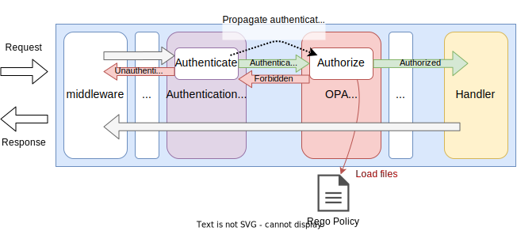

# OPA Authorization

## Summary

This is the technical design document of the OPAAuthorizationMiddleware.
OPAAuthorizationMiddleware authorize the incoming requests using the attributes of HTTP requests including authenticated client information.

## Motivation

Protecting APIs with authorization is one of the fundamental gateway features.
AILERON Gateway also has to have a solution for authorization.
[OPA (Open Policy Agent)](https://www.openpolicyagent.org/) authorization framework provides one solution for Go applications.

### Goals

- OPAAuthorizationMiddleware provides authorization.
- OPAAuthorizationMiddleware can authorize APIs called from unauthenticated client using JWT.
- OPAAuthorizationMiddleware can authorize APIs called from authenticated client using JWT.

### Non-Goals

- Provide authorization intended for a specific use cases.

## Technical Design

### Authorizing APIs

OPAAuthorizationMiddleware authorize API requests by leveraging [OPA](https://www.openpolicyagent.org/) authorization framework.
It works as middleware.

This figure shows how the OPAAuthorizationMiddleware works in the gateway.
OPA uses [Rego Policy Language](https://www.openpolicyagent.org/docs/latest/#rego) for authorization.
OPAAuthorizationMiddleware just pass the policy and model files and request attributions for the framework and yield authorization to the framework.
An error will be returned to clients when they are unauthorized.

Information that can be used for authorization is describe in [Claims section](#claims).


OPAAuthorizationMiddleware implements `core.Middleware` interface to work as middleware.

```go
type Middleware interface {
  Middleware(http.Handler) http.Handler
}
```

### Working with authentication

OPAAuthorizationMiddleware can use authenticated clients' claims for authorization.

When the client was authenticated and obtained `claims`,
the claims are saved in the request context with a string key.
The claims can be extracted and can be used for authorization.

For example, authenticated client's claims are saved in the context like this.
The key name may differ depending on the authentication method.

```go
// Example of saving claims in a context.
// Here, r is *http.Request
ctx := context.WithValue(r.Context(), "AuthnClaims", claims)
r = r.WithContext(ctx)
```

OPAAuthorizationMiddleware can extract claims from the context with the same key it was saved like below.
Then, authenticated client's claims can be used for authorization by passing it to the OPA framework.

```go
// Example of extracting claims from a context.
// Here, r is *http.Request
claims := r.Context().Value("AuthnClaims")
```

This figure shows the overview how the OPAAuthorizationMiddleware works with authentication middleware.



### Claims

Claims or attributes that can be used for authorization are defined in the table.
Extra claims may be added in the future.

Every claims are accessible from rego policy through the [input](https://www.openpolicyagent.org/docs/latest/envoy-primer/#input-document) keyword.
The `Auth` and field is filled only when the value was found in request context.
Authenticated client information is set in the `Auth` field.
To extract values and pass them to OPA, extra context keys can be set in configuration.

| Claim  | Meaning                     | Go Type                             | OPA Type     | Rego         |
| ------ | --------------------------- | ----------------------------------- | ------------ | ------------ |
| Auth   | Authenticated client claims | any (Obtained from context if any)  | -            | input.auth   |
| Host   | Requested hostname          | string                              | string       | input.host   |
| Remote | Client ip:port              | string                              | string       | input.remote |
| Method | HTTP method                 | string                              | string       | input.method |
| API    | URL path                    | string                              | string       | input.api    |
| Query  | URL queries                 | url.Values (`map[string][]string`)  | object       | input.query  |
| Header | Request headers             | http.Header (`map[string][]string`) | object       | input.header |
| Env    | Host Environment            | []string                            | string array | input.env |

Related OPA documents.

- [input](https://www.openpolicyagent.org/docs/latest/envoy-primer/#input-document)
- [string](https://www.openpolicyagent.org/docs/latest/policy-language/#strings)
- [object](https://www.openpolicyagent.org/docs/latest/policy-language/#objects)
- [arrays](https://www.openpolicyagent.org/docs/latest/policy-language/#arrays)

This is an example of OPA rego policy.
When the Auth is a map data and contains 'scope' key, it will be available through `input.auth`.

```rego
// Example of OPA rego policy.

package example.authz

import future.keywords.if
import future.keywords.in

default allow := false

allow if {
    "admin" in input.auth.attrs.scope
    input.method == "GET"
}
```

## Test Plan

### Unit Tests

Unit tests are implemented and passed.

- All functions and methods are covered.
- Coverage objective 98%.

### Integration Tests

Integration tests are implemented with these aspects.

- OPAAuthorizationMiddleware works as middleware.
- OPAAuthorizationMiddleware works with input configuration.
- OPAAuthorizationMiddleware can authorize APIs called from unauthenticated clients using JWT.
- OPAAuthorizationMiddleware can authorize APIs called from authenticated clients using JWT.
- OPAAuthorizationMiddleware can used defined claims for authorization.

### e2e Tests

e2e tests are implemented with these aspects.

- OPAAuthorizationMiddleware works as middleware.
- OPAAuthorizationMiddleware works with input configuration.
- OPAAuthorizationMiddleware can authorize APIs called from unauthenticated clients using JWT.
- OPAAuthorizationMiddleware can authorize APIs called from authenticated clients using JWT.
- OPAAuthorizationMiddleware can used defined claims for authorization.

### Fuzz Tests

Not planned.

### Benchmark Tests

Not planned.

### Chaos Tests

Not planned.

## Future works

None.

## References

- [Open Policy Agent](https://www.openpolicyagent.org/)
- [https://pkg.go.dev/github.com/open-policy-agent/opa](https://pkg.go.dev/github.com/open-policy-agent/opa)
