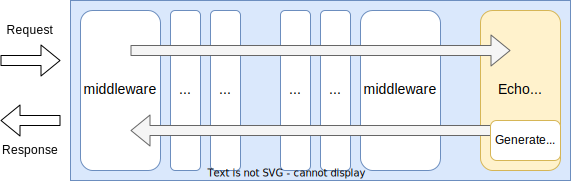

# Echo Handler

## Summary

This is the technical design document of the app/handler/echo package that provides EchoHandler resource.
EchoHandler is created for testing purpose.

## Motivation

EchoHandler can be used when testing or debugging the gateway without other handlers such as ReverseProxyHandler.

### Goals

- EchoHandler respond requested information.

### Non-Goals

## Technical Design

### Echo requests

EchoHandler returns requested information with within response body.

This image shows how echo handler works in a gateway.



EchoHandler implements [http.Handler](https://pkg.go.dev/net/http#Handler) interface.

```go
type Handler interface {
  ServeHTTP(ResponseWriter, *Request)
}
```

## Test Plan

### Unit Tests

Unit tests are implemented and passed.

- All functions and methods are covered.
- Coverage objective 98%.

### Integration Tests

Integration tests are implemented with these aspects.
Do not do too much tests for EchoHandler because this handler is
aimed only for testing or examples.

- EchoHandler works as a http handler.
- EchoHandler works with input configuration.
- EchoHandler respond requested contents.

### e2e Tests

e2e tests are implemented with these aspects.
Do not do too much tests for EchoHandler because this handler is
aimed only for testing or examples.

- EchoHandler works as a http handler.
- EchoHandler works with input configuration.
- EchoHandler respond requested contents.

### Fuzz Tests

Not planned.

### Benchmark Tests

Not planned.

### Chaos Tests

Not planned.

## Future works

None.

## References

None.
