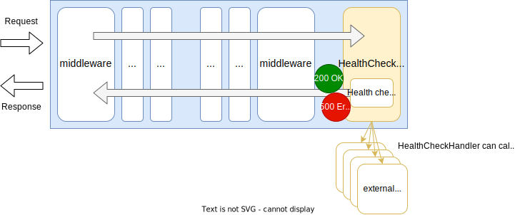
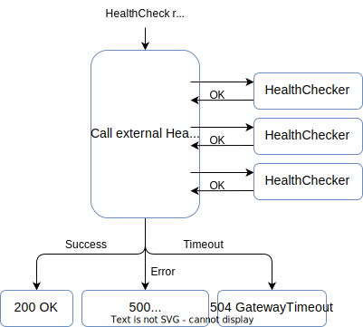

# HealthCheck Handler

## Summary

This is the design document of `app/handler/healthcheck` package that provides HealthCheckHandler.

HealthCheckHandler is intended to be used as a health check handler which handles readiness or liveness requests.

## Motivation

Health checking of an application is required for cloud native applications.
[Kubernetes](https://kubernetes.io/), for example, implements application health checking.
[Configure Liveness, Readiness and Startup Probes](https://kubernetes.io/docs/tasks/configure-pod-container/configure-liveness-readiness-startup-probes/).

### Goals

- HealthCheckHandler handles liveness or readiness requests.

### Non-Goals

- Implements specific readiness logics such as health checking databases.

## Technical Design

### Handling HealthCheck requests

HealthCheckHandler is intended to be used as a health check handler which handles readiness or liveness requests.
See [Configure Liveness, Readiness and Startup Probes](https://kubernetes.io/docs/tasks/configure-pod-container/configure-liveness-readiness-startup-probes/)
for the example of requests in Kubernetes.



HealthCheckHandler implements [http.Handler](https://pkg.go.dev/net/http#Handler) interface.

```go
type Handler interface {
  ServeHTTP(ResponseWriter, *Request)
}
```

HealthCheckHandler does not restrict HTTP methods and paths by nature.
They should be configured by configuration file if necessary.

One of the simplest example of health check requests will be

```text
GET /healthz/liveness
```

HealthCheckHandler returns an empty json response when request had been succeeded.
This response cannot be overwritten for now.

```text
HTTP/1.1 200 OK
Content-Type: application/json; charset=utf-8
X-Content-Type-Options: nosniff

{}
```

### External Health Checker

HealthCheckHandler can call external health checker which implements `app.HealthChecker` interface.
Users who extend AILERON Gateway can implement their own health check method which implements this interface
and can let the HealthCheckHandler call their methods.

```go
type HealthChecker interface {
  HealthCheck(ctx context.Context) (context.Context, bool)
}
```

HealthCheckHandler calls external HealthChecker repeatedly and receive their responses.
It returns InternalServerError when at least one of the HealthCheckers returns failed response and GatewayTimeout when timeout occurred.
Otherwise, it returns 200 OK response to the client.



## Test Plan

### Unit Tests

Unit tests are implemented and passed.

- All functions and methods are covered.
- Coverage objective 98%.

### Integration Tests

Integration tests are implemented with these aspects.

- HealthCheckHandler works as a http handler.
- HealthCheckHandler works with input configuration.
- HealthCheckHandler returns 200 OK when the application is running.
- HealthCheckHandler can call external health checkers.
- HealthCheckHandler returns 500 InternalServerError when external health checker returns failure.
- HealthCheckHandler returns 504 GatewayTimeout when timeout occurred while calling external health checker.

### e2e Tests

e2e tests are implemented with these aspects.

- HealthCheckHandler works as a http handler.
- HealthCheckHandler works with input configuration.
- HealthCheckHandler returns 200 OK when the application is running.
- HealthCheckHandler can call external health checkers.
- HealthCheckHandler returns 500 InternalServerError when external health checker returns failure.
- HealthCheckHandler returns 504 GatewayTimeout when timeout occurred while calling external health checker.

### Fuzz Tests

Not planned.

### Benchmark Tests

Not planned.

### Chaos Tests

Not planned.

## Future works

None.

## References

None.
