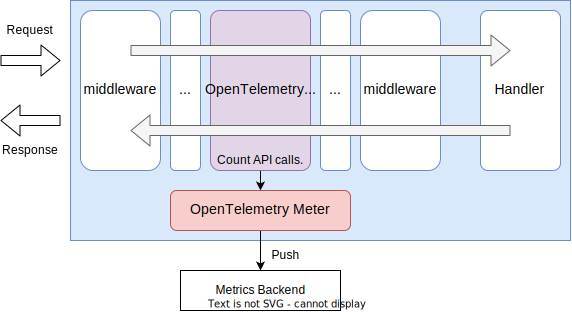

# OpenTelemetry Meter

## Summary

This is the design document of app/meter/otelmeter package which provides OpenTelemetryMeter resource.
OpenTelemetryMeter leverages [OpenTelemetry](https://opentelemetry.io/) and makes collecting metrics available in the AILERON Gateway.

## Motivation

Ensuring the observability of a system facilitates the assurance of system health and eases the investigation of failures.
In particular, [OpenTelemetry](https://opentelemetry.io/) is gaining attention as an open-source framework for the generation, processing, and transmission of the telemetry data.
As it offers vendor-agnostic SDKs, APIs, and tools, it is becoming the de facto standard for observability telemetry.
Therefore, enabling collecting metrics that is compatible with OpenTelemetry can meet a significant demand in the field of observability.

### Goals

- Provide metrics observability using OpenTelemetry(OTLP).

### Non-Goals

## Technical Design

### Export metrics

OpenTelemetryMeter works as middleware and standalone exporter in the gateway.
To collect API call metrics, the OpenTelemetryMeter implements `core.Middleware` interface which defined as below.

```go
type Middleware interface {
  Middleware(http.Handler) http.Handler
}
```

This figure shows how the OpenTelemetryMeter works in the gateway.



### Metrics

Following list is the part of metrics that the OpenTelemetryMeter exports by default.
They can be changed in the future.

- runtime.uptime: Milliseconds since application was initialized
- process.runtime.go.goroutines: Number of goroutines that currently exist
- process.runtime.go.cgo.calls: Number of cgo calls made by the current process
- process.runtime.go.mem.heap_alloc: Bytes of allocated heap objects
- process.runtime.go.mem.heap_idle: Bytes in idle (unused) spans
- process.runtime.go.mem.heap_inuse: Bytes in in-use spans
- process.runtime.go.mem.heap_objects: Number of allocated heap objects
- process.runtime.go.mem.heap_released: Bytes of idle spans whose physical memory has been returned to the OS
- process.runtime.go.mem.heap_sys: Bytes of heap memory obtained from the OS
- process.runtime.go.mem.lookups: Number of pointer lookups performed by the runtime
- process.runtime.go.mem.live_objects: Number of live objects is the number of cumulative Mallocs - Frees
- process.runtime.go.gc.count: Number of completed garbage collection cycles
- process.runtime.go.gc.pause_total_ns: Cumulative nanoseconds in GC stop-the-world pauses since the program started
- process.runtime.go.gc.pause_ns: Amount of nanoseconds in GC stop-the-world pauses

## Test Plan

### Unit Tests

- All functions and methods are covered.
- Coverage objective 98%.

### Integration Tests

Integration tests are implemented with these aspects.

- OpenTelemetryMeter works as middleware.
- OpenTelemetryMeter send metrics to observability backends.
- OpenTelemetryMeter works with configuration files.

### e2e Tests

e2e tests are implemented with these aspects.

- OpenTelemetryMeter works as middleware.
- OpenTelemetryMeter send metrics to observability backends.
- OpenTelemetryMeter works with configuration files.

### Fuzz Tests

Not planned.

### Benchmark Tests

Not planned.

### Chaos Tests

Not planned.

## Future works

Not planned.

## References

- [OpenTelemetry](https://opentelemetry.io/)
- [github.com/open-telemetry/opentelemetry-go](https://github.com/open-telemetry/opentelemetry-go)
