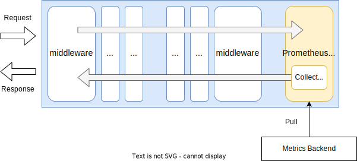
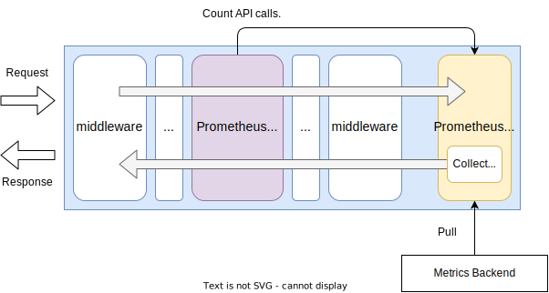

# PrometheusMeter

## Summary

This is the technical design document of the `app/meter/prommeter` package that provides PrometheusMeter.

PrometheusMeter export metrics in [Prometheus](https://prometheus.io/) data model.

## Motivation

Collecting application metrics such as memory and cpu usage, API statistics are common in cloud native applications.
Metrics is the one pillar of three telemetry in cloud native applications (See [What is OpenTelemetry?](https://opentelemetry.io/docs/what-is-opentelemetry/)).
It provides visibility in application that help monitoring, debugging and operations.
[Prometheus](https://prometheus.io/) is the de facto standard data model for metrics.

### Goals

- PrometheusMeter exports application metrics such as memory and cpu usage.
- PrometheusMeter can extends its metrics by users.

### Non-Goals

## Technical Design

### Export metrics

PrometheusMeter works as middleware and http handler in the gateway.
So it works as middleware and a handler.

This figure shows how the PrometheusMeter works in the gateway.
It leverages [client_golang/prometheus](https://pkg.go.dev/github.com/prometheus/client_golang/prometheus).



PrometheusMeter implements [http.Handler](https://pkg.go.dev/net/http#Handler) interface.

```go
type Handler interface {
  ServeHTTP(ResponseWriter, *Request)
}
```

To collect API call metrics, the PrometheusMeter implements `core.Middleware` interface which defined as below.

```go
type Middleware interface {
  Middleware(http.Handler) http.Handler
}
```



### Metrics

PrometheusMeter uses [collectors.NewGoCollector](https://pkg.go.dev/github.com/prometheus/client_golang/prometheus/collectors#NewGoCollector)
to export metrics by default.

Following list is the part of metrics that the PrometheusMeter exports by default.
They can be changed in the future.

- A summary of the pause duration of garbage collection cycles
    - go_gc_duration_seconds
    - go_gc_duration_seconds_sum
    - go_gc_duration_seconds_count
- Number of goroutines that currently exist.
    - go_goroutines
- Information about the Go environment.
    - go_info
- Number of bytes allocated and still in use.
    - go_memstats_alloc_bytes
- Total number of bytes allocated, even if freed.
    - go_memstats_alloc_bytes_total
- Number of bytes used by the profiling bucket hash table.
    - go_memstats_buck_hash_sys_bytes
- Total number of frees.
    - go_memstats_frees_total
- Number of bytes used for garbage collection system metadata.
    - go_memstats_gc_sys_bytes
- Number of heap bytes allocated and still in use.
    - go_memstats_heap_alloc_bytes
- Number of heap bytes waiting to be used.
    - go_memstats_heap_idle_bytes
- Number of heap bytes that are in use
    - go_memstats_heap_inuse_bytes
- Number of allocated objects.
    - go_memstats_heap_objects
- Number of heap bytes released to OS.
    - go_memstats_heap_released_bytes
- Number of heap bytes obtained from system.
    - go_memstats_heap_sys_bytes
- Number of seconds since 1970 of last garbage collection.
    - go_memstats_last_gc_time_seconds
- Total number of pointer lookups.
    - go_memstats_lookups_total
- Total number of mallocs.
    - go_memstats_mallocs_total
- Number of bytes in use by mcache structures.
    - go_memstats_mcache_inuse_bytes
- Number of bytes used for mcache structures obtained from system.
    - go_memstats_mcache_sys_bytes
- Number of bytes in use by mspan structures.
    - go_memstats_mspan_inuse_bytes
- Number of bytes used for mspan structures obtained from system.
    - go_memstats_mspan_sys_bytes
- Number of heap bytes when next garbage collection will take place.
    - go_memstats_next_gc_bytes
- Number of bytes used for other system allocations.
    - go_memstats_other_sys_bytes
- Number of bytes in use by the stack allocator.
    - go_memstats_stack_inuse_bytes
- Number of bytes obtained from system for stack allocator.
    - go_memstats_stack_sys_bytes
- Number of bytes obtained from system.
    - go_memstats_sys_bytes
- Number of OS threads created.
    - go_threads
- Total user and system CPU time spent in seconds.
    - process_cpu_seconds_total
- Maximum number of open file descriptors.
    - process_max_fds
- Number of open file descriptors.
    - process_open_fds
- Resident memory size in bytes.
    - process_resident_memory_bytes
- Start time of the process since unix epoch in seconds.
    - process_start_time_seconds
- Virtual memory size in bytes.
    - process_virtual_memory_bytes
- Maximum amount of virtual memory available in bytes.
    - process_virtual_memory_max_bytes
- Current number of scrapes being served.
    - promhttp_metric_handler_requests_in_flight
- Total number of scrapes by HTTP status code.
    - promhttp_metric_handler_requests_total

## Test Plan

### Unit Tests

Unit tests are implemented and passed.

- All functions and methods are covered.
- Coverage objective 98%.

### Integration Tests

Integration tests are implemented with these aspects.

- PrometheusMeter works as a http handler.
- PrometheusMeter works with input configuration.
- PrometheusMeter returns metrics by default.

### e2e Tests

e2e tests are implemented with these aspects.

- PrometheusMeter works as a http handler.
- PrometheusMeter works with input configuration.
- PrometheusMeter returns metrics by default.

### Fuzz Tests

Not planned.

### Benchmark Tests

Not planned.

### Chaos Tests

Not planned.

## Future works

None.

## References

None.
