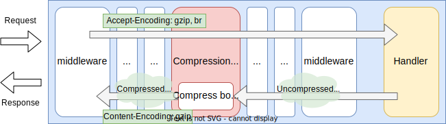
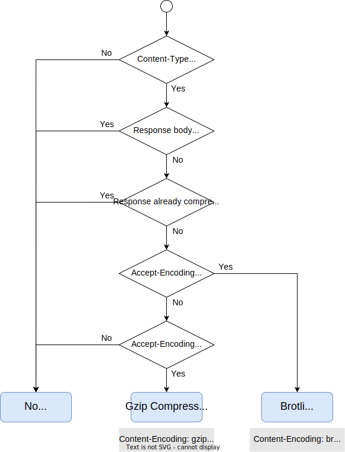

# Compression Middleware

## Summary

This is the technical design document of the app/middleware/compression package which provides CompressionMiddleware.
Compression middleware compresses HTTP response bodies by checking the `Accept-Encoding` header in the requests.

## Motivation

Compressing the HTTP bodies is one of the important way to improve the performance of web or API servers.

### Goals

- Add features to compress HTTP response bodies.

### Non-Goals

- Support compression for streaming type communication like WebSocket or SSE (Server Sent Event).

## Technical Design

### Compressing body

CompressionMiddleware compresses response body with encoding clients can accept.

- Compress the response body by checking the [Accept-Encoding](https://developer.mozilla.org/en-US/docs/Web/HTTP/Headers/Accept-Encoding) header.
- Compression is done by streaming. Do not load entire body on memory.
- Support at least `gzip` and `brotli` algorithm.
- Enable compression by whitelist of the MIME type.

This figure shows how the CompressionMiddleware works in the gateway.

Currently the CompressionMiddleware cannot understand `q-factor`.
Brotli is always prior to gzip.

- `Accept-Encoding: gzip` -> gzip will be applied.
- `Accept-Encoding: br` -> brotli will be applied.
- `Accept-Encoding: gzip, br` -> brotli will be applied.

This is the decision process to determine the compression algorithm.

### Streaming consideration

CompressionMiddleware does not identify streaming type response body.

## Test Plan

### Unit Tests

Unit tests are implemented and passed.

- All functions and methods are covered.
- Coverage objective 98%.

### Integration Tests

Integration tests are implemented with these aspects.

- CompressionMiddleware works as middleware.
- CompressionMiddleware works with input configuration.
- Compression will be applied to the uncompressed response body.
- Brotli is prior to the gzip compression.

### e2e Tests

e2e tests are implemented with these aspects.

- CompressionMiddleware works as middleware.
- CompressionMiddleware works with input configuration.
- Compression will be applied to the uncompressed response body.
- Brotli is prior to the gzip compression.

### Fuzz Tests

Not planned.

### Benchmark Tests

Not planned.

### Chaos Tests

Not planned.

## Future works

- [ ] Consider quality factor or `q-factor`.
- [ ] Ignore streaming response like WebSocket or SSE.

## References

- [HTTP compression - Wikipedia](https://en.wikipedia.org/wiki/HTTP_compression)
- [Content-Encoding](https://developer.mozilla.org/en-US/docs/Web/HTTP/Headers/Content-Encoding)
- [How does Cloudflare compress content?](https://developers.cloudflare.com/speed/optimization/content/brotli/content-compression/)
- [Enabling payload compression for an API - AWS](https://docs.aws.amazon.com/apigateway/latest/developerguide/api-gateway-gzip-compression-decompression.html)
- [Compression in HTTP - MDN Web Docs](https://developer.mozilla.org/en-US/docs/Web/HTTP/Compression)
- [Accept-Encoding - MDN Web Docs](https://developer.mozilla.org/en-US/docs/Web/HTTP/Headers/Accept-Encoding)
- [Content-Encoding - MDN Web Docs](https://developer.mozilla.org/en-US/docs/Web/HTTP/Headers/Content-Encoding)
- [Hypertext Transfer Protocol (HTTP/1.1): Semantics and Content](https://datatracker.ietf.org/doc/rfc7231/)
- [Accept-Encoding - RFC9110 HTTP Semantics](https://www.rfc-editor.org/rfc/rfc9110.html#name-accept-encoding)
- [Content-Encoding - RFC9110 HTTP Semantics](https://www.rfc-editor.org/rfc/rfc9110.html#field.content-encoding)
- [Quality Values - RFC9110 HTTP Semantics](https://www.rfc-editor.org/rfc/rfc9110.html#name-quality-values)
- [Accept-Encoding - http.dev](https://http.dev/accept-encoding)
