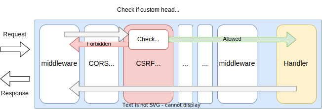
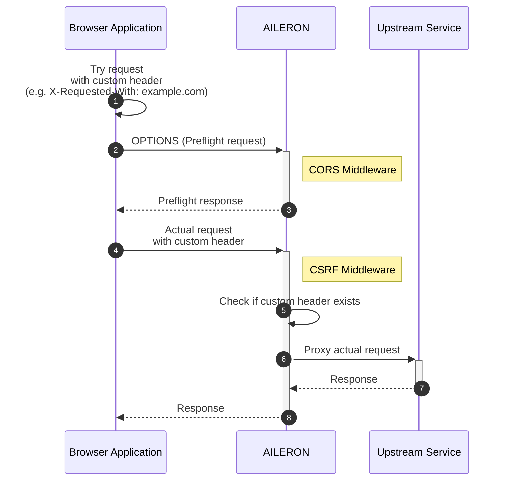
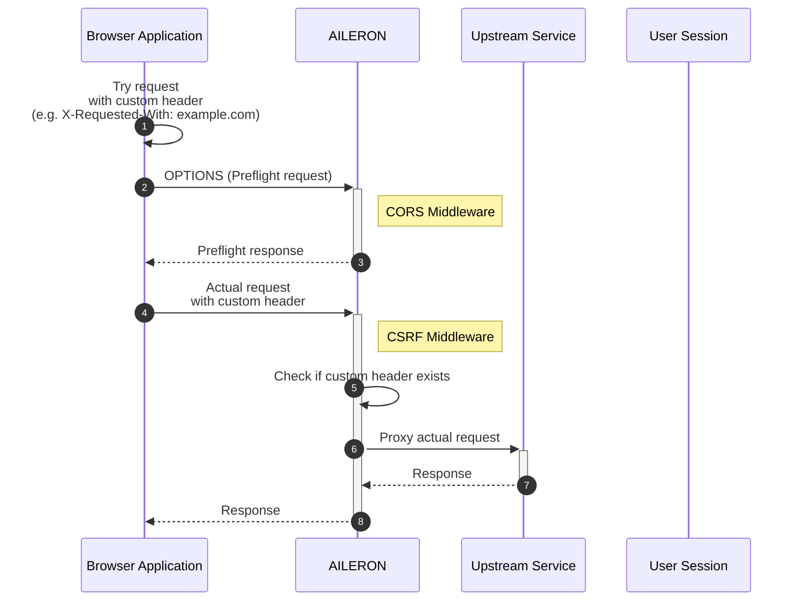

# CSRF Middleware

## Summary

This is the design document of the app/middleware/csrf package that provides CSRFMiddleware.
CSRFMiddleware provides ability to secure APIs from CSRF vulnerability.

## Motivation

CSRF is one of the basic security features required for protecting APIs.

### Goals

- CSRFMiddleware protect APIs from CSRF vulnerability.

### Non-Goals

## Technical Design

### CSRF Strategies

#### Custom Request Header

Custom Request Header pattern is the way to utilize CORS policy for CSRF.
It is described at [Custom Request Header](https://cheatsheetseries.owasp.org/cheatsheets/Cross-Site_Request_Forgery_Prevention_Cheat_Sheet.html#custom-request-headers).

Custom header means the header defined in the [Fetch standard](https://fetch.spec.whatwg.org/).
`X-Requested-With` or `X-Requested-From` are one of the commonly used header.
By adding a custom header to request, it becomes non simple request.
Therefore, the requests are supposed to be allowed by the server's CORS policy.
Custom request header strategy is the strategy that utilize the CORS.

Note that the `simple request` is originally defined in [RFC 1945 Hypertext Transfer Protocol -- HTTP/1.0](https://datatracker.ietf.org/doc/rfc1945/).
There defined Simple Request and Full Request.
Now, the simple requests are understood as the requests that do not require preflight request
by the [Fetch standard](https://fetch.spec.whatwg.org/).

This figure shows how the CSRF middleware works in the gateway using custom request header strategy.



CSRF middleware implements the `core.Middleware` interface to work as middleware.

```go
type Middleware interface {
  Middleware(http.Handler) http.Handler
}
```

The overall process becomes like this.



1. Browser application try to send request with a custom header.
   1. The request becomes non-simple request that requires preflight request.
2. Browser application send an OPTIONS, or preflight, request.
3. AILERON Gateway respond to the preflight request based on the CORS policy.
4. If allowed by the CORS policy, the browser application send the actual request.
5. AILERON Gateway checks if the request has a custom header.
   1. The existence of a custom header indicates the origin is allowed by the CORS policy.
6. If passed the CSRF middleware, the actual request is proxied to upstream service.
7. Upstream returns response.
8. Aileron Gateway returns response.

#### Double Submit Cookies

[Double Submit Cookies](https://cheatsheetseries.owasp.org/cheatsheets/Cross-Site_Request_Forgery_Prevention_Cheat_Sheet.html#double-submit-cookie)

| Token-1 stored in | Token-2 sent via | Note |
| - | - | - |
| Cookie | Header | Custom header name is recommended. |
| Cookie | Form | Request parameter or hidden value. Content-Type must be `application/x-www-form-urlencoded`. |
| Cookie | JSON | Content-Type must be `application/json`. |

#### Synchronizer Token Pattern

[Synchronizer Token](https://cheatsheetseries.owasp.org/cheatsheets/Cross-Site_Request_Forgery_Prevention_Cheat_Sheet.html#synchronizer-token-pattern)

| Token-1 stored in | Token-2 sent via | Note |
| - | - | - |
| Session | Header | Custom header name is recommended. |
| Session | Form | Request parameter or hidden value. Content-Type must be `application/x-www-form-urlencoded`. |
| Session | JSON | Content-Type must be `application/json`. |



## Test Plan

### Unit Tests

Unit tests are implemented and passed.

- All functions and methods are covered.
- Coverage objective 98%.

### Integration Tests

Integration tests are implemented with these aspects.

### e2e Tests

e2e tests are implemented with these aspects.

### Fuzz Tests

Not planned.

### Benchmark Tests

Not planned.

### Chaos Tests

Not planned.

## Future works

Not planned.

## References

- [Cross-Origin Resource Sharing (CORS)](https://developer.mozilla.org/en-US/docs/Web/HTTP/CORS)
- [RFC 1945 Hypertext Transfer Protocol -- HTTP/1.0](https://datatracker.ietf.org/doc/rfc1945/)
- [Cross-Site Request Forgery Prevention Cheat Sheet](https://cheatsheetseries.owasp.org/cheatsheets/Cross-Site_Request_Forgery_Prevention_Cheat_Sheet.html)
