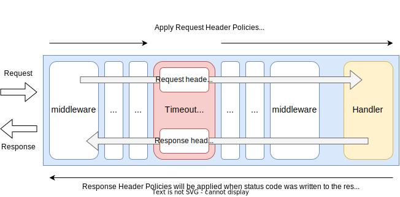

# Header Policy Middleware

## Summary

This is the design document of `app/middleware/header` package that provides HeaderPolicyMiddleware.

HeaderPolicyMiddleware apply header policies to requests and response headers.
Policies include allow, remove, add, set and rewrite.

## Motivation

There are hundreds of header names used in real world systems.
Adding some user-defined headers or adding some security related headers are general use cases.
So, it should be configurable to manipulate headers.

### Goals

- HeaderPolicyMiddleware provides header manipulation.
    - Allow: white list of headers.
    - Remove: remove specific headers.
    - Add: adds specific header values not removing existing ones.
    - Set: sets specific header value replacing the existing ones.
    - Rewrite: rewrite header values.

### Non-Goals

- Path-based or method-based application of header policies.

## Technical Design

### Applying header policies

HeaderPolicyMiddleware applies header policies to request headers and response headers.
Request header policy is applied at the HeaderPolicyMiddleware.
Response header policy, on the other hand, is applied
just before the HTTP status code is written to the response.



HeaderPolicyMiddleware implements `core.Middleware` interface to work as middleware.

```go
type Middleware interface {
  Middleware(http.Handler) http.Handler
}
```

### Policies

Available policies are listed in the table.

| Policy  | Description                                             |
| ------- | ------------------------------------------------------- |
| Allow   | Allow only specified header. Works as a whitelist.      |
| Remove  | Remove specified headers by name.                       |
| Add     | Add header value. Do not replace the existing values.   |
| Set     | Add header value. Replace the existing value.           |
| Rewrite | Rewrite header value if exists.                         |

In addition to hte policies in the table, following policies can be applied.

- `MIME Allow List`: Allows requests that media type is in the configured MIME list.
    - 415 UnsupportedMediaType will be returned for violating requests.
- `Maximum Content Length`: Allows requests which [Request.ContentLength](https://pkg.go.dev/net/http#Request.ContentLength) is below configured value.
    - 413 RequestEntityTooLarge will be returned for violating requests.

## Test Plan

Unit tests are implemented and passed.

- All functions and methods are covered.
- Coverage objective 98%.

### Integration Tests

Integration tests are implemented with these aspects.

- HeaderPolicyMiddleware works as middleware.
- HeaderPolicyMiddleware works with input configuration.
- Header policies works as defined in this document.

### e2e Tests

e2e tests are implemented with these aspects.

- HeaderPolicyMiddleware works as middleware.
- HeaderPolicyMiddleware works with input configuration.
- Header policies works as defined in this document.

### Fuzz Tests

Not planned.

### Benchmark Tests

Not planned.

### Chaos Tests

Not planned.

## Future works

None.

## References

None.
