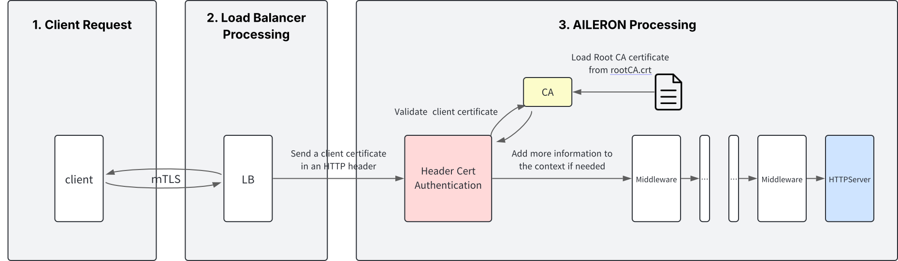

# Package `core/headercert` for `HeaderCertAuthMiddleware`

## Summary

This is the design document of core/headercert package which provides `HeaderCertAuthMiddleware` resource.
`HeaderCertAuthMiddleware` authenticates API calls by using client certificates provided in HTTP headers.

## Motivation

This Middleware is useful when TLS traffic is terminated by an external Load Balancer before entering AILERON Gateway.
The client certificate is passed along in HTTP headers for subsequent validation.

### Goals

- Validate client certificates received in HTTP headers.
- Reject requests with expired client certificates.
- Ensure that certificates are signed by a trusted CA.
- Match the client certificate against the provided fingerprint.

### Non-Goals

- Implement various logging or monitoring features.
- Provide extensive customization for certificate validation options beyond the basic checks.
- Support certificate revocation lists (CRL) or more complex CA hierarchies.

## Technical Design

### Client Certificate Validation Flow

`HeaderCertAuthMiddleware` validates the client certificate and transfers the request to the upstream server as shown in the image below.



<!--  -->

1. **Client Request**
   - The client initiates a request using TLS for secure communication.

2. **Load Balancer Processing**
   - The request reaches Load Balancer, where the TLS connection to the client has already been terminated.
   - The Load Balancer extracts the client certificate and the fingerprint and adds them to the request headers.

3. **AILERON Processing**
   - The middleware extracts the client certificate and fingerprint from the specified HTTP header (e.g., `X-SSL-Client-Cert`, `X-SSL-Client-Fingerprint`).
   - The middleware validates the following:
     - The client certificate is not expired.
     - The certificate is issued by a trusted CA (as determined by the configured root CA file).
     - The certificate fingerprint matches the provided fingerprint in the request header (which must be hashed by SHA256).

### Validating

HeaderCertAuthMiddleware performs the following validations on the client certificate:

- Expiration Check

   Checks the expiration date of the client certificate. If the certificate is expired, it returns a 401 Unauthorized error.

- Trusted CA Verification

   Verifies the certificate chain to ensure the root certificate is registered as a trusted root certificate in the middleware. If the client certificate cannnot be trusted, it returns a 401 Unauthorized error.

- Fingerprint Matching

   Hashes the client certificate using SHA256 and compares it with the fingerprint sent from the proxy via the HTTP header. If the fingerprint does not match the hashed value, it returns a 401 Unauthorized error.

To achieve this, the middleware requires the proxy to add the client certificate and fingerprint to the request headers.
**The client certificate should be in PEM format and Base64 encoded, while the fingerprint should be a SHA256 hash of the client certificate.**
These should be stored in the `X-SSL-Client-Cert` and `X-SSL-Client-Fingerprint` headers, respectively.

### Error Handling

The middleware will return the following HTTP status codes based on the outcome of the validation:

- **400: Bad Request:** Returned when the request does not contain a valid client certificate or fingerprint.

- **401: Unauthorized:** Returned if the client certificate is not valid or the fingerprint does not match.

### CA Configuration

The middleware uses a local certificate file (`rootCA.crt`) to validate the client certificates. This file must be correctly configured and accessible to the middleware.

### Verification Method

To test the middleware's functionality, you can send a request with a client certificate and fingerprint included in the HTTP header. Use the following `curl` command template

```bash
curl -v --cert pki/client.crt --key pki/client.key \
     -H "X-SSL-Client-Cert: $(base64 -w 0 pki/client.crt)" \
     -H "X-SSL-Client-Fingerprint: $(cat pki/fingerprint.txt)" \
     http://localhost:8080/
```

## Test Plan

### Unit Tests

Unit tests are implemented and passed.

- Ensure all functions and methods associated with certificate validation are covered by unit tests.
- Aim for at least 98% code coverage to guarantee functionality.

### Integration Tests

Integration tests are implemented with these aspects.

- Validate the middleware works as expected when integrated with upstream services.
- Test various scenarios for successful and unsuccessful validation.

### e2e Tests

e2e tests are implemented with the aspect.

- Conduct end-to-end tests to ensure the entire validation flow functions correctly from request initiation to response.

### Fuzz Tests

Not planned.

### Benchmark Tests

Not planned.

### Chaos Tests

Not planned.

## Future works

None.

## References

- [FAPI 2.0 Security Profile](https://openid.net/specs/fapi-security-profile-2_0-final.html)
- [kong/header-cert-auth](https://docs.konghq.com/hub/kong-inc/header-cert-auth/)
- [tyk/client-authentication](https://tyk.io/docs/api-management/client-authentication/#use-mutual-tls)
- [nginx/securing-http-traffic-upstream](https://docs.nginx.com/nginx/admin-guide/security-controls/securing-http-traffic-upstream/)
