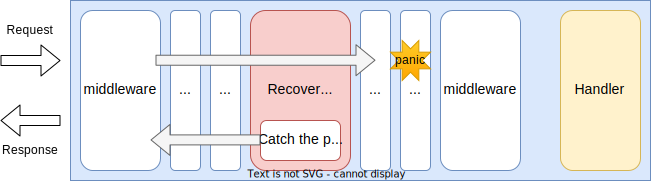

# Recover Middleware

## Summary

This is the design document of app/middleware/recover package that provides RecoverMiddleware resource.
RecoverMiddleware catches panics occurred in the succeeding middleware and handlers and return an appropriate HTTP error response to the clients.

## Motivation

Panics can occur in a golang application.
So, handling unexpected panics is required because they can dis-connect clients or can crash the gateway.

### Goals

- RecoverMiddleware caches any panics occurred in the succeeding middleware and handlers.

### Non-Goals

## Technical Design

### Caching panics

A panic can occurs in middleware or handlers.
It will disconnect the client that is sending the corresponding request.
In general, panic should not occur in the gateway but can unexpectedly occur in third-party libraries or bad implementation.

RecoverMiddleware cache the panics occurred in the succeeding middleware.
And return a HTTP error response to the client.



RecoverMiddleware implements `core.Middleware` interface to work as middleware.

```go
type Middleware interface {
  Middleware(http.Handler) http.Handler
}
```

## Test Plan

Unit tests are implemented and passed.

- All functions and methods are covered.
- Coverage objective 98%.

### Integration Tests

Integration tests are implemented with these aspects.

- TimeoutMiddleware works as middleware.
- RecoverMiddleware works with input configuration.
- RecoverMiddleware caches panics.

### e2e Tests

e2e tests are implemented with these aspects.

- RecoverMiddleware works with input configuration.
- RecoverMiddleware caches panics.

### Fuzz Tests

Not planned.

### Benchmark Tests

Not planned.

### Chaos Tests

Not planned.

## Future works

None.

## References

None.
