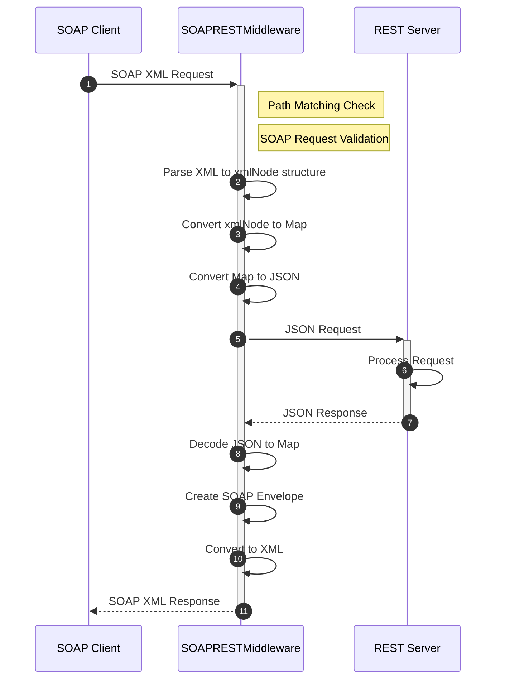

# SOAPREST Middleware

## Summary

This is the technical document of app/middleware/soaprest package that provides SOAPRESTMiddleware.
SOAPRESTMiddleare provides conversion functionality between SOAP/XML and REST/JSON.

## Motivation

Converting between SOAP/XML and REST/JSON is required in scenarios where you wish to continue supporting legacy clients that can only handle SOAP/XML, while utilizing REST/JSON-based applications on the server side.

### Goals

- SOAPRESTMiddleware can convert SOAP/XML requests into REST/JSON format.
- SOAPRESTMiddleware can convert REST/JSON responses back into SOAP/XML format.

### Non-Goals

## Technical Design

### Converting requests/responses

SOAPRESTMiddleware converts requests in SOAP/XML format into REST/JSON format and transforms responses in REST/JSON format back into SOAP/XML format.


SOAPRESTMiddleware is positioned to be the first middleware applied, allowing it to work with other middleware designed for JSON.

SOAPRESTMiddleware implements `core.Middleware` interface to work as middleware.

```go
type Middleware interface {
  Middleware(http.Handler) http.Handler
}
```

Initially, support will only be provided for SOAP 1.1, and SOAP messages will be sent in HTTP/1.1 format.

### Converting algorithm

The overall process becomes like this.



#### Request Validation and Routing

1. When a request is received, the middleware first checks if the request path matches the configured pattern.
2. If the path doesn't match, the request is passed to the next handler without modification.
3. If the path matches, the middleware validates whether it's a SOAP 1.1 request by checking:
   - The Content-Type header contains "text/xml"
   - OR the SOAPAction header contains a value
4. If the request doesn't meet SOAP 1.1 criteria, a VersionMismatch fault error is returned.

#### SOAP to REST Conversion

If the request is valid SOAP 1.1, the middleware performs the following transformations:

1. **XML Parsing**: The request body is read and parsed into an internal structure
2. **Namespace Processing**: XML namespaces are tracked and managed
3. **Structure Conversion**: The hierarchical XML structure is converted to a map representation
4. **JSON Transformation**: The map is marshaled into a JSON format for REST endpoints

During this conversion:
- SOAP Envelope, Header, and Body elements are properly handled
- XML namespaces are preserved with separators
- XML attributes are collected under an attribute key
- Element values are parsed according to configuration (string, boolean, integer, float)
- Null values (xsi:nil="true") are properly represented

#### Request Forwarding

1. A new HTTP request is created with:
   - The same context as the original request
   - JSON body from the conversion
   - Content-Type set to "application/json"
   - Method set to "POST"
2. This request is forwarded to the next handler or service

#### REST to SOAP Conversion

1. **JSON Parsing**: The response body is decoded from JSON to a map structure
2. **SOAP Envelope Creation**: A new SOAP envelope is constructed with:
   - Proper SOAP namespace declarations
   - Optional SOAP Header section if present in the original data
   - SOAP Body containing the response data
   - Invalid characters in XML will be sanitized
3. **XML Marshalling**: The SOAP envelope structure is marshaled to XML
4. **Response Preparation**: The XML content is sent back with:
   - Content-Type set to "text/xml; charset=utf-8"
   - Does not perform the calculation of Content-Length.

### Converting Features

#### SOAP to REST Conversion

##### Basic Structure

The SOAP messages received by the SOAPRESTMiddleware must comply with the SOAP 1.1 specification and consist of a SOAPEnvelope, a SOAPBody, and an optional SOAPHeader.
The namespace URI defined in the SOAPEnvelope is mapped to the key specified by `namespaceKey` during JSON conversion and is converted at the same depth alongside `soap:Body` and `soap:Header`. In JSON, namespace prefixes are retained as underscores (`_`) between the prefix and the key name.

```xml
<?xml version="1.0" encoding="UTF-8"?>
<soap:Envelope xmlns:soap="http://schemas.xmlsoap.org/soap/envelope/">
  <soap:Header></soap:Header>
  <soap:Body>
    <ElementNode>textNode</ElementNode>
  </soap:Body>
</soap:Envelope>
```

```json
{
  "soap_Envelope": {
    "namespaceKey": {
      "soap": "http://schemas.xmlsoap.org/soap/envelope/"
    },
    "soap_Body": {
      "ElementNode": "textNode"
    },
    "soap_Header": {}
  }
}
```

If the SOAPHeader is omitted, elements with the key `soap_Header` will not be included in the JSON output during conversion.

```xml
<?xml version="1.0" encoding="UTF-8"?>
<soap:Envelope xmlns:soap="http://schemas.xmlsoap.org/soap/envelope/">
  <soap:Body>
    <ElementNode>textNode</ElementNode>
  </soap:Body>
</soap:Envelope>
```

```json
{
  "soap_Envelope": {
    "namespaceKey": {
      "soap": "http://schemas.xmlsoap.org/soap/envelope/"
    },
    "soap_Body": {
      "ElementNode": "textNode"
    }
  }
}
```

When an element contains attributes, the attributes are preserved under the key specified by `attributeKey` during JSON conversion. 

```xml
<ElementNode testAttribute="example">
  <ChildElementNode>textNode</ChildElementNode>
</ElementNode>
```

```json
{
  "ElementNode": {
    "ChildElementNode": "textNode",
    "attributeKey": {
      "testAttribute": "example"
    }
  }
}
```

If an element has attributes but no child elements, and instead contains a text node, the corresponding text node is preserved under the key specified by `textKey` during JSON conversion.

```xml
<ElementNode testAttribute="example">textNode</ElementNode>
```

```json
{
  "attributeKey": {
    "testAttribute": "example"
  },
  "textKey": "textNode"
}
```

By modifying the `soapNamespacePrefix`, you can change the prefix used for the namespace definition of `http://schemas.xmlsoap.org/soap/envelope/` from `soap` to a different value. The example below demonstrates a conversion where the prefix is changed from `soap` to `SOAPENV`.

```xml
<?xml version="1.0" encoding="UTF-8"?>
<SOAPENV:Envelope xmlns:SOAPENV="http://schemas.xmlsoap.org/soap/envelope/">
  <SOAPENV:Header></SOAPENV:Header>
  <SOAPENV:Body>
    <ElementNode>textNode</ElementNode>
  </SOAPENV:Body>
</SOAPENV:Envelope>
```

```json
{
  "SOAPENV_Envelope": {
    "SOAPENV_Body": {
      "ElementNode": "textNode"
    },
    "SOAPENV_Header": {},
    "namespaceKey": {
      "SOAPENV": "http://schemas.xmlsoap.org/soap/envelope/"
    }
  }
}
```

When converting to JSON, the keys are automatically sorted in alphabetical order. This follows the specifications of `json.Marshal`. This also applies when converting array elements.

```xml
<elements>
  <aKey>aValue</aKey>
  <aaKey>aaValue</aaKey>
  <bKey>bValue</bKey>
  <cKey>cValue</cKey>
</elements>
```

```json
"elements": {
  "aKey": "aValue",
  "aaKey": "aaValue",
  "bKey": "bValue",
  "cKey": "cValue"
}
```

##### Data Transformation

By default, if a TextNode has double quotes, they are escaped and additional double quotes are added. For TextNodes without double quotes, double quotes are appended during the conversion to JSON.

```xml
<MultipleElement>
  <StringElementNode>"StringWithDoubleQuotations"</StringElementNode>
  <StringElementNode>StringWithoutDoubleQuotations</StringElementNode>
</MultipleElement>
```

```json
{
  "MultipleElement": {
    "StringElementNode": [
      "\"StringWithDoubleQuotations\"",
      "StringWithoutDoubleQuotations"
    ]
  }
}
```

When the `extractStringElement` option is set to `true`, escaping is not performed even if double quotes are present.

```xml
<MultipleElement>
  <StringElementNode>"StringWithDoubleQuotations"</StringElementNode>
  <StringElementNode>StringWithoutDoubleQuotations</StringElementNode>
</MultipleElement>
```

```json
{
  "MultipleElement": {
    "StringElementNode": [
      "StringWithDoubleQuotations",
      "StringWithoutDoubleQuotations"
    ]
  }
}
```

Regardless of the extractStringElement setting, whitespace at the beginning and end of the string is not removed.

```xml
<MultipleElement>
  <StringElementNode>"     IncludeSeveralWhitespaces     "</StringElementNode>
  <StringElementNode>     IncludeSeveralWhitepaces     </StringElementNode>
</MultipleElement>
```

```json
{
  "MultipleElement": {
    "StringElementNode": [
      "\"     IncludeSeveralWhitepaces     \"",
      "     IncludeSeveralWhitepaces     "
    ]
  }
}
```

Therefore, please note that unexpected whitespace may occur depending on how the XML is written.

```xml
<Element>
  <IndentedElementNode>
    IndentedTextNode
  </IndentedElementNode>
</Element>
```

```json
{
  "Element": {
    "IndentedElementNode": "    IndentedTextNode  "
  }
}
```

By default, even if a TextNode is a boolean value (true/false), it undergoes escaping and the addition of double quotes, just like in string conversion.

```xml
<MultipleElement>
  <BooleanElementNode>true</BooleanElementNode>
  <BooleanElementNode>false</BooleanElementNode>
  <BooleanElementNode>"true"</BooleanElementNode>
  <BooleanElementNode>"false"</BooleanElementNode>
</MultipleElement>
```

```json
{
  "MultipleElement": {
    "BooleanElementNode": [
      "true",
      "false",
      "\"true\"",
      "\"false\""
    ]
  }
}
```

When only `extractBooleanElement` is set to `true`, elements without double quotes will not have double quotes added during JSON conversion.

```json
{
  "MultipleElement": {
    "BooleanElementNode": [
      true,
      false,
      "\"true\"",
      "\"false\""
    ]
  }
}
```

If both `extractBooleanElement` and `extractStringElement` are set to `true`, elements with double quotes will not be escaped during JSON conversion, as with the earlier string conversion. However, double quotes will still be added during the conversion.

```json
{
  "MultipleElement": {
    "BooleanElementNode": [
      true,
      false,
      "true",
      "false"
    ]
  }
}
```

By default, TextNodes that can be converted to an integer are processed in the same manner as string conversion, with escaping and the addition of double quotes.

```xml
<MultipleElement>
  <IntegerElementNode>0</IntegerElementNode>
  <IntegerElementNode>100</IntegerElementNode>
  <IntegerElementNode>"0"</IntegerElementNode>
  <IntegerElementNode>"100"</IntegerElementNode>
</MultipleElement>
```

```json
{
  "MultipleElement": {
    "IntegerElementNode": [
      0,
      100,
      "\"0\"",
      "\"100\""
    ]
  }
}
```

When only `extractIntegerElement` is set to `true`, elements without double quotes will not have double quotes added during JSON conversion.

```json
{
  "MultipleElement": {
    "IntegerElementNode": [
      0,
      100,
      "\"0\"",
      "\"100\""
    ]
  }
}
```

If both `extractIntegerElement` and `extractStringElement` are set to `true`, elements with double quotes will not be escaped during JSON conversion, similar to the earlier string conversion. However, double quotes will still be added during the conversion.

```json
{
  "MultipleElement": {
    "IntegerElementNode": [
      0,
      100,
      "0",
      "100"
    ]
  }
}
```

However, if `extractFloatElement` is set to `true` and `extractIntegerElement` is set to `false`, TextNodes that can be converted to integer types without double quotes will be converted without double quotes being added.

```json
{
  "MultipleElement": {
    "IntegerElementNode": [
      0,
      100,
      "\"0\"",
      "\"100\""
    ]
  }
}
```

By default, TextNodes that can be converted to a floating-point type are processed in the same way as string conversion, with escaping and the addition of double quotes.

```xml
<MultipleElement>
  <FloatElementNode>0.1</FloatElementNode>
  <FloatElementNode>3.141592653589793238462643</FloatElementNode>
  <FloatElementNode>"0.1"</FloatElementNode>
  <FloatElementNode>"3.141592653589793238462643"</FloatElementNode>
</MultipleElement>
```

```json
{
  "MultipleElement": {
    "FloatElementNode": [
      "0.1",
      "3.141592653589793238462643",
      "\"0.1\"",
      "\"3.141592653589793238462643\""
    ]
  }
}
```

When only `extractFloatElement` is set to `true`, elements without double quotes will not have double quotes added during JSON conversion. However, since they are treated as floating-point types, there is a possibility of precision loss.

```json
{
  "MultipleElement": {
    "FloatElementNode": [
      0.1,
      3.141592653589793,
      "\"0.1\"",
      "\"3.141592653589793238462643\""
    ]
  }
}
```

If both `extractFloatElement` and `extractStringElement` are set to `true`, elements with double quotes will not be escaped during JSON conversion, similar to the earlier string conversion. However, double quotes will still be added during the conversion.

```json
{
  "MultipleElement": {
    "FloatElementNode": [
      0.1,
      3.141592653589793,
      "0.1",
      "3.141592653589793238462643"
    ]
  }
}
```

When using `NaN` or `Inf` in XML, `extractFloatElement` must be set to `false`. This is because `NaN` and `Inf` will cause marshalling to fail during JSON conversion. When `extractFloatElement` is set to false, the conversion is performed as shown below.

```xml
<?xml version="1.0" encoding="UTF-8"?>
<soap:Envelope xmlns:soap="http://schemas.xmlsoap.org/soap/envelope/">
  <soap:Header></soap:Header>
  <soap:Body>
    <soap:ElementNode>
      <NaNElementNode>NaN</NaNElementNode>
      <InfElementNode>Inf</InfElementNode>
      <NegativeInfElementNode>-Inf</NegativeInfElementNode>
      <FloatElementNode>0.1</FloatElementNode>
    </soap:ElementNode>
  </soap:Body>
</soap:Envelope>
```

```json
{
  "soap_Envelope": {
    "namespaceKey": {
      "soap": "http://schemas.xmlsoap.org/soap/envelope/"
    },
    "soap_Body": {
      "soap_ElementNode": {
        "FloatElementNode": "0.1",
        "InfElementNode": "Inf",
        "NaNElementNode": "NaN",
        "NegativeInfElementNode": "-Inf"
      }
    },
    "soap_Header": {}
  }
}
```

If `extractFloatElement` is set to `true` and the XML contains `NaN` or `Inf`, an error occurs.

```json
{
    "time": "2025-03-21 13:48:24",
    "level": "DEBUG",
    "msg": "serve http error. status=400",
    "datetime": {
        "date": "2025-03-21",
        "time": "13:48:24.101",
        "zone": "Local"
    },
    "location": {
        "file": "http/errorhandler.go",
        "func": "http.(*DefaultErrorHandler).ServeHTTPError",
        "line": 299
    },
    "error": {
        "code": "E3217",
        "kind": "AppMiddleSOAPRESTMarshalJSONData",
        "msg": "E3217.AppMiddleSOAPRESTMarshalJSONData failed to marshal jsonData. map[soap_Envelope:map[namespaceKey:map[soap:http://schemas.xmlsoap.org/soap/envelope/] soap_Body:map[soap_ElementNode:map[FloatElementNode:0.1 InfElementNode:+Inf NaNElementNode:NaN NegativeInfElementNode:-Inf]] soap_Header:map[]]] [json: unsupported value: +Inf]",
        "stack": ""
    }
}
```

To represent null in JSON, the `xsi:nil` attribute must be specified as true in SOAP/XML.

```xml
<ElementNode>
  <NullElementNode xsi:nil="true"></NullElementNode>
</ElementNode>
```

```json
{
  "ElementNode": {
    "NullElementNode": null
  }
}
```

If the `xsi:nil` attribute is not specified, it will be converted into an empty element rather than null during JSON transformation.

```xml
<ElementNode>
  <EmptyElementNode></EmptyElementNode>
</ElementNode>
```

```json
{
  "ElementNode": {
    "EmptyElementNode": {}
  }
}
```

##### Arrays

SOAPRESTMiddleware treats child elements with the same key name within a particular element as array elements and converts them accordingly.

```xml
<Array>
  <Name>Alice</Name>
  <Name>Bob</Name>
  <Name>Charlie</Name>
</Array>
```

```json
{
  "Array": {
    "Name": [
      "Alice",
      "Bob",
      "Charlie"
    ]
  }
}
```

Additionally, if multiple child elements with the same key name exist within a single element, they are treated as array elements and converted while preserving their order.

```xml
<Array>
  <Name>Alice</Name>
  <Name>Bob</Name>
  <Name>Charlie</Name>
  <Age>25</Age>
  <Age>30</Age>
  <Age>20</Age>
</Array>
```

```json
{
  "Array": {
    "Age": [
      "25",
      "30",
      "20"
    ],
    "Name": [
      "Alice",
      "Bob",
      "Charlie"
    ]
  }
}
```

When attributes with different key names are arranged in various orders, identical key names are stored as the same element within an array.

```xml
<Array>
  <Name>Alice</Name>
  <Age>25</Age>
  <Name>Bob</Name>
  <Age>30</Age>
  <Name>Charlie</Name>
  <Age>20</Age>
</Array>
```

```json
{
  "Array": {
    "Age": [
      "25",
      "30",
      "20"
    ],
    "Name": [
      "Alice",
      "Bob",
      "Charlie"
    ]
  }
}
```

If child elements are assigned an index, the conversion is performed according to the settings of `textKey` and `attributeKey`, and when the key names of the child elements match, they are still treated as an array.

```xml
<Array>
  <Name index="0">Alice</Name>
  <Name index="1">Bob</Name>
  <Name index="2">Charlie</Name>
</Array>
```

```json
{
  "Array": {
    "Name": [
      {
        "attributeKey": {
          "index": "0"
        },
        "textKey": "Alice"
      },
      {
        "attributeKey": {
          "index": "1"
        },
        "textKey": "Bob"
      },
      {
        "attributeKey": {
          "index": "2"
        },
        "textKey": "Charlie"
      }
    ]
  }
}
```

##### Namespace

As described in the Basic Structure, when a namespace is defined, the namespace is stored in the key specified according to the `namespaceKey` setting.

```xml
<ns:ElementNode xmlns:ns="http://example.com/">
  <ns:ChildElementNode>textNode</ns:ChildElementNode>
</ns:ElementNode>
```

```json
{
  "ns_ElementNode": {
    "namespaceKey": {
      "ns": "http://example.com/"
    },
    "ns_ChildElementNode": "textNode"
  }
}
```

When multiple namespace definitions are specified, the namespace definitions are stored under the key set by `namespaceKey`. Additionally, definitions not specified in `xmlns`, including those with encodingStyle, are stored under the key set by `attributeKey`.

```xml
<?xml version="1.0" encoding="UTF-8"?>
<soap:Envelope xmlns:soap="http://schemas.xmlsoap.org/soap/envelope/" xmlns:xsi="http://www.w3.org/2001/XMLSchema-instance" xmlns:example="http://example.com/" soap:encodingStyle="http://schemas.xmlsoap.org/soap/encoding/">
  <soap:Header>
  </soap:Header>
  <soap:Body>
  </soap:Body>
</soap:Envelope>
```

```json
{
  "soap_Envelope": {
    "attributeKey": {
      "encodingStyle": "http://schemas.xmlsoap.org/soap/encoding/"
    },
    "namespaceKey": {
      "example": "http://example.com/",
      "soap": "http://schemas.xmlsoap.org/soap/envelope/",
      "xsi": "http://www.w3.org/2001/XMLSchema-instance"
    },
    "soap_Body": {},
    "soap_Header": {}
  }
}
```

When using partial namespaces, namespace definitions are stored under the key set by `namespaceKey` beneath the element that includes the namespace.

```xml
<?xml version="1.0" encoding="UTF-8"?>
<soap:Envelope xmlns:soap="http://schemas.xmlsoap.org/soap/envelope/">
  <soap:Header></soap:Header>
  <soap:Body>
    <ns:ElementNode xmlns:ns="http://example.com/">
		<ns:ChildElementNode>textNode</ns:ChildElementNode>
	</ns:ElementNode>
  </soap:Body>
</soap:Envelope>
```

```json
{
  "soap_Envelope": {
    "namespaceKey": {
      "soap": "http://schemas.xmlsoap.org/soap/envelope/"
    },
    "soap_Body": {
      "ns_ElementNode": {
        "namespaceKey": {
          "ns": "http://example.com/"
        },
        "ns_ChildElementNode": "textNode"
      }
    },
    "soap_Header": {}
  }
}
```

In SOAP/REST conversion, the use of default namespace declarations is allowed. If child elements under an element with a declared default namespace omit their own namespace declaration, they inherit the declaration from their parent element.

```xml
<?xml version="1.0" encoding="UTF-8"?>
<soap:Envelope xmlns:soap="http://schemas.xmlsoap.org/soap/envelope/">
    <soap:Header></soap:Header>
    <soap:Body>
        <DefaultNamespace xmlns="http://example.com/">
            <Item>default</Item>
        </DefaultNamespace>
    </soap:Body>
</soap:Envelope>
```

```json
{
  "soap_Envelope": {
    "namespaceKey": {
      "soap": "http://schemas.xmlsoap.org/soap/envelope/"
    },
    "soap_Body": {
      "xmlns_DefaultNamespace": {
        "namespaceKey": {
          "xmlns": "http://example.com/"
        },
        "xmlns_Item": "default"
      }
    },
    "soap_Header": {}
  }
}
```

It is also possible to declare the namespace under the SOAPEnvelope element, and child elements that omit a namespace declaration will, without exception, inherit the declaration from their parent element.

```xml
<?xml version="1.0" encoding="UTF-8"?>
<soap:Envelope xmlns:soap="http://schemas.xmlsoap.org/soap/envelope/" xmlns="http://example.com/">
    <soap:Header></soap:Header>
    <soap:Body>
        <DefaultNamespace>default namespace</DefaultNamespace>
        <NewNamespaceDeclaredNode xmlns:ne="http://newExample.com/">new default namespace</NewNamespaceDeclaredNode>
    </soap:Body>
</soap:Envelope>
```

```json
{
  "soap_Envelope": {
    "namespaceKey": {
      "soap": "http://schemas.xmlsoap.org/soap/envelope/",
      "xmlns": "http://example.com/"
    },
    "soap_Body": {
      "xmlns_DefaultNamespace": "default namespace",
      "xmlns_NewNamespaceDeclaredNode": {
        "namespaceKey": {
          "ne": "http://newExample.com/"
        },
        "textKey": "new default namespace"
      }
    },
    "soap_Header": {}
  }
}
```

When a prefix defined in the namespace is used as the key for an attribute, it will automatically be converted during JSON transformation, changing the colon to an underscore as the `separatorChar`.

```xml
<?xml version="1.0" encoding="UTF-8"?>
<soap:Envelope xmlns:soap="http://schemas.xmlsoap.org/soap/envelope/" xmlns:xsd="http://www.w3.org/2001/XMLSchema" xmlns:xsi="http://www.w3.org/2001/XMLSchema-instance">
  <soap:Header></soap:Header>
  <soap:Body>
    <ns:example xmlns:ns="http://example.com/stockquote">
      <exampleKey xsi:type="xsd:string">exampleValue</exampleKey>
    </ns:example>
  </soap:Body>
</soap:Envelope>
```

```json
{
  "soap_Envelope": {
    "namespaceKey": {
      "soap": "http://schemas.xmlsoap.org/soap/envelope/",
      "xsd": "http://www.w3.org/2001/XMLSchema",
      "xsi": "http://www.w3.org/2001/XMLSchema-instance"
    },
    "soap_Body": {
      "ns_example": {
        "exampleKey": {
          "attributeKey": {
            "xsi_type": "xsd:string"
          },
          "textKey": "exampleValue"
        },
        "namespaceKey": {
          "ns": "http://example.com/stockquote"
        }
      }
    },
    "soap_Header": {}
  }
}
```

##### Error Handling

If a request that is not compliant with SOAP 1.1 is sent, an error related to `AppMiddleSOAPRESTVersionMismatch` will be returned.

```json
{
    "time": "2025-03-21 14:37:47",
    "level": "DEBUG",
    "msg": "serve http error. status=403",
    "datetime": {
        "date": "2025-03-21",
        "time": "14:37:47.442",
        "zone": "Local"
    },
    "location": {
        "file": "http/errorhandler.go",
        "func": "http.(*DefaultErrorHandler).ServeHTTPError",
        "line": 299
    },
    "error": {
        "code": "E3214",
        "kind": "AppMiddleSOAPRESTVersionMismatch",
        "msg": "E3214.AppMiddleSOAPRESTVersionMismatch received request is not a SOAP 1.1 request.",
        "stack": ""
    }
}
```

If an error occurs during the conversion process from SOAP/XML to REST/JSON, an error related to `AppMiddleSOAPRESTUnmarshalRequestBody` will be returned.

```json
{
    "time": "2025-03-21 14:41:58",
    "level": "DEBUG",
    "msg": "serve http error. status=400",
    "datetime": {
        "date": "2025-03-21",
        "time": "14:41:58.134",
        "zone": "Local"
    },
    "location": {
        "file": "http/errorhandler.go",
        "func": "http.(*DefaultErrorHandler).ServeHTTPError",
        "line": 299
    },
    "error": {
        "code": "E3216",
        "kind": "AppMiddleSOAPRESTUnmarshalRequestBody",
        "msg": "E3216.AppMiddleSOAPRESTUnmarshalRequestBody failed to unmarshal request body. a [EOF]",
        "stack": ""
    }
}
```

##### Request Header

SOAPRESTMiddleware forwards the received request headers while modifying the `Content-Type` and `Content-Length`.
The `Content-Type` is updated to `application/json`, and the `Content-Length` is adjusted based on the converted body.

#### REST to SOAP Conversion

##### Basic Structure

In the conversion from REST/JSON to SOAP/XML, the process essentially follows the reverse of the steps used to convert from SOAP/XML to REST/JSON.
When converting from REST/JSON to SOAP/XML, the `namespaceKey`, `textKey`, and `attributeKey` settings are also referenced.

```json
{
  "soap_Envelope": {
    "namespaceKey": {
      "soap": "http://schemas.xmlsoap.org/soap/envelope/"
    },
    "soap_Body": {
      "ElementNode": {
        "attributeKey": {
          "testAttribute": "example"
        },
        "textKey": "textNode"
      }
    },
    "soap_Header": {}
  }
}
```

```xml
<?xml version="1.0" encoding="UTF-8"?>
<soap:Envelope xmlns:soap="http://schemas.xmlsoap.org/soap/envelope/">
  <soap:Header></soap:Header>
  <soap:Body>
    <ElementNode testAttribute="example">textNode</ElementNode>
  </soap:Body>
</soap:Envelope>
```

If you omit the SOAPHeader in JSON, an empty SOAPHeader element will be automatically added in the XML.

```json
{
  "soap_Envelope": {
    "namespaceKey": {
      "soap": "http://schemas.xmlsoap.org/soap/envelope/"
    },
    "soap_Body": {
      "ElementNode": {
        "attributeKey": {
          "testAttribute": "example"
        },
        "textKey": "textNode"
      }
    },
    "soap_Header": {}
  }
}
```

```xml
<?xml version="1.0" encoding="UTF-8"?>
<soap:Envelope xmlns:soap="http://schemas.xmlsoap.org/soap/envelope/">
  <soap:Header></soap:Header>
  <soap:Body>
    <ElementNode testAttribute="example">textNode</ElementNode>
  </soap:Body>
</soap:Envelope>
```

If a TextNode is placed directly under a SOAPEnvelope, that TextNode will also be converted into XML.

```json
{
  "soap_Envelope": {
    "namespaceKey": {
      "soap": "http://schemas.xmlsoap.org/soap/envelope/"
    },
    "soap_Body": {
      "textKey": "bodyTextNode"
    },
    "soap_Header": {
      "textKey": "headerTextNode"
    },
    "textKey": "envelopeTextNode"
  }
}
```

```xml
<?xml version="1.0" encoding="UTF-8"?>
<soap:Envelope xmlns:soap="http://schemas.xmlsoap.org/soap/envelope/">
  <soap:Header>
    headerTextNode
  </soap:Header>
  <soap:Body>
    bodyTextNode
  </soap:Body>
</soap:Envelope>
```

##### Data Transformation

In the conversion from REST/JSON to SOAP/XML, all elements are treated as string.

```json
{
  "soap_Envelope": {
    "namespaceKey": {
      "soap": "http://schemas.xmlsoap.org/soap/envelope/"
    },
    "soap_Body": {
      "BooleanElementNode": true,
      "FloatElementNode": "3.141592653589793238462643",
      "IntegerElementNode": 100,
      "StringElementNode": "example"
    },
    "soap:Header": {}
  }
}
```

```xml
<?xml version="1.0" encoding="UTF-8"?>
<soap:Envelope xmlns:soap="http://schemas.xmlsoap.org/soap/envelope/">
  <soap:Header></soap:Header>
  <soap:Body>
    <StringElementNode>example</StringElementNode>
    <BooleanElementNode>true</BooleanElementNode>
    <FloatElementNode>3.141592653589793238462643</FloatElementNode>
    <IntegerElementNode>100</IntegerElementNode>
  </soap:Body>
</soap:Envelope>
```

When null is specified in JSON, the corresponding key in SOAP/XML will be represented with the `xsi:nil` attribute set to `true`.
Additionally, even if the `xsi` namespace is not defined in the JSON's SOAPEnvelope, the namespace definition `xmlns:xsi="http://www.w3.org/2001/XMLSchema-instance"` will be automatically added.

```json
{
  "soap_Envelope": {
    "namespaceKey": {
      "soap": "http://schemas.xmlsoap.org/soap/envelope/"
    },
    "soap_Body": {
      "NullElementNode": null
    },
    "soap_Header": {}
  }
}
```

```xml
<?xml version="1.0" encoding="UTF-8"?>
<soap:Envelope xmlns:xsi="http://www.w3.org/2001/XMLSchema-instance" xmlns:soap="http://schemas.xmlsoap.org/soap/envelope/">
  <soap:Header></soap:Header>
  <soap:Body>
    <NullElementNode xsi:nil="true"></NullElementNode>
  </soap:Body>
</soap:Envelope>
```

If the JSON contains characters that are not valid in XML, those characters will be sanitized and output accordingly. The invalid characters will be handled according to the XML 1.0 specification.

```json
{
  "StringElement": "Hello\u0000World\u0001"
}
```

```xml
<StringElement>HelloWorld</StringElement>
```

In the conversion from REST/JSON to SOAP/XML, certain characters are represented using escape sequences. This conversion depends on the specifications of `xml.Marshal`.

```json
{
  "Apostrophe": "It's a nice day",
  "Quotation": "\"quotation\"",
  "Ampersand": "&",
  "LessThan": "<",
  "GreaterThan": ">"
}
```

```xml
<Apostrophe>It&#39;s a nice day</Apostrophe>
<Quotation>&#34;quotation&#34;</Quotation>
<Ampersand>&amp;</Ampersand>
<LessThan>&lt;</LessThan>
<GreaterThan>&gt;</GreaterThan>
```

##### Arrays

In the conversion from REST/JSON to SOAP/XML, array elements are converted into XML based on the keys used in the JSON.

```json
{
  "soap_Envelope": {
    "namespaceKey": {
      "soap": "http://schemas.xmlsoap.org/soap/envelope/"
    },
    "soap_Body": {
      "Array": {
        "Age": [
          25,
          30,
          20
        ],
        "Name": [
          "Alice",
          "Bob",
          "Charlie"
        ]
      }
    },
    "soap_Header": {}
  }
}
```

```xml
<?xml version="1.0" encoding="UTF-8"?>
<soap:Envelope xmlns:soap="http://schemas.xmlsoap.org/soap/envelope/">
  <soap:Header></soap:Header>
  <soap:Body>
    <Array>
      <Age>25</Age>
      <Age>30</Age>
      <Age>20</Age>
      <Name>Alice</Name>
      <Name>Bob</Name>
      <Name>Charlie</Name>
    </Array>
  </soap:Body>
</soap:Envelope>
```

##### Namespace

As described in the Basic Structure, namespace definitions in SOAPEnvelope can be defined by configuring the `namespaceKey`.
When defining partial namespaces, you can use the key name specified in `attributeKey` to create partial namespace definitions.

```json
{
	"soap_Envelope": {
		"namespaceKey": {
			"soap": "http://schemas.xmlsoap.org/soap/envelope/"
		},
		"soap_Body": {
			"ns_ElementNode": {
				"attributeKey": {
					"ns": "http://example.com/"
				},
				"ns_ChildElementNode": {
					"ns_exampleKey": "exampleValue"
				}
			}
		},
		"soap:Header": {}
	}
}
```

```xml
<?xml version="1.0" encoding="UTF-8"?>
<soap:Envelope xmlns:soap="http://schemas.xmlsoap.org/soap/envelope/">
  <soap:Header></soap:Header>
  <soap:Body>
    <ns:ElementNode ns="http://example.com/">
      <ns:ChildElementNode>
        <ns:exampleKey>exampleValue</ns:exampleKey>
      </ns:ChildElementNode>
    </ns:ElementNode>
  </soap:Body>
</soap:Envelope>
```

If the namespace definition for a child element is omitted, the corresponding child element will not include a namespace definition and will be output with only the key name.

```json
{
  "soap_Envelope": {
    "namespaceKey": {
      "soap": "http://schemas.xmlsoap.org/soap/envelope/"
    },
    "soap_Body": {
      "ns_getQuantity": {
        "attributeKey": {
          "ns": "http://example.com/"
        },
        "quantity": {
          "apple": "5",
          "banana": "10"
        }
      }
    },
    "soap_Header": {}
  }
}
```

```xml
<?xml version="1.0" encoding="UTF-8"?>
<soap:Envelope xmlns:soap="http://schemas.xmlsoap.org/soap/envelope/">
  <soap:Header></soap:Header>
  <soap:Body>
    <ns:getQuantity ns="http://example.com/">
      <quantity>
        <apple>5</apple>
        <banana>10</banana>
      </quantity>
    </ns:getQuantity>
  </soap:Body>
</soap:Envelope>
```

The use of default namespace declarations is also possible, in REST/SOAP conversion. However, when defining namespaces partially, it is necessary to represent them using `attributeKey`, as shown in the previous example.

```json
{
  "soap_Envelope": {
    "namespaceKey": {
      "soap": "http://schemas.xmlsoap.org/soap/envelope/"
    },
    "soap_Body": {
      "DefaultNamespace": {
        "Item": "default",
        "attributeKey": {
          "xmlns": "http://example.com/"
        }
      }
    },
    "soap_Header": {}
  }
}
```

```xml
<?xml version="1.0" encoding="UTF-8"?>
<soap:Envelope xmlns:soap="http://schemas.xmlsoap.org/soap/envelope/">
  <soap:Header></soap:Header>
  <soap:Body>
    <DefaultNamespace xmlns="http://example.com/">
      <Item>default</Item>
    </DefaultNamespace>
  </soap:Body>
</soap:Envelope>
```

Attributes that are not namespaces but need to be specified, such as EncodingStyle, can be reflected in the XML by designating them with `attributeKey`.

```json
{
  "soap_Envelope": {
    "namespaceKey": {
      "ns": "http://example.com/",
      "soap": "http://schemas.xmlsoap.org/soap/envelope/",
      "xsd": "http://www.w3.org/2001/XMLSchema",
      "xsi": "http://www.w3.org/2001/XMLSchema-instance"
    },
    "soap_Body": {
      "attributeKey": {
        "soap_encodingStyle": "http://schemas.xmlsoap.org/soap/encoding/"
      },
      "ns_Item": {
        "Quantity": {
          "attributeKey": {
            "xsi_type": "xsd:int"
          },
          "textKey": "10"
        }
      }
    },
    "soap_Header": {}
  }
}
```

```xml
<?xml version="1.0" encoding="UTF-8"?>
<soap:Envelope xmlns:xsd="http://www.w3.org/2001/XMLSchema" xmlns:xsi="http://www.w3.org/2001/XMLSchema-instance" xmlns:ns="http://example.com/" xmlns:soap="http://schemas.xmlsoap.org/soap/envelope/">
  <soap:Header></soap:Header>
  <soap:Body soap:encodingStyle="http://schemas.xmlsoap.org/soap/encoding/">
    <ns:Item>
      <Quantity xsi:type="xsd:int">10</Quantity>
    </ns:Item>
  </soap:Body>
</soap:Envelope>
```

If the key name of the element specified by `attributeKey` contains the prefixes `xmlns_` or `xsi_`, SOAPRESTMiddleware will automatically convert underscore `_` to colon `:` even if namespace definitions are not present in the SOAP Envelope.

```json
{
  "soap_Envelope": {
    "attributeKey": {
      "encodingStyle": "http://schemas.xmlsoap.org/soap/encoding/"
    },
    "namespaceKey": {
      "soap": "http://schemas.xmlsoap.org/soap/envelope/"
    },
    "soap_Body": {
      "e_SomeNode": {
        "attributeKey": {
          "xmlns_e": "http://example.com/"
        },
        "testKey": "testValue"
      }
    }
  }
}
```

```xml
<?xml version="1.0" encoding="UTF-8"?>
<soap:Envelope xmlns:soap="http://schemas.xmlsoap.org/soap/envelope/" encodingStyle="http://schemas.xmlsoap.org/soap/encoding/">
  <soap:Header></soap:Header>
  <soap:Body>
    <e:SomeNode xmlns:e="http://example.com/">
      <testKey>testValue</testKey>
    </e:SomeNode>
  </soap:Body>
</soap:Envelope>
```

For key names that have prefixes other than `xmlns_` and `xsi_`, if namespace definitions are not provided in the SOAP Envelope, SOAPRESTMiddleware will not automatically convert underscore to colon.

```json
{
  "soap_Envelope": {
    "attributeKey": {
      "encodingStyle": "http://schemas.xmlsoap.org/soap/encoding/"
    },
    "namespaceKey": {
      "soap": "http://schemas.xmlsoap.org/soap/envelope/"
    },
    "soap_Body": {
      "e_SomeNode": {
        "attributeKey": {
          "prefix_attrkey": "attrValue"
        },
        "testKey": "testValue"
      }
    }
  }
}
```

```xml
<?xml version="1.0" encoding="UTF-8"?>
<soap:Envelope xmlns:soap="http://schemas.xmlsoap.org/soap/envelope/" encodingStyle="http://schemas.xmlsoap.org/soap/encoding/">
  <soap:Header></soap:Header>
  <soap:Body>
    <e:SomeNode prefix_attrkey="attrValue">
      <testKey>testValue</testKey>
    </e:SomeNode>
  </soap:Body>
</soap:Envelope>
```

When namespace definitions are present in the SOAP Envelope, underscores will be automatically converted to colons.

```json
{
  "soap_Envelope": {
    "attributeKey": {
      "encodingStyle": "http://schemas.xmlsoap.org/soap/encoding/"
    },
    "namespaceKey": {
      "prefix": "http://example.com/",
      "soap": "http://schemas.xmlsoap.org/soap/envelope/"
    },
    "soap_Body": {
      "e_SomeNode": {
        "attributeKey": {
          "prefix_attrkey": "attrValue"
        },
        "testKey": "testValue"
      }
    }
  }
}
```

```xml
<?xml version="1.0" encoding="UTF-8"?>
<soap:Envelope xmlns:prefix="http://example.com/" xmlns:soap="http://schemas.xmlsoap.org/soap/envelope/" encodingStyle="http://schemas.xmlsoap.org/soap/encoding/">
  <soap:Header></soap:Header>
  <soap:Body>
    <e:SomeNode prefix:attrkey="attrValue">
      <testKey>testValue</testKey>
    </e:SomeNode>
  </soap:Body>
</soap:Envelope>
```

By using an array, it is possible to represent the same element name and structure (of the same type) repeatedly.

```json
{
  "soap_Envelope": {
    "namespaceKey": {
      "soap": "http://schemas.xmlsoap.org/soap/envelope/",
      "xsd": "http://www.w3.org/2001/XMLSchema",
      "xsi": "http://www.w3.org/2001/XMLSchema-instance"
    },
    "soap_Body": {
      "repeatElement": [
        {
          "attributeKey": {
            "xsi:type": "xsd:string"
          },
          "textKey": null
        },
        {
          "attributeKey": {
            "xsi:type": "xsd:string"
          },
          "textKey": null
        },
        {
          "attributeKey": {
            "xsi:type": "xsd:string"
          },
          "textKey": null
        }
      ]
    },
    "soap_Header": {}
  }
}
```

```xml
<?xml version="1.0" encoding="UTF-8"?>
<soap:Envelope xmlns:soap="http://schemas.xmlsoap.org/soap/envelope/" xmlns:xsd="http://www.w3.org/2001/XMLSchema" xmlns:xsi="http://www.w3.org/2001/XMLSchema-instance">
  <soap:Header></soap:Header>
  <soap:Body>
    <repeatElement xsi:type="xsd:string" xsi:nil="true"></repeatElement>
    <repeatElement xsi:type="xsd:string" xsi:nil="true"></repeatElement>
    <repeatElement xsi:type="xsd:string" xsi:nil="true"></repeatElement>
  </soap:Body>
</soap:Envelope>
```

When converting from REST/JSON to SOAP/XML, the order of elements specified in an array in JSON is not preserved. This can result in variations in the output each time the conversion process is performed.

```json
"elements": [
  {
    "aKey": "aValue",
    "bKey": "bValue",
    "cKey": "cValue"
  },
  {
    "aKey": "aValue",
    "bKey": "bValue",
    "cKey": "cValue"
  }
]
```

```xml
<elements>
  <cKey>cValue</cKey>
  <aKey>aValue</aKey>
  <bKey>bValue</bKey>
</elements>
<elements>
  <cKey>cValue</cKey>
  <aKey>aValue</aKey>
  <bKey>bValue</bKey>
</elements>
```

##### Error Handling

If an error occurs during the process of converting REST/JSON to SOAP/XML, an error related to `AppMiddleSOAPRESTDecodeResponseBody` will be returned.

```json
{
    "time": "2025-03-21 15:20:13",
    "level": "ERROR",
    "msg": "serve http error. status=500",
    "datetime": {
        "date": "2025-03-21",
        "time": "15:20:13.779",
        "zone": "Local"
    },
    "location": {
        "file": "http/errorhandler.go",
        "func": "http.(*DefaultErrorHandler).ServeHTTPError",
        "line": 296
    },
    "error": {
        "code": "E3218",
        "kind": "AppMiddleSOAPRESTDecodeResponseBody",
        "msg": "E3218.AppMiddleSOAPRESTDecodeResponseBody failed to decode response body. failed to decode:  [invalid character 'e' in literal true (expecting 'r')]",
        "stack": "omitted",
    }
}
```

In SOAPRESTMiddleware, it is possible to return errors to the client by converting a custom JSON response from the server into a SOAPFault.  
Additionally, status codes and headers are inherited as they are sent by the server.

```json
{
  "soap_Envelope": {
    "namespaceKey": {
	    "soap": "http://schemas.xmlsoap.org/soap/envelope/"
    },
    "soap_Body": {
	    "soap_Fault": {
	  	  "faultcode": "Server",
		    "faultstring": "Internal Server Error",
		    "faultactor": "localhost:8000",
		    "detail": {
			    "message": "An error has occured on the upstream server.",
			    "statusCode": 500
		    }
	    }
	  },
    "soap_Header": {}
  }
}
```

However, for errors that occur after the request has been transformed by the SOAPRESTMiddleware, it is necessary to pass a JSON format that can be converted by the SOAPRESTMiddleware, as the conversion from REST to SOAP will take place before sending the response to the client. If a response body in a non-convertible format is provided, an error `AppMiddleSOAPRESTDecodeResponseBody` will be triggered in the SOAPRESTMiddleware, and this error will overwrite the previous one, sending the response to the client. To prevent this, it is necessary to configure the `ErrorHandler` in `core/v1` to convert specific error codes into a defined JSON format.

##### Response Header

When converting REST/JSON to SOAP/XML, SOAPRESTMiddleware retains any existing response headers while modifying the `Content-Type`. During this process, the `Content-Type` is changed to `text/xml`.

## Test Plan

### Unit Tests

Unit tests are implemented and passed.

- All functions and methods are covered.
- Coverage objective 100%.

### Integration Tests

Integration tests are implemented with these aspects.

- SOAPRESTMiddleware works as middleware.
- SOAPRESTMiddleware works with input configuration.
- Conversion can be applied with path-based.

### e2e Tests

e2e tests are implemented with these aspects.

- SOAPRESTMiddleware works as middleware.
- SOAPRESTMiddleware works with input configuration.
- Conversion can be applied with path-based.

### Fuzz Tests

Not planned.

### Benchmark Tests

Not planned.

### Chaos Tests

Not planned.

## Future works

- [ ] Support for SOAP 1.2.
- [ ] Support for CDATA Section

## References

None.