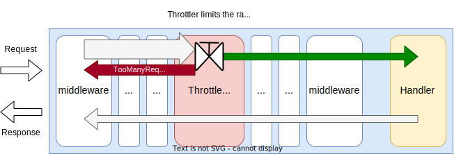
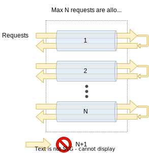
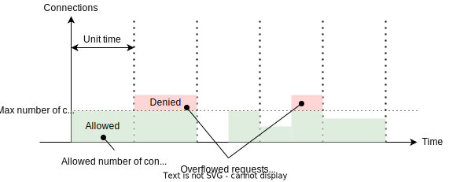
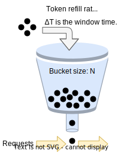
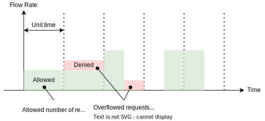
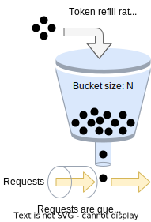
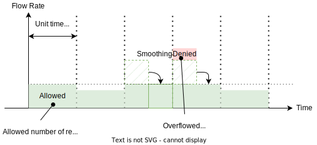
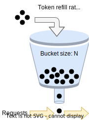
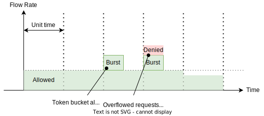

# Throttle Middleware

## Summary

This is the technical document of app/middleware/throttle package that provides ThrottleMiddleware.
ThrottleMiddleware apply rate limiting to incoming HTTP requests.

## Motivation

Restricting HTTP request flow rate is required to protecting upstream services from overloading.

### Goals

- ThrottleMiddleware can apply rate limiting to HTTP requests.
- ThrottleMiddleware can apply method-based and path-based throttling.

### Non-Goals

## Technical Design

### Applying throttling

ThrottleMiddleware

APIThrottler apply

- HTTP Method based throttling
- URL Path based throttling

### Throttling algorithm

**Max Connections** algorithm restricts the maximum number of connections at a time.
Following images shows the overview of rate limiting with max connections algorithm.
Requests that exceeds the limit can be retried when configured.

Max connections algorithm allows fixed number of requests at a time.
Requests that exceeds the number won't be proceeded and errors will be returned.

**Fixed Window** algorithm allows the fixed number of requests during fixed time window.
Following images show the overview of rate limiting with fixed window algorithm.
Requests that exceeds the limit are denied and error responses will be returned.

Only a fixed number of requests are allowed during the window when using the Fixed Window algorithm.

**Leaky Bucket** algorithm smooth the flow rate of the requests.
See [Leaky bucket - Wikipedia](https://en.wikipedia.org/wiki/Leaky_bucket).
Following image shows the overview of rate limiting with leaky bucket algorithm.

- `N` tokens will be refilled every window interval.
- Tokens are stored in a bucket with size `N`.
- Tokens are consumed when proceeding the requests.
- Requests that could not obtain tokens will be retried.
- Requests that could not obtain tokens even after tries will be denied and errors will be returned.

**Token Bucket** algorithm is a burst-able rate limiting algorithm.
See [Token bucket - Wikipedia](https://en.wikipedia.org/wiki/Token_bucket).
Following images show the overview of rate limiting with token bucket algorithm.

- `n` tokens will be refilled every fixed time interval.
- Tokens are stored in a bucket with size `N`. Tokens exceeds `N` will be discarded.
- Tokens are consumed when proceeding the requests.
- Requests that could not obtain tokens will be denied and errors will be returned.

Token Bucket algorithm is burst-able.
It means requests more than the bucket size `N` will be proceeded during the interval.

## Test Plan

### Unit Tests

Unit tests are implemented and passed.

- All functions and methods are covered.
- Coverage objective 98%.

### Integration Tests

Integration tests are implemented with these aspects.

- ThrottleMiddleware works as middleware.
- ThrottleMiddleware works with input configuration.
- ThrottleMiddleware applies throttling to HTTP requests.
- Throttling can be applied with method-based and path-based.

### e2e Tests

e2e tests are implemented with these aspects.

- ThrottleMiddleware works as middleware.
- ThrottleMiddleware works with input configuration.
- ThrottleMiddleware applies throttling to HTTP requests.
- Throttling can be applied with method-based and path-based.

### Fuzz Tests

Not planned.

### Benchmark Tests

Not planned.

### Chaos Tests

Not planned.

## Future works

- [ ] Add global throttling.
- [ ] Client identified throttling (User-based throttling).

## References

None.
