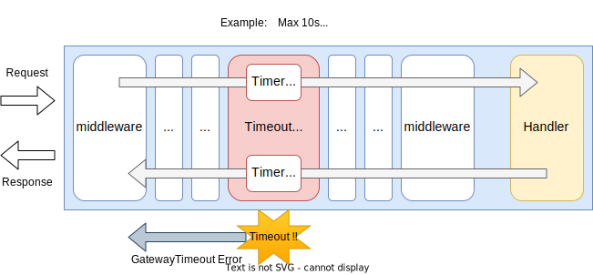

# Timeout Middleware

## Summary

This is the design document of app/middleware/timeout package that provides TimeoutMiddleware resource.
TimeoutMiddleware apply timeout for incoming requests.

## Motivation

API requests taking longer time than expected can consume memory and cpu resource.
It can lower the overall performance of AILERON Gateway.
It is one of the most basic measurements for API gateways to apply timeouts to API requests from the stand point of robustness and protecting upstream services.

### Goals

- TimeoutMiddleware apply timeouts for API requests.
- Timeout can be applied at least URL path basis.

### Non-Goals

- Header and other information based timeouts.

## Technical Design

### Applying timeout

TimeoutMiddleware should be able to apply timeout to incoming requests with URL path basis.
This figure shows how the TimeoutMiddleware works in the AILERON Gateway.

As the figure shows, TImeout return a HTTP error response such a GatewayTimeout error when timeout occurs.



TimeoutMiddleware implements `core.Middleware` interface to work as middleware.

```go
type Middleware interface {
  Middleware(http.Handler) http.Handler
}
```

### Request matching

Timeout middleware supports path matching and method matching when applying timeouts.

- **Method matching**
    - Apply timeouts based on HTTP method such as GET or POST.
- **Path matching**
    - Apply timeout based on URL path with *prefix matching*.
    - Apply timeout based on URL path with *regular expression matching*.

Other matching algorithms can be added in any time in the future.

## Test Plan

Unit tests are implemented and passed.

- All functions and methods are covered.
- Coverage objective 98%.

### Integration Tests

Integration tests are implemented with these aspects.

- TimeoutMiddleware works as middleware.
- TimeoutMiddleware works with input configuration.
- Timeout are applied to right target APIs with URL path basis.
- Appropriate error, or GatewayError, returned when timeout occurred.

### e2e Tests

e2e tests are implemented with these aspects.

- TimeoutMiddleware works with input configuration.
- Timeout are applied to right target APIs with URL path basis.
- Appropriate error, or GatewayError, returned when timeout occurred.

### Fuzz Tests

Not planned.

### Benchmark Tests

Not planned.

### Chaos Tests

Not planned.

## Future works

None.

## References

None.
