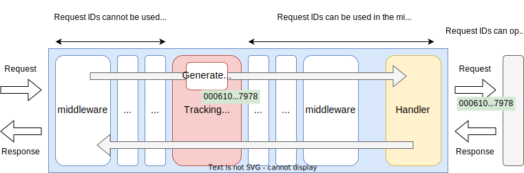
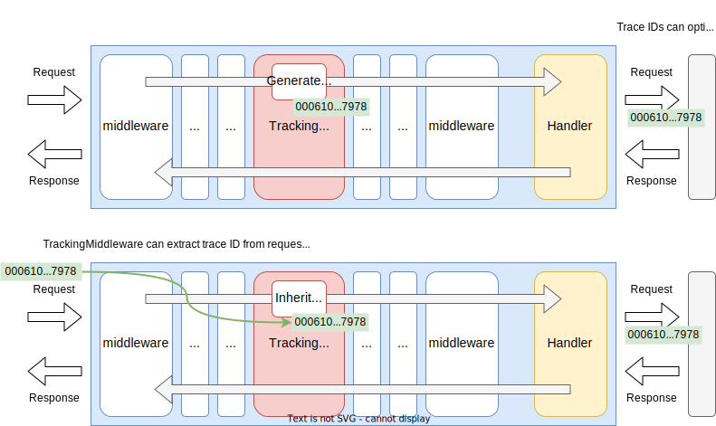

# Tracking Middleware

## Summary

This is the design document of app/middleware/tracking package that provides TrackingMiddleware resource.
TrackingMiddleware adds **Request ID** and/or **Trace ID** for incoming requests.

## Motivation

When multiple logs that are related to a single HTTP requests are output, it can be difficult to identify which logs are bounded to the same request.
Request ID adds an unique ID to requests and it will be an identifier to bound multiple logs to the request.

Trace ID, in contrast to requests IDs, transferred across multiple applications and works like request IDs across them.

### Goals

- TrackingMiddleware generate new request IDs.
- TrackingMiddleware generate new trace IDs.
- TrackingMiddleware inherits trace IDs by extracting from request headers.
- Request IDs and Trace IDs can be transferred to upstream services.

### Non-Goals

## Technical Design

### Request and Trace ID

Request ID is the globally unique request identifier.
A new unique ID is generated and bounded to every requests by the TrackingMiddleware.
The request ID is mainly used to bound logs to its corresponding request.
So. the request IDs are only used with in the application and not transferred to upstream services.
The following image shows how the TrackingMiddleware works for request IDs.
It works as middleware.



Trace ID, on the other hand, is mainly used to identify logs belonging to a certain request across multiple applications.
TrackingMiddleware generate a new trace ID or extract an ID from request and transfer it to upstream services.

This figure shows how the TrackingMiddleware works for trace IDs.



TrackingMiddleware implements `core.Middleware` interface to work as middleware.

```go
type Middleware interface {
  Middleware(http.Handler) http.Handler
}
```

### Using Request/Trace IDs

Request IDs are store in the request context. Trace IDs are not.
Succeeding middleware, tripperware and handlers can use request IDs by
getting them from request contexts.
`uid.ContextWithID` and `uid.IDFromContext` can be used for that purpose.
They follow the basic usage of [https://pkg.go.dev/context](https://pkg.go.dev/context) package
and have the following signature.

```go
func ContextWithID(ctx context.Context, id string) context.Context
```

```go
func IDFromContext(ctx context.Context) string 
```

### ID format

TrackingMiddleware uses IDs created with `uid.NewHostedID`.
It creates 30 bytes ID which consists of the following three parts.
As we can know from the three elements, IDs are sortable by time.

- 8 bytes unix time in microsecond.
- 8 bytes FNV1 hash of the hostname.
- 14 bytes random value read from crypt/rand.

This is an example of ID encoded by Base16 encoder.

`000610b0c3367a7bc8869cf17b54f8ead6e94e80bc7c0a7839af8ed47978`

## Test Plan

Unit tests are implemented and passed.

- All functions and methods are covered.
- Coverage objective 98%.

### Integration Tests

Integration tests are implemented with these aspects.

- TrackingMiddleware works as middleware.
- TrackingMiddleware works with input configuration.
- Request IDs and Trace IDs are generated as expected.
- Trace ID can be inherited from the request header.
- IDs can be transferred to upstream services using http header.

### e2e Tests

e2e tests are implemented with these aspects.

- TrackingMiddleware works as middleware.
- TrackingMiddleware works with input configuration.
- Request IDs and Trace IDs are generated as expected.
- Trace ID can be inherited from the request header.
- IDs can be transferred to upstream services using http header.

### Fuzz Tests

Not planned.

### Benchmark Tests

Not planned.

### Chaos Tests

Not planned.

## Future works

Not planned.

## References

None.
