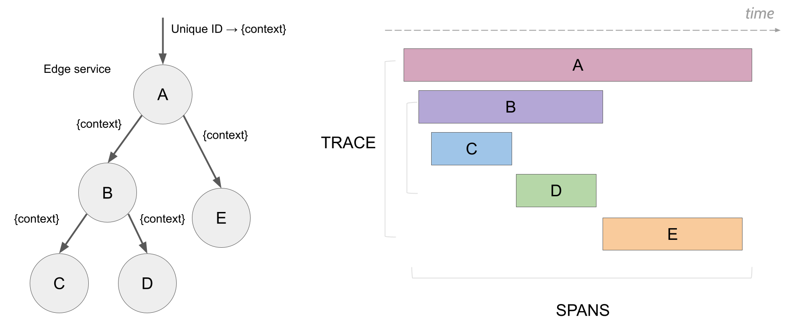
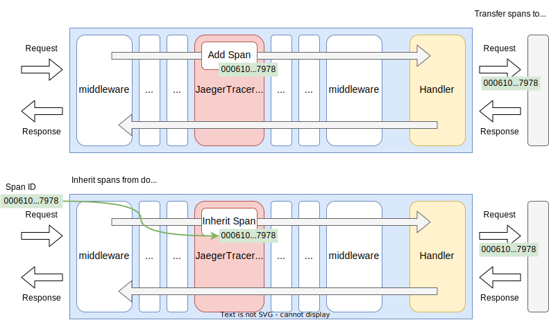
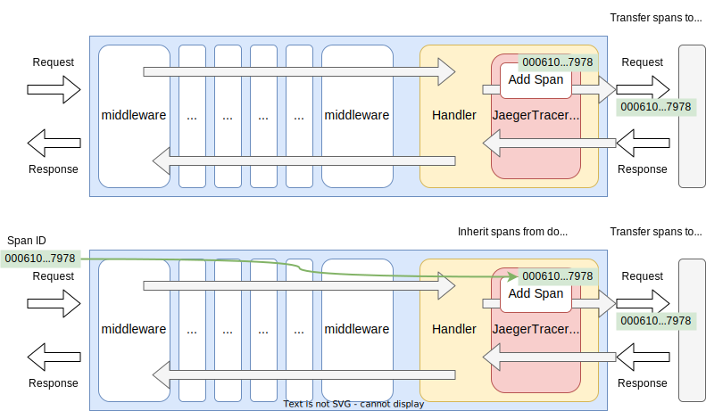

# Jaeger Tracer

## Summary

This is the design document of app/tracer/jaegertracer package which provides JaegerTracer resource.
JaegerTracer leverages [Jaeger](https://www.jaegertracing.io/) and make tracing available in the AILERON Gateway.

## Motivation

Tracing is one one of the important telemetry data of three mentioned in [OpenTelemetry Documentation](https://opentelemetry.io/docs/).
As a distributed tracing product, Jaeger is registered as a [CNCF Graduated](https://www.cncf.io/projects/) project.
Even [OpenTelemetry](https://opentelemetry.io/) has been emerged, there are many projects that leverage Jaeger.
AILERON Gateway also leverages Jaeger to provides deeper visibilities of the application to help debugging and monitoring.

### Goals

- JaegerTracer make tracing available.

### Non-Goals

## Technical Design

### Add/Inherit Tracing Spans

JaegerTracer adds new spans with/without inheriting parent spans.
The concepts of spans and jaeger architecture is described at [Architecture](https://www.jaegertracing.io/docs/1.58/architecture/).

This image describes hierarchical structure of spans (Image cited from [Architecture](https://www.jaegertracing.io/docs/1.58/architecture/)).



JaegerTracer implements both `core.Middleware` and `core.Tripperware` interfaces.
So, it can work as middleware and tripperware.

This figure shows how the JaegerTracer works in the gateway as middleware.
JaegerTracer generate a new tracing spans.
When a parent span were found in the request header, JaegerTracer inherits it and set it as the parent span.



`core.Middleware` interface is defined as this.

```go
type Middleware interface {
  Middleware(http.Handler) http.Handler
}
```

This figure shows how the JaegerTracer works in the gateway as tripperware.



`core.Tripperware` interface is defined as this.

```go
type Tripperware interface {
  Tripperware(http.RoundTripper) http.RoundTripper
}
```

### Using Tracer elsewhere

To make the JaegerTracer re-usable, it implements `app.Tracer` interface which is defined as below.
Call the method with span name and additional tags to generate a new spans.
Callers must update their context with the returned context which contains span info.
The returned function which finishes a span also have to be called once the span finished.

```go
type Tracer interface {
  Trace(ctx context.Context, name string, tags map[string]string) (context.Context, func())
}
```

### Tags

Spans can have [Tags](https://www.jaegertracing.io/docs/1.58/architecture/), or Attributes in [OpenTelemetry](https://opentelemetry.io/).

AILERON Gateway adds following tags only to the root spans.
These tags are added in both middleware and tripperware.
Tags may be changed in the future depending on necessity.

- `caller.file`: Caller's file name who created the span.
- `caller.func`: Caller's function name who created the span.
- `http.id`: Request ID if exists.
- `http.schema`: HTTP schema. `http` or `https`.
- `http.method`: HTTP method such as GET, POST or HEAD.
- `http.path`: URL path string.
- `http.query`: Raw URL query string.
- `net.addr`: Remote address.
- `net.host`: Host name used for connection.
- `http.header.<HEADER_NAME>`: HTTP header values specified by configuration.
- `http.status_code`: HTTP response status.

## Test Plan

### Unit Tests

Unit tests are implemented and passed.

- All functions and methods are covered.
- Coverage objective 98%.

### Integration Tests

Integration tests are implemented with these aspects.

- JaegerTracer works as middleware.
- JaegerTracer works as tripperware.
- JaegerTracer works with configuration files.
- JaegerTracer inherits trace spans from clients.
- JaegerTracer propagates trace spans to upstream services.

### e2e Tests

e2e tests are implemented with these aspects.

- JaegerTracer works as middleware.
- JaegerTracer works as tripperware.
- JaegerTracer works with configuration files.
- JaegerTracer inherits trace spans from clients.
- JaegerTracer propagates trace spans to upstream services.

### Fuzz Tests

Not planned.

### Benchmark Tests

Not planned.

### Chaos Tests

Not planned.

## Future works

None.

## References

- [Jaeger](https://www.jaegertracing.io/)
- [github.com/uber/jaeger-client-go](github.com/uber/jaeger-client-go)
