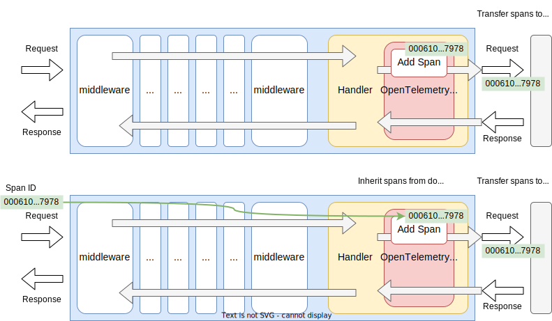

# OpenTelemetry Tracer

## Summary

This is the design document of app/tracer/oteltracer package which provides OpenTelemetryTracer resource.
OpenTelemetryTracer leverages [OpenTelemetry](https://opentelemetry.io/) and makes tracing available in the AILERON Gateway.

## Motivation

Ensuring the observability of a system facilitates the assurance of system health and eases the investigation of failures.
In particular, [OpenTelemetry](https://opentelemetry.io/) is gaining attention as an open-source framework for the generation, processing, and transmission of the telemetry data.
As it offers vendor-agnostic SDKs, APIs, and tools, it is becoming the de facto standard for observability telemetry.
Therefore, enabling tracing that is compatible with OpenTelemetry can meet a significant demand in the field of observability.

### Goals

- Provide tracing feature using OpenTelemetry.

### Non-Goals

- OpenTelemetryTracer does not handle [Span Events](https://opentelemetry.io/docs/concepts/signals/traces/#span-events) and [Span Status](https://opentelemetry.io/docs/concepts/signals/traces/#span-status).

## Technical Design

### Add/Inherit Tracing Spans

OpenTelemetryTracer adds new spans with/without inheriting parent spans.
The concepts of spans and OpenTelemetry architecture is described at [Traces](https://opentelemetry.io/docs/concepts/signals/traces/).

OpenTelemetryTracer implements both `core.Middleware` and `core.Tripperware` interfaces.
So, it can work as middleware and tripperware.

This figure shows how the OpenTelemetryTracer works in the gateway as middleware.
OpenTelemetryTracer generate a new tracing spans.
When a parent span was found in the request header, OpenTelemetryTracer inherits it and set it as the parent span.



`core.Middleware` interface is defined as this.

```go
type Middleware interface {
  Middleware(http.Handler) http.Handler
}
```

This figure shows how the OpenTelemetryTracer works in the gateway as tripperware.



`core.Tripperware` interface is defined as this.

```go
type Tripperware interface {
  Tripperware(http.RoundTripper) http.RoundTripper
}
```

OpenTelemetryTracer also implements `core.Finalizer` interface.
Finalize ensures [Shutdown](https://opentelemetry.io/docs/specs/otel/trace/sdk/#shutdown) will be called before the application exited.
[Shutdown](https://opentelemetry.io/docs/specs/otel/trace/sdk/#shutdown) flushes trace data remaining in the buffer of exporter.

```go
type Finalizer interface {
  Finalize() error
}
```

### Using Tracer elsewhere

To make the OpenTelemetryTracer re-usable, it implements `app.Tracer` interface which is defined as below.
Call the method with span name and additional attributes to generate a new spans.
Callers must update their context with the returned context which contains span info.
The returned function which finishes a span also have to be called once the span finished.

```go
type Tracer interface {
  Trace(ctx context.Context, name string, tags map[string]string) (context.Context, func())
}
```

### Attributes

Spans can have [Attributes](https://opentelemetry.io/docs/concepts/signals/traces/#attributes), or Tags in [Jaeger](https://www.jaegertracing.io/docs/architecture/).

AILERON Gateway adds following tags only to the root spans.
These tags are added in both middleware and tripperware.
Tags may be changed in the future depending on necessity.

- `caller.file`: Caller's file name who created the span.
- `caller.func`: Caller's function name who created the span.
- `http.id`: Request ID if exists.
- `http.schema`: HTTP schema. `http` or `https`.
- `http.method`: HTTP method such as GET, POST or HEAD.
- `http.path`: URL path string.
- `http.query`: Raw URL query string.
- `net.addr`: Remote address.
- `net.host`: Host name used for connection.
- `http.header.<HEADER_NAME>`: HTTP header values specified by configuration.
- `http.status_code`: HTTP response status.

### Context Propagation

In [OpenTelemetry](https://opentelemetry.io/), there is a concept which is called [Context Propagation](https://opentelemetry.io/docs/concepts/context-propagation/).
In AILERON, we support the following six types of Propagators that are compatible with OpenTelemetry.

- [W3C TraceContext](https://www.w3.org/TR/trace-context/)
- [W3C Baggage](https://www.w3.org/TR/baggage/)
- [B3](https://github.com/openzipkin/b3-propagation)
- [Jaeger](https://www.jaegertracing.io/docs/1.18/client-libraries/#propagation-format)
- OpenCensus Binary Format
- OpenTracing

Notes:

In AILERON, [inject](https://opentelemetry.io/docs/specs/otel/context/api-propagators/#inject) is performed only in the first Span in middleware and tripperware.
Therefore, if multiple OpenTelemetryTracer Middlewares or Tripperwares were configured, the parent-child relationship of spans won't be correctly shown on UIs.

## Test Plan

### Unit Tests

- All functions and methods are covered.
- Coverage objective 98%.

### Integration Tests

Integration tests are implemented with these aspects.

- OpenTelemetryTracer works as middleware.
- OpenTelemetryTracer works as tripperware.
- OpenTelemetryTracer works as configuration files.
- OpenTelemetryTracer inherits trace spans from clients.
- OpenTelemetryTracer propagates trace spans to upstream services.

### e2e Tests

e2e tests are implemented with these aspects.

- OpenTelemetryTracer works as middleware.
- OpenTelemetryTracer works as tripperware.
- OpenTelemetryTracer works as configuration files.
- OpenTelemetryTracer inherits trace spans from clients.
- OpenTelemetryTracer propagates trace spans to upstream services.

### Fuzz Tests

Not planned.

### Benchmark Tests

Not planned.

### Chaos Tests

Not planned.

## Future works

Not planned.

## References

- [OpenTelemetry](https://opentelemetry.io/)
- [github.com/open-telemetry/opentelemetry-go](https://github.com/open-telemetry/opentelemetry-go)
