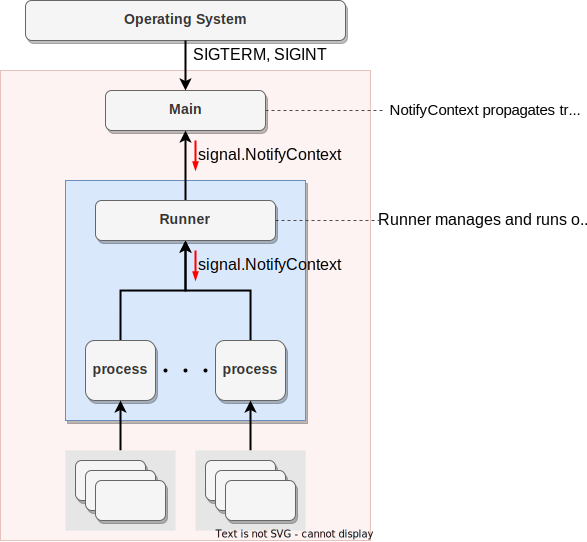
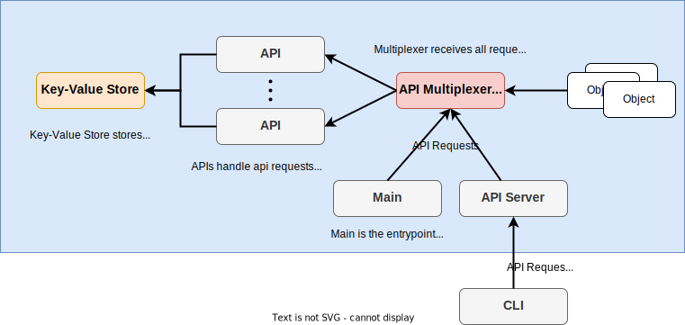
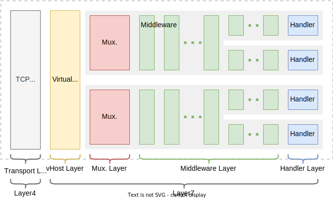
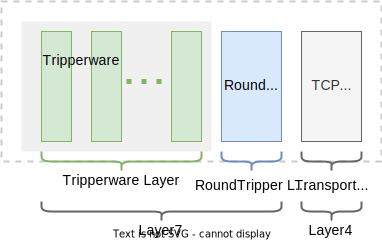

# Architecture

## Process Tree

Processes in the AILERON Gateway have tree structure as shown below.

`Main`, which means `main()` function of [golang](https://go.dev/doc/code), is the entrypoint of the gateway.
Therefore, there always be exactly one `Main` component in a single gateway process.

```go
// Main component corresponds to the main function.
func main(){
    // Start-up the gateway.
}
```

Main component calls `Runner` component.
Runner component is implemented to have a runner interface.
Therefore, the runner can be replaced by any other component with the runner interface.
And the runner component exists exactly one in a single gateway process.

```go
// Runner component corresponds to any objects with Runner interface.
type Runner interface {
  Run(context.Context) error
}
```

`process` components, which does not mean OS processes, are the component that the runner manages.
An example of a process component is single HTTP server.
It means that multiple HTTP servers can be run in a single gateway process.
The definition of the `process` may differ depending on the implementation of runner component.



## API

API is the basic concept of the AILERON Gateway to create, delete, update objects.
This basic concept is strongly inspired by the [Kubernetes Cluster Architecture](https://kubernetes.io/docs/concepts/architecture/).

`object` corresponds to an instance of component of AILERON Gateway such as HTTP Servers or Loggers.
Note that the CLI is not currently available.



`Manifest` is the definition of a single object.
Its concept is also borrowed from the [Objects In Kubernetes](https://kubernetes.io/docs/concepts/overview/working-with-objects/).
All manifests meets the following structure which is very similar to kubernetes manifests.
Object specific configurations are set in **spec**.

```yaml
apiVersion:    <string> API group and version.
kind:          <string> API kind name.
metadata:      <object>
    namespace: <string> Namespace name for logical separation of this instances.
    name:      <string> Name of this instance. Unique in namespace.
spec:          <object> API specific configurations.
status:        <object> Status of this instance. Read-only.
```

**yaml** and **json** format are supported as the manifest.
AILERON Gateway loads the given manifests on start up and create objects.

## Server/Client Architecture

AILERON Gateway uses a typical architecture of HTTP server of GO applications.
There are two major objects, `Middleware` and `Handler`.
`Middleware`, which sometimes called filter or interceptor in other languages, provides intermediate processing for HTTP requests.
`Handler` provides terminate processing for API requests.
All API endpoints are made up with the combination of middleware and handlers.
Middleware can be shared with multiple handlers.
"Mux" or multiplexer dispatches API requests to the right handler.

- Example of middleware
    - Logging
    - Throttling
    - CORS, CSRF
    - Authentication
    - Authorization
- Example of handlers
    - Reverse Proxy
    - File server

Following figure shows the architecture of a HTTP server in AILERON Gateway.
A single http server uses multiple multiplexers to support virtual host.
Mux, middleware and handlers have their unique interface.



HTTP clients consist of two major objects, `Tripperware` and `RoundTripper`.
`Tripperware`, which corresponds to middleware of a server, provides intermediate processing for HTTP clients.
`RoundTripper`, which corresponds to handlers of a server, provides terminate processing for HTTP clients.

- Example of tripperware
    - Logging
    - Retry
- Example of RoundTripper
    - HTTP Client

Following figure shows the architecture of a HTTP client in AILERON Gateway.



## References

- [Cluster Architecture](https://kubernetes.io/docs/concepts/architecture/)
- [Objects In Kubernetes](https://kubernetes.io/docs/concepts/overview/working-with-objects/)
