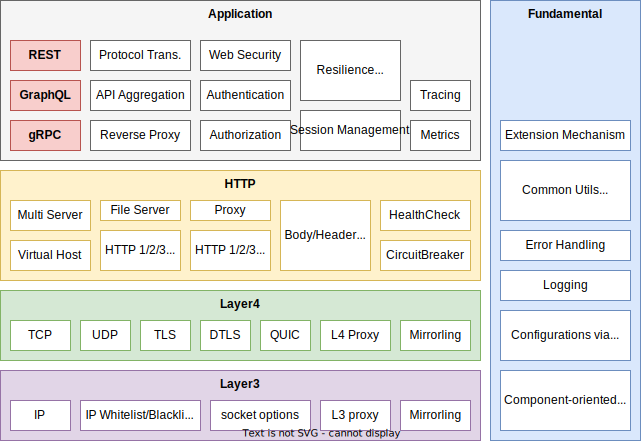
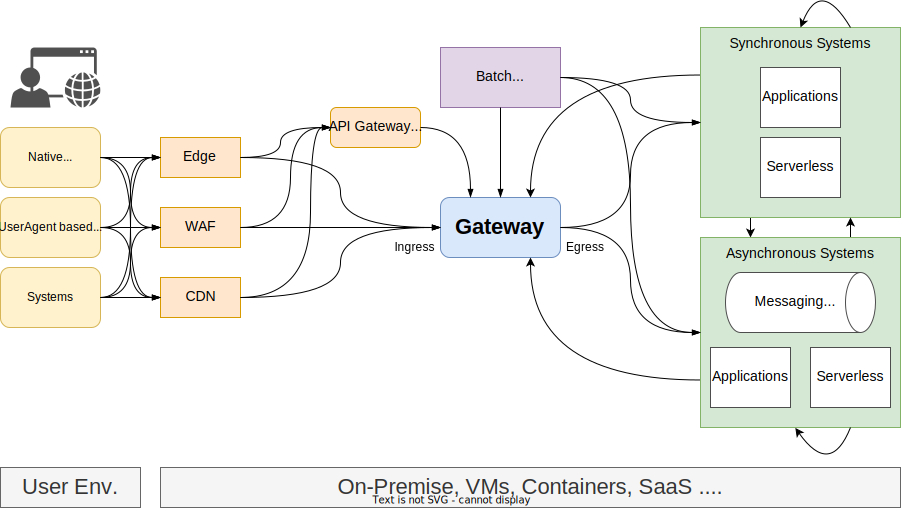

# Concept

## Mission

**Our mission is to build a high-performance, secure, and production-grade API Gateway
without compromising on maintainability and usability.**

## AILERON Gateway Technology Landscape

To achieve our mission, AILERON Gateway leverages wide range of networking, APIs and cloud native technologies.
This landscape show the key technologies and specifications.

Notes: The landscape may be changed in the future. The landscape contains the technologies it has not had yet.

- Networking
    - [TCP](https://en.wikipedia.org/wiki/Transmission_Control_Protocol)
    - [UDP](https://en.wikipedia.org/wiki/User_Datagram_Protocol)
    - [TLS](https://en.wikipedia.org/wiki/Transport_Layer_Security) (or TLS over TCP)
    - [DTLS](https://en.wikipedia.org/wiki/Datagram_Transport_Layer_Security) (or TLS over UDP)
    - [QUIC](https://en.wikipedia.org/wiki/QUIC)
    - [HTTP 1.1/2/3](https://en.wikipedia.org/wiki/HTTP)
- APIs
    - [REST](https://en.wikipedia.org/wiki/REST)
    - [GraphQL](https://graphql.org/)
    - [gRPC](https://grpc.io/)
- Security
    - WebSecurity (Header-related security, CORS, CSRF)
    - Authentication ([OAuth2](https://oauth.net/2/), [OpenID Connect](https://openid.net/))
    - Authorization ([OPA](https://www.openpolicyagent.org/), [Casbin](https://casbin.org/))
- CloudNative
    - Logging (Stdout, Stderr, File, ...)
    - Metrics ([Prometheus](https://prometheus.io/), [OpenTelemetry](https://opentelemetry.io/))
    - Tracing ([Jaeger](https://www.jaegertracing.io/), [Zipkin](https://zipkin.io/), [OpenTelemetry](https://opentelemetry.io/))

## Reference Architecture

AILERON Gateway consider the following architecture as the environment where the it works.

- Ingress
    - can be called from edge computers.
    - can be called from batch applications.
        - may be take longer than the normal API call
        - may require special considerations for authn/authz
    - can come through WAF
    - can come through CDN
        - cache should be considered
    - can come from other gateways
    - can come from MPAs and SPAs, or native apps
    - can come from user-agent based apps (e.g. browser apps) and non user-agent based apps
- Egress
    - can go to synchronous upstream applications
    - can go to asynchronous upstream applications
    - can go to serverless applications
- Run on
    - On-Premise
    - Virtual Machines
    - Containers

## Design Principals

5 design principals are defined to achieve consistent growth.

- **Simple and Clear Architecture**: Architecture must be simple that all uses and developers can understand with lesser time.
- **Highly Customizable and Extensible**: AILERON Gateway must be extensible as much as possible to cover wider use cases.
- **Production Grade**: All features must be well tested and be robust to reduce unexpected error on runtime.
- **Secure**: Security is prior to anything else.

## Implement Directions

5 implement directions are defined to give directions to developers when writing programs.

- **Highly Customizable**: All features should be configurable as much as possible.
- **Usability First**: Think how the features are used. Make configuration intuitive.
- **Secure by Default**: Features should work secure by default.
- **Minimize Requirement**: Reduce the number of required configurations.
- **Highly Decoupled**: Decouple the components and connect them using interfaces.

## References

- [Principles of Container-based Application Design](https://kubernetes.io/blog/2018/03/principles-of-container-app-design/)
