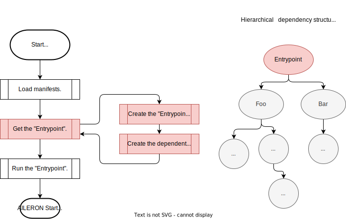

# Package `core/entrypoint` for `Entrypoint`

## Summary

This is the design document of core/entrypoint package which provides `Entrypoint` resource.
Entrypoint is the unique resource that is used as an entrypoint of AILERON Gateway.
Entrypoint will be called on start up time of the gateway.

## Motivation

AILERON Gateway uses de-coupled component oriented architecture.
It means that the AILERON Gateway needs information about what resource should run at first.
Entrypoint resource is the resource that always be run at first on start up.

### Goals

- Define entrypoint which will be run first on start up time.

### Non-Goals

## Technical Design

### Start-up process

AILERON Gateway gets the `Entrypoint` as the resource to run at first.
Entrypoint resource implement the Runner interface.

This figure show the brief overview of the start up process of the AILERON Gateway.
It describe that the Entrypoint resource



Entrypoints implements `core.Runner` interface.

```go
type Runner interface {
  Run(context.Context) error
}
```

### ChannelGroup and WaitGroup

ChannelGroup and WaitGroup manages multiple runners.
They are included in the Entrypoint resource.
They differs in how they behave when the child runners exited.

**ChanelGroup** runs multiple runners in new goroutine.
The following image represents the concept of ChannelGroup.
It exits when **ONE** of the child runners failed or exited.



`Runner` in the figure means that they all implement the Runner interface.
It is the same interface that the Entrypoint implements.

```go
type Runner interface {
  Run(context.Context) error
}
```

Child runners notify the result of processing, **error** or **nil**, to the parent ChannelGroup via channels.
ChannelGroup exits when one of the child runners exited as shown below.

**WaitGroup** runs multiple runners in new goroutine.
The following image represents the concept of WaitGroup.
It exits when **ALL** of the child runners failed or exited.
It leverages [sync.WaitGroup](https://pkg.go.dev/sync#WaitGroup).


`Runner` in the figure means that they all implement the Runner interface.

```go
type Runner interface {
  Run(context.Context) error
}
```

## Test Plan

### Unit Tests

Unit tests are implemented and passed.

- All functions and methods are covered.
- Coverage objective 98%.

### Integration Tests

Integration tests are implemented with these aspects.

- Entrypoint works with input configuration.
- ChannelGroup exit when one of the child runner exited.
- WaitGroup exit when all of the child runner exited.

### e2e Tests

e2e tests are implemented with these aspects.

- Entrypoint works with input configuration.
- ChannelGroup exit when one of the child runner exited.
- WaitGroup exit when all of the child runner exited.

### Fuzz Tests

Not planned.

### Benchmark Tests

Not planned.

### Chaos Tests

Not planned.

## Future works

Not planned.

## References

None.
