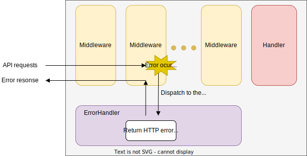
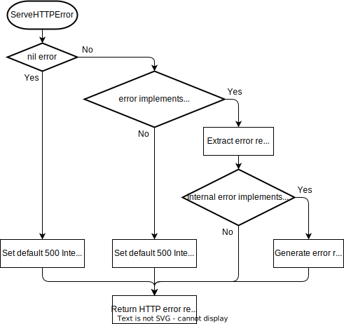

# Package `core/errhandler` for `ErrorHandler`

## Summary

This is the design document of ErrorHandler resource.
ErrorHandler handles errors occurred in the gateway and return HTTP error response to clients.

## Motivation

HTTP error responses are one of the most important concerns for API servers.
In some cases, it will be required to modify error response with configurations.
ErrorHandler will be made to make it possible.

### Goals

- ErrorHandler handles errors and return HTTP error responses to clients.
- HTTP error response can be modified with configuration.

### Non-Goals

## Technical Design

### Handling error

ErrorHandler handles errors occurred in middleware, handlers, tripperware and round trippers and return HTTP error to clients.
The content of the error response can be modified with the configuration.



ErrorHandler implements the `core.ErrorHandler` interface.
It means that the ErrorHandler can be replaced with the resource that implements the interface.

```go
type ErrorHandler interface {
  ServeHTTPError(http.ResponseWriter, *http.Request, error)
}
```

### Default ErrorHandler

An ErrorHandler used by default is defined for convenience.
It proceeds the given error with the following steps.
Where, ErrorResponse and ErrorKind indicates the interface defined the later.



HTTPError interface provides the HTTP error response information of status code, content type and the body content.
It can wrap an error which should be obtained with Unwrap() method.

```go
type HTTPError interface {
  error
  Unwrap() error
  StatusCode() int
  Header() http.Header
  Content(accept string) (string, []byte)
}
```

```go
type ErrorKind interface {
  Code() string
  Kind() string
}
```

## Test Plan

### Unit Tests

Unit tests are implemented and passed.

- All functions and methods are covered.
- Coverage objective 98%.

### Integration Tests

Integration tests are implemented with these aspects.

- ErrorHandler can handle error and return HTTP error response.
- Error response will be returned when HTTPError was passed to the handler.
- Code and Kind obtained from ErrorKInd will be used in the error response.

### e2e Tests

e2e tests are implemented with these aspects.

- ErrorHandler can handle error and return HTTP error response.
- Error response will be returned when HTTPError was passed to the handler.
- Code and Kind obtained from ErrorKInd will be used in the error response.

### Fuzz Tests

Not planned.

### Benchmark Tests

Not planned.

### Chaos Tests

Not planned.

## Future works

None.

## References

None.
