# Package `core/httpclient` for `HTTPClient`

## Summary

This is the design document of `core/client` package

This package provides `HTTPClient` resource.
HTTPClient is the resource that works as HTTP client.

## Motivation

HTTP clients are used for connecting to other services over HTTP.
For example, reverse proxy uses it for proxy requests and redis client uses it for connecting to redis.
HTTP clients, in many cases, have some networking related parameters and manage connections.
Even clients are used in variety of resources, it is reasonable to share their underlying TCP connections
from the stand point view of resource consumption and management.

### Goals

- Provides http client.
- Provide ability to retry requests in generalized style.

### Non-Goals

- Implement a HTTP client from scratch.
- Tuning parameters of clients.
- Provide a HTTP client for specific use cases.

## Technical Design

### HTTP Clients

HTTP clients support the following protocols.
Available configurations are basically follows their specifications.

- HTTP 1.1 (Using [http.Transport](https://pkg.go.dev/net/http#Transport))
- HTTP 2 (Using [http2.Transport](https://pkg.go.dev/golang.org/x/net/http2#Transport))
- HTTP 3 (Using [http3.RoundTripper](https://pkg.go.dev/github.com/quic-go/quic-go/http3#RoundTripper))

In terms of network resiliency, clients have the following feature.

- Timeout:
    - Timeouts are provided by each clients listed above.
- Retry:
    - Retry requests when `0 <= Content-Length <= ${maxLength}`.
    - Retry requests when response status is in configured retry status.
    - Do not check the http method of the target request.
    - Do not check any http header value of the target request including `Idempotency-Key`, `X-Idempotency-Key`.
        - Reference [http.Request.isReplayable()](https://cs.opensource.google/go/go/+/refs/tags/go1.23.1:src/net/http/request.go;l=1543).

HTTPClient exposes the [http.RoundTripper](https://pkg.go.dev/net/http#RoundTripper) interface.

```go
type RoundTripper interface {
  RoundTrip(*http.Request) (*http.Response, error)
}
```

### RoundTripper and Tripperware

This figure shows the overall structure of a HTTPClient.
HTTPClient consists of two types of component, `Tripperware` and `RoundTripper`.
Tripperware provides pre processing before requests reaches to the RoundTripper.



RoundTripper interface is defined as follows and available at [http.RoundTripper](https://pkg.go.dev/net/http#RoundTripper).

```go
type RoundTripper interface {
  RoundTrip(*http.Request) (*http.Response, error)
}
```

Tripperware, or client middleware, have the following interface.

```go
type Tripperware interface {
  Tripperware(http.RoundTripper) http.RoundTripper
}
```

## Test Plan

### Unit Tests

Unit tests are implemented and passed.

- All functions and methods are covered.
- Coverage objective 98%.

### Integration Tests

Integration tests are implemented with these aspects.

- HTTPClient works as a RoundTripper.
- HTTPClient works with input configuration.
- HTTPClient can send HTTP requests.
- HTTPClient can apply retries.

### e2e Tests

e2e tests are implemented with these aspects.

- HTTPClient works as a RoundTripper.
- HTTPClient works with input configuration.
- HTTPClient can send HTTP requests.
- HTTPClient can apply retries.

### Fuzz Tests

Not planned.

### Benchmark Tests

Not planned.

### Chaos Tests

Not planned.

## Future works

None.

## References

- [http.Transport](https://pkg.go.dev/net/http#Transport)
- [http2.Transport](https://pkg.go.dev/golang.org/x/net/http2#Transport)
- [http3.RoundTripper](https://pkg.go.dev/github.com/quic-go/quic-go/http3#RoundTripper)
