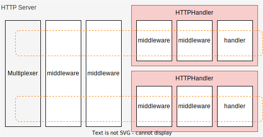

# Package `core/httphandler` for `HTTPHandler`

## Summary

This is the design document of core/httphandler package which provides HTTPHandler resource.
HTTPHandler aggregate the set of middleware a handler.
It makes a HTTP server to have multiple routes of middleware sets.

## Motivation

Middleware chain is the basic concept in API server implemented by Golang.
[justinas/alice](https://pkg.go.dev/github.com/justinas/alice) is one candidate to create middleware chains.
[go-chi](https://go-chi.io/#/) and the most of server framework of golang adopt that concept.

While middleware chain is an basic concept of an api server, it can not have multiple branches.
This will be a kind of problem for AILERON Gateway from its underlying architecture in the point of that users ought to write many configurations.
HTTPHandler reduce the problem buy making it possible to branch out middleware chains.

### Goals

- HTTPHandler aggregate multiple middleware and a handler.
- Middleware chains can be branched out using HTTPHandler.

### Non-Goals

## Technical Design

### Aggregating middleware and handler

In golang standard API server, middleware can not be configured to have branches.
Middleware chain cannot be branch out like shown in the figure below.
HTTPHandler resource make it possible by aggregating multiple middleware and single handler.



HTTPHandler implements [http.Handler](https://pkg.go.dev/net/http#Handler) interface itself
as the result of aggregating multiple middleware and a handler.

```go
type Handler interface {
  ServeHTTP(ResponseWriter, *Request)
}
```

and the aggregated middleware must implements `core.Middleware` interface.

```go
type Middleware interface {
  Middleware(http.Handler) http.Handler
}
```

## Test Plan

### Unit Tests

Unit tests are implemented and passed.

- All functions and methods are covered.
- Coverage objective 98%.

### Integration Tests

Integration tests are implemented with these aspects.

- HTTPHandler works as a http handler.
- HTTPHandler works with input configuration.
- HTTPHandler aggregate middleware with given order and handlers.

### e2e Tests

e2e tests are implemented with these aspects.

- HTTPHandler works as a http handler.
- HTTPHandler works with input configuration.
- HTTPHandler aggregate middleware with given order and handlers.

### Fuzz Tests

Not planned.

### Benchmark Tests

Not planned.

### Chaos Tests

Not planned.

## Future works

None.

## References

None.
