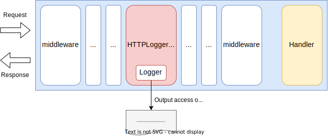
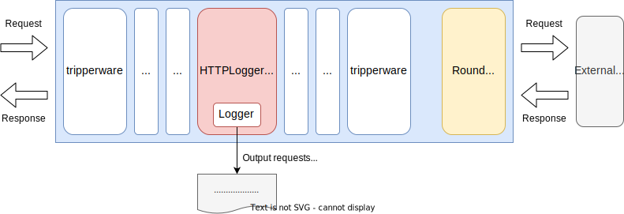

# Package `core/httplogger` for `HTTPLogger`

## Summary

This is the design document of core/httplogger package which provides HTTPLogger resource.
HTTPLogger logs request and response logs.

## Motivation

Request and response logs are required in most of the project to record accesses.
They can be used for recording, auditing and more.

### Goals

- HTTPLogger output request and response logs.
- HTTPLogger can log both server side and client side requests.

### Non-Goals

## Technical Design

### Logging middleware and tripperware

HTTPLogger collect requests and response information for log output.
It works as **middleware** and **tripperware**.
It means that the HTTPLogger implements both `core.Middleware` interface and `cor.Tripperware` interfaces.

```go
type Middleware interface {
  Middleware(http.Handler) http.Handler
}
```

```go
type Tripperware interface {
  Tripperware(http.RoundTripper) http.RoundTripper
}
```

These figures show how HTTPLogger works in the gateway as middleware and tripperware.

HTTPLogger works as middleware when doing server side logging.



HTTPLogger works as tripperware when doing client side logging.



HTTPLogger is only responsible for collecting requests and response information.
Output logs are responsible of loggers which the HTTPLoggers use internally.

### Log fields

Available log fields are listed in the table.
Request and response bodies are available for journal log only.

| key                  | value type      | value example | description              | journal only |
| -------------------- | --------------- | ------------- | ------------------------ | ------------ |
| method               | string          | GET           | HTTP method              |              |
| path                 | string          | /foo/bar      | URL path                 |              |
| query                | string          | foo=bar       | URL query                |              |
| duration             | number          | 123.456       | Duration in nanoseconds  |              |
| \[request.\] host    | string          | example.com   | Host name od host header |              |
| \[request.\] remote  | string          | 172.24.0.1    | Remote address           |              |
| \[request.\] size    | number          | 1024          | Requested content size   |              |
| \[request.\] header  | object (or map) | {"foo":"bar"} | Request headers          |              |
| \[request.\] body    | string          | foobar        | Request body             | yes          |
| \[response.\] status | number          | 200           | Response status code     |              |
| \[response.\] size   | number          | 1024          | Response content size    |              |
| \[response.\] header | object (or map) | {"foo":"bar"} | Response headers         |              |
| \[response.\] body   | string          | foobar        | Response body            | yes          |

Request and response bodies are not output for all content type from the stand point view of robustness.
Target [media types](https://www.iana.org/assignments/media-types/media-types.xhtml) should explicitly be indicated with configuration.
Maximum content size to output bodies should be set with configuration because the HTTPLogger load entire body on memory.
And, at least base64 encoding should be available for binary bodies.

## Test Plan

### Unit Tests

Unit tests are implemented and passed.

- All functions and methods are covered.
- Coverage objective 98%.

### Integration Tests

Integration tests are implemented with these aspects.

- HTTPLogger works as both middleware and tripperware.
- Access logging works and key-values are output as expected.
- Journal logging works and key-values are output as expected.

### e2e Tests

e2e tests are implemented with these aspects.

- Access logging works and key-values are output as expected.
- Journal logging works and key-values are output as expected.
- Logging works for WebSocket requests and responses.
- Logging works for chunked requests and responses.

### Fuzz Tests

Not planned.

### Benchmark Tests

Not planned.

### Chaos Tests

Not planned.

## Future works

None.

## References

- [Media Types - IANA](https://www.iana.org/assignments/media-types/media-types.xhtml)
- [OpenTelemetry Logging](https://opentelemetry.io/docs/specs/otel/logs/)
