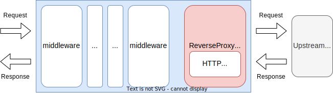
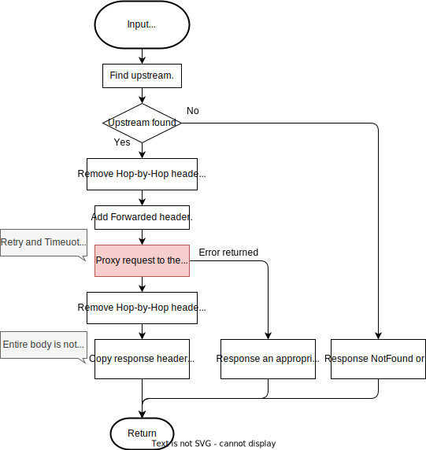
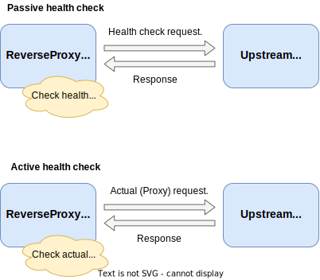
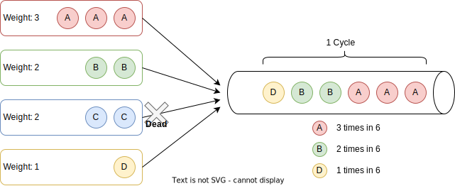
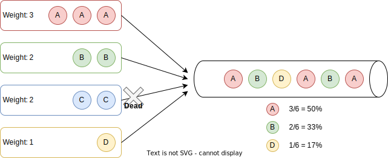

# Package `core/httpproxy` for `ReverseProxyHandler`

## Summary

This is the design document of core/httpproxy package which provides `ReverseProxyHandler` resource.
`ReverseProxyHandler` works as a HTTP reverse proxy.
It is one of the most basic features of API gateways.

## Motivation

Reverse proxy is required to work as an API gateway.

### Goals

- HTTPProxy proxy requests to upstream services.
- HTTPProxy can do load balancing.
- HTTPProxy can do upstream health checking.

### Non-Goals

## Technical Design

### Proxy requests

ReverseProxyHandler works as a reverse proxy as shown in the figure below.
ReverseProxyHandler use default HTTP client if not configured with configuration file.
It can use HTTPClient resource as client to send HTTP requests tp upstream services.
If some HTTP client parameters are required to be tuned, users should use the HTTPClient instead of the default client.



ReverseProxyHandler implements [http.Handler](https://pkg.go.dev/net/http#Handler) interface.

```go
type Handler interface {
  ServeHTTP(ResponseWriter, *Request)
}
```

Basic workflow of the ReverseProxyHandler will be



The proxy uses path matching to determine the corresponding upstream.
Available matching methods are listed in the table.
Not only checking matches, but the proxy can rewrite the path.
Check matching and rewriting paths follow the these steps.
You can check matching and rewriting on the Go Playground from the url in the table.

1. Remove prefix if necessary (Use trimPrefix parameter).
2. Check if the path matches to the pattern.
3. Rewrite the path (Only Regex and RegexPOSIX can rewrite the path).
4. Add prefix if necessary (Use appendPrefix parameter).

| Match type | Used method                                                   | Try on Go Playground                                                   |
| ---------- | ------------------------------------------------------------- | ---------------------------------------------------------------------- |
| Exact      | ==                                                            | [https://go.dev/play/p/s_JkTVtRdoN](https://go.dev/play/p/s_JkTVtRdoN) |
| Prefix     | [strings#HasPrefix](https://pkg.go.dev/strings#HasPrefix)     | [https://go.dev/play/p/TnmURQCw-xP](https://go.dev/play/p/TnmURQCw-xP) |
| Suffix     | [strings#HasSuffix](https://pkg.go.dev/strings#HasSuffix)     | [https://go.dev/play/p/nWuL138MOb-](https://go.dev/play/p/nWuL138MOb-) |
| Contains   | [strings#Contains](https://pkg.go.dev/strings#Contains)       | [https://go.dev/play/p/noY55ctREbJ](https://go.dev/play/p/noY55ctREbJ) |
| Path       | [path#Match](https://pkg.go.dev/path#Match)                   | [https://go.dev/play/p/Qv0TNV0e7oc](https://go.dev/play/p/Qv0TNV0e7oc) |
| FilePath   | [filepath#Match](https://pkg.go.dev/path/filepath#Match)      | [https://go.dev/play/p/TUh9XznQZ_c](https://go.dev/play/p/TUh9XznQZ_c) |
| Regex      | [regexp#Regexp.Match](https://pkg.go.dev/regexp#Regexp.Match) | [https://go.dev/play/p/gZxOZ5giu4-](https://go.dev/play/p/gZxOZ5giu4-) |
| RegexPOSIX | [regexp#Regexp.Match](https://pkg.go.dev/regexp#Regexp.Match) | [https://go.dev/play/p/5LrD7yyNwPp](https://go.dev/play/p/5LrD7yyNwPp) |

ReverseProxyHandler modify the request UTL with the configured upstream URL.
And the proxy request to the upstream services uses calculated URL.
Following table shows the operation for each [URL](https://pkg.go.dev/net/url#URL) components.
Note that the `Path` will be calculated for the requested URL and the configured path is ignored.
`Fragment` is overwritten only when configured.

| Component | Operation            | Requested URL  | Configured URL  | Resulting Proxy URL |
| --------- | -------------------- | -------------- | --------------- | ------------------- |
| Schema    | Overwrite            | https          | http            | `Overwrite` http    |
| Host      | Overwrite            | in.example.com | out.example.com | out.example.com     |
| Path      | Calculate by matcher | /api/v1/users  | /no/meanings    | /api/v1/users       |
| Query     | Joined               | foo=bar        | alice=bob       | foo=bar&alice=bob   |
| Fragment  | As-Is or Overwrite   | #alice         | #bob            | #bob                |

### HTTP header manipulation

HTTP headers should be appropriately handled when working as a proxy.
ReverseProxyHandler manipulate **Hop-by-Hop** headers  and **Forwarded** headers.

Hop-by-Hop header should be removed when proxying requests.
Headers to be removed are described in [RFC 7230](https://datatracker.ietf.org/doc/rfc7230/) and [RFC 2616](https://datatracker.ietf.org/doc/rfc2616/).
One of the reference implementations would be [httputil/reverseproxy.go](https://go.dev/src/net/http/httputil/reverseproxy.go).

AILERON Gateway removes following headers from requests to be proxied.

- `Connection`
- `Keep-Alive`
- `Proxy-Connection`
- `Proxy-Authenticate`
- `Proxy-Authorization`
- `Te`
- `Trailer`
- `Transfer-Encoding`
- `Upgrade`
- Headers listed in `Connection`

[Forwarded](https://developer.mozilla.org/en-US/docs/Web/HTTP/Headers/Forwarded) related headers are added to the proxy headers.
[X-Forwarded-For](https://developer.mozilla.org/en-US/docs/Web/HTTP/Headers/X-Forwarded-For), [X-Forwarded-Host](https://developer.mozilla.org/en-US/docs/Web/HTTP/Headers/X-Forwarded-Host), X-Forwarded-Port and [X-Forwarded-Proto](https://developer.mozilla.org/en-US/docs/Web/HTTP/Headers/X-Forwarded-Proto) are added.
But [Forwarded](https://developer.mozilla.org/en-US/docs/Web/HTTP/Headers/Forwarded) header is not added itself.
This is because the `X-Forwarded-*` header is more generally used than `Forwarded` itself.

Following table shows the forwarded headers and the example values.

| Header            | Added | Prior values | Value                 | Example                  |
| ----------------- | ----- | ------------ | --------------------- | ------------------------ |
| X-Forwarded-For   | Yes   | Keep         | Client IP address     | `192.167.0.1, 127.0.0.1` |
| X-Forwarded-Port  | Yes   | Discard      | Client port number    | `12345`                  |
| X-Forwarded-Host  | Yes   | Discard      | Requested host name   | `example.com`            |
| X-Forwarded-Proto | Yes   | Discard      | Requested scheme      | `http` or `https`        |
| Forwarded         | No    | -            | All of above          | -                        |

### Health check

ReverseProxyHandler supports **active health check** and **passive health check**.
Active health check sends health check requests to upstream services with fixed time interval.
Passive health check checks the response status of the actual proxy requests.



### Load balancing

The ReverseProxyHandler supports following load balancing algorithm.
`Direct Map`, `Ring Hash` and `Maglev` are under development and therefor not available currently.

| LB Algorithm           | Hash based | Consistent | When assigned upstream inactive           | Speed                              |
| ---------------------- | ---------- | ---------- | ----------------------------------------- | ---------------------------------- |
| (Weighted) Round Robin | No         | -          | Skip inactive upstream.                   | :star: :star: :star: :star: :star: |
| (Weighted) Random      | No         | -          | Skip inactive upstream.                   | :star: :star: :star: :star:        |
| (Weighted) Direct Hash | Yes        | No         | Error or fallback to other hash function. | :star: :star:                      |
| (Weighted) Ring Hash   | Yes        | Yes        | Skip inactive upstream.                   | :star: :star: :star:               |
| (Weighted) Maglev      | Yes        | Yes        | Recalculate hash table.                   | :star: :star: :star:               |

Following hash sources are available for hash based load balancing.
All hash function that `kernel/hash` package provides can be used in the load balancers.
Because there is no need to choose cryptographic hash function,
`FNV1_32`, `FNV1a_32` or `XX` are recommended from the standpoint view of performance.

Hash Source Limitations:

- Only 1 value is randomly used if there were multiple header values bounded to a single key.
- Only 1 value is randomly used if there were multiple query values bounded to a single key.
- ReverseProxyHandler must be registered to a server with path parameter pattern. See [http#ServeMux](https://pkg.go.dev/net/http#ServeMux).

| Hashing Methods | Hash Source                                                 | Hash function                  |
| --------------- | ----------------------------------------------------------- | ------------------------------ |
| Header          | A header value.                                             | One of `kernel/hash` provides. |
| Multiple Header | A joined string of header values.                           | One of `kernel/hash` provides. |
| Header Pattern  | A string extracted from header value by regular expression. | One of `kernel/hash` provides. |
| Cookie          | A cookie value.                                             | One of `kernel/hash` provides. |
| Query           | A URL query value.                                          | One of `kernel/hash` provides. |
| Path Param      | A URL path parameter.                                       | One of `kernel/hash` provides. |
| Client Addr     | Client ip and port.                                         | One of `kernel/hash` provides. |

#### (Weighted) Round Robin

Round Robin algorithm is one of the most basic load balancing algorithm.
It assigns upstream services with their configured order based on their weights.

An overview of the Round Robin algorithm and its concept are described below.

- Upstream services are assigned to a request
    - with configured order.
    - based on the weights.
- Inactive upstream services are skipped.
- Weights are not changed dynamically.



#### (Weighted) Random

Random algorithm is also one of the most basic load balancing algorithm.
It assigns upstream services randomly based on their weights.
The percentages of the requests assigned to a upstream service are not
exactly the same with configured weights.

An overview of the Random algorithm and its concept are described below.

- Upstream services are assigned to a request randomly
    - based on the weights.
    - using a random number generated with [math/rand#Intn](https://pkg.go.dev/math/rand#Intn).
- Inactive upstream services are skipped.
- Weights are not changed dynamically.



#### (Weighted) Direct Hash

Direct Hash algorithm uses a hash value generated by request information such as header values.
Upstream services are directly assigned to requests based on the hash values even the upstream is inactive.
This is a very straight forward way in many hash-based load balancing algorithms.

An overview of the Direct Hash algorithm and its concept are described below.

- A hash table has size `N`.
    - `N` is fixed to the sum of the weights of the active upstream services.
- Upstream services are mapped to a hash table based on their weights.
    - The hash table does not have any empty slot.
- Hash values are calculated for requests using their information.
    - Hash values are converted into a 16 bits unsigned integer `x` using [encoding/binary#BigEndian](https://pkg.go.dev/encoding/binary#BigEndian).
- Upstream services are assigned to requests by the value of `x mod N`.
- Inactive upstream services are not skipped.
    - Hash value can be re-calculated using another hash source or another hash function.
- Weights are not changed dynamically.



#### (Weighted) Ring Hash  

Ring Hash algorithm is one of the consistent hashing algorithms.
Ring Hash based load balancing uses a hash value generated by request information such as header values.
This algorithm leverage a ring-shaped, or cyclic, hash table.
Upstream services are directly assigned to requests based on the hash values even the upstream is inactive.
This is a very straight forward way in many hash-based load balancing algorithms.

An overview of the Direct Hash algorithm and its concept are described below.

- A ring-shaped hash table has size `N`.
    - `N` can be configured.
    - Generally `N` is a large number around 1,000 to 1,000,000 (Use relatively large memory).
- Upstream services are mapped to a hash table based on their weights.
    - The hash table have many empty slot.
- Hash values are calculated for requests using their information.
    - Hash values are converted into a 16 bits unsigned integer `x` using [encoding/binary#BigEndian](https://pkg.go.dev/encoding/binary#BigEndian).
    - Requests are mapped to the hashed table by the value of `x mod N`.
- Upstream services to be assigned are searched clockwise on the hash table.
    - An active upstream service found first is assigned.
- Inactive upstream services are skipped.
- Weights are not changed dynamically.



#### (Weighted) Maglev  

Maglev algorithm is one of the consistent hashing algorithms.
Maglev load balancing that uses a hash value generated by request information such as header values.
It's algorithm is described in the following papers.

- [Maglev: A Fast and Reliable Software Network Load Balancer](https://research.google/pubs/maglev-a-fast-and-reliable-software-network-load-balancer/)
- [Maglev A Fast and Reliable Network Load Balancer](https://www.usenix.org/sites/default/files/conference/protected-files/nsdi16_slides_eisenbud.pdf)

Compare to the Ring Hash algorithm, Maglev uses less memory.
An hash table, which is mentioned as a lookup table in the papers above, is generated based on the

Upstream services are directly assigned to requests based on the hash values even the upstream is inactive.
This is a very straight forward way in many hash-based load balancing algorithms.

An overview of the Direct Hash algorithm and its concept are described below.

- Generate a hash table with size `N` by maglev algorithm (See the paper).
    - `N` can be configured.
    - `N` **MUST** be a prime number as described in the paper.
    - In practice, `N` is larger than 100 times the number of upstream services.
- Hash values are calculated for requests using their information.
    - Hash values are converted into a 16 bits unsigned integer `x` using [encoding/binary#BigEndian](https://pkg.go.dev/encoding/binary#BigEndian).
- Upstream services are assigned to requests by the value of `x mod N`.
- Inactive upstream services are ignores.
    - The hash table is re-generated when an inactive upstream found.
- Weights are not changed dynamically.



### Circuit breaker

*Circuit Breaker is now under active development.*

[Circuit Breaker pattern](https://learn.microsoft.com/en-us/azure/architecture/patterns/circuit-breaker) is a fault tolerant system of networking.
ReverseProxyHandler implements circuit breaker.
Circuit Breaker is a state machine with 3 states of `CLosed`, `Open` and `HalfClosed`.

- `Closed`: is the closed circuit state. Requests **CAN** be proxied to upstream services.
- `Open`: is the open circuit state. Requests **CANNOT** be proxied to upstream services.
- `HalfClosed`: is the half-open circuit state. Requests **CAN** be proxied to upstream services but the state will be `Closed` or `Open` depending on the result.

This figure shows the state.



## Test Plan

### Unit Tests

Unit tests are implemented and passed.

- All functions and methods are covered.
- Coverage objective 98%.

### Integration Tests

Integration tests are implemented with these aspects.

- ReverseProxyHandler works as a http handler.
- ReverseProxyHandler works with input configuration.
- Load balancing algorithm works correct.
- Active and passive health checks work as designed.
- Circuit breaker works as designed.

### e2e Tests

e2e tests are implemented with these aspects.

- ReverseProxyHandler works as a http handler.
- ReverseProxyHandler works with input configuration.
- Load balancing algorithm works correct.
- Active and passive health checks work as designed.
- Circuit breaker works as designed.

### Fuzz Tests

Not planned.

### Benchmark Tests

Not planned.

### Chaos Tests

Not planned.

## Future works

None.

## References

- [Circuit Breaker pattern](https://learn.microsoft.com/en-us/azure/architecture/patterns/circuit-breaker)
- [Load Balancing -Envoy](https://www.envoyproxy.io/docs/envoy/latest/intro/arch_overview/upstream/load_balancing/load_balancing)
- [HTTP Load Balancing - Nginx](https://docs.nginx.com/nginx/admin-guide/load-balancer/http-load-balancer/)
- [Load Balancing Reference - Kong Gateway](https://docs.konghq.com/gateway/latest/how-kong-works/load-balancing/)
- [HAPROXY documentation](https://www.haproxy.com/documentation/haproxy-configuration-manual/latest/#4.2-balance)
- [ApisixUpstream](https://apisix.apache.org/docs/ingress-controller/references/apisix_upstream/)
- [Load Balancing - API7.ai](https://docs.api7.ai/apisix/key-concepts/upstreams#load-balancing)
- [Maglev: A Fast and Reliable Software Network Load Balancer](https://research.google/pubs/maglev-a-fast-and-reliable-software-network-load-balancer/)
- [Maglev A Fast and Reliable Network Load Balancer](https://www.usenix.org/sites/default/files/conference/protected-files/nsdi16_slides_eisenbud.pdf)
- [Weighted round robin - Wikipedia](https://en.wikipedia.org/wiki/Weighted_round_robin)
- [Consistent hashing - Wikipedia](https://en.wikipedia.org/wiki/Consistent_hashing)
- [HTTP headers and Application Load Balancers - AWS](https://docs.aws.amazon.com/elasticloadbalancing/latest/application/x-forwarded-headers.html)
- [HTTP headers and Classic Load Balancers- AWS](https://docs.aws.amazon.com/elasticloadbalancing/latest/classic/x-forwarded-headers.html)
