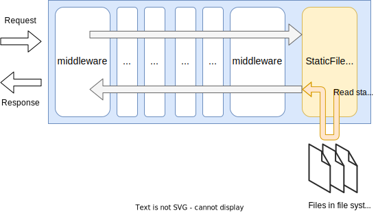

# Package `core/static` for `StaticHandler`

## Summary

This is the design document of core/static package that provides StaticFileHandler resource.
StaticFileHandler serves static files reading from local filesystem.

## Motivation

Serving static files is used in some situation such as serving static error pages or login pages.

### Goals

- StaticFileHandler serves static files.

### Non-Goals

## Technical Design

### Serving static files

StaticFileHandler serve static files reading from the local file system.
It serves local files under the root directory configured by leveraging [http.Dir - pkg.go](https://pkg.go.dev/net/http#Dir).

Files  `<root-dir>/<sub-dir>/<file>` will be served with URL such like

- `http://example.com/<sub-dir>/<file>`

It is possible to add a prefix to the URL path which will be removed when reading files from filesystem.

- `http://example.com/<prefix>/<sub-dir>/<file>`

This figure shows how the StaticFileHandler works.



StaticFileHandler implements [http.Handler](https://pkg.go.dev/net/http#Handler) interface.

```go
type Handler interface {
  ServeHTTP(ResponseWriter, *Request)
}
```

A single file root can be set to the StaticFileHandler that contains static files to be served.

An example of file directory will be like this.
`content/` is the root directory and files under the `content/` are served.
foo.txt will be served with `http://example.com/foo/foo.txt` or with some prefix like `http://example.com/prefix/foo/foo.txt`.

```txt
content/
├── foo/
│   ├── foo.txt
│   └── foo.json
└── bar/
    ├── bar.txt
    └── bar.json
```

### Security consideration

Static file server can sometimes have vulnerability.
StaticFileHandler consider these things for security.

- Directory listing
    - StaticFileHandler can enable/disable directory listing.
    - Default configuration should be disable.
- MIME sniffing
    - Files should be served with extension such as .json
    - `Content-Type` header can be set when serving files without extension.
    - `X-Content-Type-Options: nosniff` is added to the responses.

## Test Plan

### Unit Tests

Unit tests are implemented and passed.

- All functions and methods are covered.
- Coverage objective 98%.

### Integration Tests

Integration tests are implemented with these aspects.

- StaticFileHandler works as a handler.
- StaticFileHandler works with input configuration.
- StaticFileHandler can serve static files.
- StaticFileHandler returns HTTP error correctly when an error occurred.

### e2e Tests

e2e tests are implemented with these aspects.

- StaticFileHandler works as a handler.
- StaticFileHandler works with input configuration.
- StaticFileHandler can serve static files.
- StaticFileHandler returns HTTP error correctly when an error occurred.

### Fuzz Tests

Not planned.

### Benchmark Tests

Not planned.

### Chaos Tests

Not planned.

## Future works

None.

## References

None.
