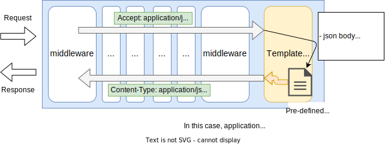

# Package `core/template` for `TemplateHandler`

## Summary

This is the design document of `core/template` package that provides `TemplateHandler` resource.
`TemplateHandler` serves static contents.

## Motivation

Serving static content is used in some situation such as serving static error pages or login pages.

### Goals

- TemplateHandler serves static content.

### Non-Goals

## Technical Design

### Serving template content

TemplateHandler serve static content that are defined in configuration file.

Serving static content flows:

- TemplateHandler checks `Accept` header to determine the response content.
- TemplateHandler looks for the pre-defined content that matches to the accepted content type.
- TemplateHandler generate response content. JSON or Queries in the request can be embedded to the template.
- TemplateHandler returns generated content.

So the request header should contain `Accept` like this.

```bash
/foo HTTP/1.1
Accept: text/plain
```

This figure shows how the TemplateHandler works.



TemplateHandler implements [http.Handler](https://pkg.go.dev/net/http#Handler) interface.

```go
type Handler interface {
  ServeHTTP(ResponseWriter, *Request)
}
```

### Template engines

TemplateHandler provides 3 types of templates.

1. Text: Template engine that use the given text as it is.
2. GoText: Template engine that leverages [text/template](https://pkg.go.dev/text/template).
3. GoHTML: Template engine that leverages [html/template](https://pkg.go.dev/html/template).

Example of `Text` template will be like below.
This is just a plain text.
Key-value information given by the JSON requests, form requests or requests with URL queries **CANNOT** be embedded in the template.

```text
AILERON Gateway
Hello World!
```

Example of `GoText` template will be like below.
This template should follow the [text/template](https://pkg.go.dev/text/template) format.
Key-value information given by the JSON requests, form requests or requests with URL queries **CAN** be embedded in the template.

```json
{
  "app": "AILERON Gateway",
  "hello": "world!",
  "foo": "{{ .foo }}"
}
```

Example of `GoHTML` template will be like below.
This template should follow the [html/template](https://pkg.go.dev/html/template) format.
Key-value information given by the JSON requests, form requests or requests with URL queries **CAN** be embedded in the template.

```html
<!doctype html>
<html>
  <head>
    <title>AILERON Gateway</title>
  </head>
  <body>
    <h1>AILERON Gateway</h1>    
    <p>Hello World!</p>
    <p>foo={{ .foo }}</p>
  </body>
</html>
```

### Security consideration

TemplateHandler consider these things for security.

- MIME sniffing
    - `X-Content-Type-Options: nosniff` is added to the responses.

## Test Plan

### Unit Tests

Unit tests are implemented and passed.

- All functions and methods are covered.
- Coverage objective 98%.

### Integration Tests

Integration tests are implemented with these aspects.

- TemplateHandler works as a handler.
- TemplateHandler works with input configuration.
- TemplateHandler can serve pre-defined template by checking the `Accept` header.
- TemplateHandler returns HTTP error correctly when an error occurred.

### e2e Tests

e2e tests are implemented with these aspects.

- TemplateHandler works as a handler.
- TemplateHandler works with input configuration.
- TemplateHandler can serve pre-defined template by checking the `Accept` header.
- TemplateHandler returns HTTP error correctly when an error occurred.

### Fuzz Tests

Not planned.

### Benchmark Tests

Not planned.

### Chaos Tests

Not planned.

## Future works

None.

## References

None.
