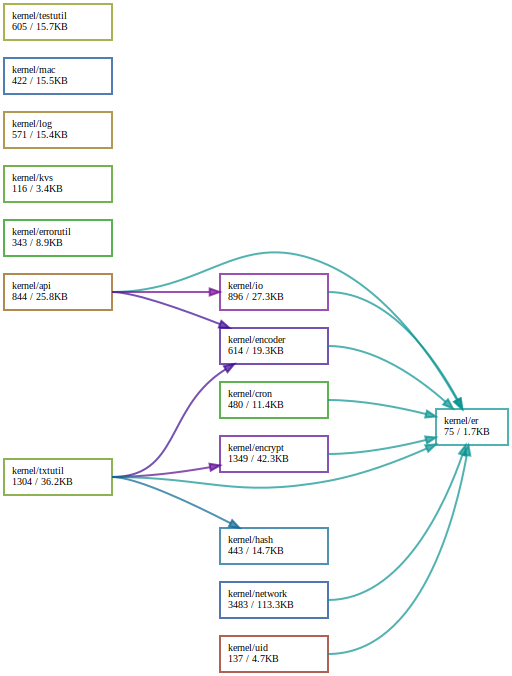

# Package `kernel`

## Summary

Package `kernel` provides utility functions that are generalized and isolated from other packages.

## Packages

All packages provided under kernel are shown in this section.
Dependency graphs are generated by the [https://github.com/loov/goda](https://github.com/loov/goda).
It visualize the graph using [Graphviz](https://graphviz.org/).
Graphviz is also available at [Graphviz Online](https://dreampuf.github.io/GraphvizOnline/).

```bash
# Basic usage of goda.
go install github.com/loov/goda@latest
goda graph ./kernel/... | dot -Tsvg -o depenency-graph.svg
```

Each packages are basically independent from each other except for `kernel/apis/` and `kernel/txtutil/`.
The `kernel/er/` is the special package that provides custom error struct used entire application.
Of course they use `apis/kernel/` package which is generated by proto files.

This dependency graphs was generated by

```bash
goda graph ./kernel/... \
  | sed 's/"github.com\/aileron-gateway\/aileron-gateway\//"/g' \
  | dot -Tsvg -o depenency-graph.svg
```



## Interfaces

There is no `kernel` package level Go interfaces.

## Errors

Errors are defined in

- kernel/errors.go

Note that the errors may be changed in future updates.
