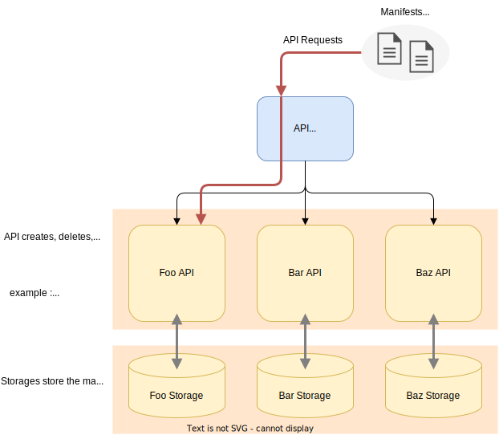

# Package `kernel/api`

## Summary

This is the design document of kernel/api package.
kernel/api package provides underlying framework of AILERON Gateway.
The concept of API in this package is strongly influenced by [Kubernetes architecture](https://kubernetes.io/docs/concepts/architecture/).

## Motivation

AILERON Gateway have the basic concept of loosely coupled architecture.
To achieve the de-coupling of components in the gateway,
a framework like dependency injection are required.

### Goals

- Provide a framework to achieve de-coupling of components.
- Make the de-coupling framework simple and dependent from other packages.

### Non-Goals

## Technical Design

### APIs

An `API` in the context of architecture of AILERON Gateway does not mean APIs of HTTP servers.
APIs in the AILERON Gateway means the operator that creates, deletes or update components used in the gateway.

The following image shows the concept and the architecture of API in AILERON Gateway.
A multiplexer is the same as a router.
It dispatches the requests to the correct API.



APIs and API multiplexers implement the following interface.
This interface is borrowed from [http.Handler](https://pkg.go.dev/net/http#Handler) interface.
API interface is defined using generics because the implementation of request `Q` and response `S` would be different depending on implementations.

```go
type API[Q, S any] interface {
  Serve(context.Context, Q) (S, error)
}
```

```go
type ServeMux[K comparable, Q, S any] interface {
  API[Q, S]
  Handle(K, API[Q, S]) error
}
```

### Built-in APIs

AILERON Gateway have 3 build-in APIs to achieve de-coupling of components.
They have the same interface defined as below.

```go
type API interface {
  Serve(context.Context, *Request) (*Response, error)
}
```

Here, "Request" and "Response" are defined as this.

```go
// Request corresponds to Q of the interface.
type Request struct {
  Method  Method            // Operation method name. (Correspond to HTTP method)
  Key     string            // Keys to dispatch for correct API.  (Correspond to HTTP URL path)
  Format  Format            // Data format of the Content field.
  Params  map[string]string // Extra info passed to the target API. (Correspond to HTTP header)
  Content any               // Request content. (Correspond to HTTP body)
}
```

```go
// Response corresponds to S of the interface.
type Response struct {
  Params  map[string]string // Extra info returned to the client. (Correspond to HTTP header)
  Content any               // Response content.  (Correspond to HTTP body)
}
```

#### Factory API

**Factory API** is one of the built-in APIs.
This figure show the overview of the factory API.
`manifests` means the configuration of the instances of each resources.
Factory APIs leverage [ProtocolBuffer](https://protobuf.dev/) to define the manifests interface.
It means that the factory APIs are **schema-based** API.

Factory API works in these steps.

1. Receive an API request through `Serve()` method.
2. Proceed the request with the right method of GET, POST, DELETE or else.
3. The method proceeds the request by calling the right `Resource APIs`.
4. Return response to the client.


Here, resources are defined with this interface.

```go
type Resource interface {
  Default() protoreflect.ProtoMessage
  Validate(protoreflect.ProtoMessage) error
  Mutate(protoreflect.ProtoMessage) protoreflect.ProtoMessage
  Create(API[*Request, *Response], protoreflect.ProtoMessage) (any, error)
  Delete(API[*Request, *Response], protoreflect.ProtoMessage, any) error
}
```

#### Extension API

**Extension API** is one of the built-in APIs.
This figure show the overview of the extension API.
Extension APIs works in the same way as the Factory API but it does not use protocol-buffer.
It means that the Extension APIs are **schema-less** API.


Here, creators are defined with this interface.

```go
type Creator interface {
  Create(API[*Request, *Response], Format, any) (any, error)
}
```

#### Container API

**Container API** is one of the built-in APIs.
This figure show the overview of the container API.
Container APIs works just like an object storage.

It store the given component when requested and returns the stored component when requested.


## Test Plan

### Unit Tests

Unit tests are implemented and passed.

- All functions and methods are covered.
- Coverage objective 98%.

### Integration Tests

Not planned.

### e2e Tests

Not planned.

### Fuzz Tests

Not planned.

### Benchmark Tests

Not planned.

### Chaos Tests

Not planned.

## Future works

None.

## References

- [Cluster Architecture - Kubernetes](https://kubernetes.io/docs/concepts/architecture/)
- [Kubernetes Components](https://kubernetes.io/docs/concepts/overview/components/)
