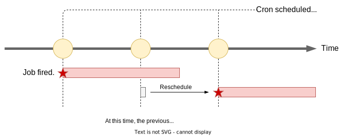

# Package `kernel/cron`

## Summary

This is the design document of `kernel/cron` package.

kernel/cron package provides cron utilities.
Cron can schedule jobs at pre-defined datetime.

## Motivation

Cron job is used for running some jobs with pre-defined schedule.
Log rotation, authorization policy reloads are specific use cases.
Because implementing cron job is not easy than most people think,
its utility is provided by this package.

Note that there are some implementation of cron in golang
such as [https://github.com/robfig/cron](https://github.com/robfig/cron)
or [https://github.com/go-co-op/gocron](https://github.com/go-co-op/gocron).

But they are

- Not intuitive to use.
- Difficult to test even using [FakeClock](https://github.com/go-co-op/gocron?tab=readme-ov-file#testing). Tests fails sometimes.
- Increases the number of dependent packages.

### Goals

- Provides cron utility.
- Cron runs a job with cron expression.

### Non-Goals

- Support complex job control.
    - Multiple jobs at a time.
    - Rescheduling policies.

## Technical Design

### Cron expression

Cron expression is basically follow the [https://en.wikipedia.org/wiki/Cron](https://en.wikipedia.org/wiki/Cron) and [https://man7.org/linux/man-pages/man5/crontab.5.html](https://man7.org/linux/man-pages/man5/crontab.5.html).
Cron expression have some implementation specific specifications.
Cron expressions provided by the kernel/cron package follow the following specifications.

Cron expression has following fields.
Here, timezone and second are optional fields which means they can be omitted.

```txt
TZ=UTC * * * * * *
|      | | | | | |
|      | | | | | |- Day of week
|      | | | | |--- Month
|      | | | |----- Day of month
|      | | |------- Hour
|      | |--------- Minute
|      |----------- Second (Optional)
|------------------ Timezone (Optional)
```

```txt
Field name   | Mandatory  | Values          | Special characters
----------   | ---------- | --------------  | -------------------
Timezone     | No         | Timezone name   |
Second       | No         | 0-59            | * / , -
Minute       | Yes        | 0-59            | * / , -
Hours        | Yes        | 0-23            | * / , -
Day of month | Yes        | 1-31            | * / , -
Month        | Yes        | 1-12 or JAN-DEC | * / , -
Day of week  | Yes        | 0-6 or SUN-SAT  | * / , -
```

- Cron cannot contain any spaces except for field delimiters.
- Timezone name is case sensitive. See [time#LoadLocation](https://pkg.go.dev/time#LoadLocation)
- `JAN-DEC` are case sensitive.
- `SUN-SAT` are case sensitive.
- `1` can be expressed as `01`.
- Ranges cannot be over 0. e.g. Use `50-59,0-10` not `50-10`.
- Day of month and day of week are evaluated by `AND` condition.
- Non existing days are ignored. e.g. Feb 30th is ignored.
- At least 1 job must be schedule-able in 10 years.

For convenience, some aliases are defined.
Daily job in UTC time zone can be written as `CRON_TZ=UTC @daily`.
All aliases are **case sensitive**.
Aliases are simply replaced to alias value before parsing cron expression. It means combined expressions such as `@sunday,@monday` , which produce `0 0 * * 0,0 0 * * 1`, are not allow.

```txt
CRON_TZ     :  TZ

@yearly     :  0 0 1 1 *
@annually   :  0 0 1 1 *
@monthly    :  0 0 1 * *
@weekly     :  0 0 * * 0
@daily      :  0 0 * * *
@hourly     :  0 * * * *

@sunday     :  0 0 * * 0
@monday     :  0 0 * * 1
@tuesday    :  0 0 * * 2
@wednesday  :  0 0 * * 3
@thursday   :  0 0 * * 4
@friday     :  0 0 * * 5
@saturday   :  0 0 * * 6
```

**Available simulators.**

- [https://crontab.guru/](https://crontab.guru/)
- [https://crontab.cronhub.io/](https://crontab.cronhub.io/)
- [https://www.freeformatter.com/cron-expression-generator-quartz.html](https://www.freeformatter.com/cron-expression-generator-quartz.html)
- [https://crontab-generator.org/](https://crontab-generator.org/)
- [https://www.atatus.com/tools/cron](https://www.atatus.com/tools/cron)

### Scheduling job

Jobs are scheduled and fired by following rules.

- Run only one job at a time.
- Reschedule job to the next schedule time when the previous job ha not ended.
- Errors and panics in jobs are not handled. Job functions should handle them by themselves.

Notes:

- Jobs won't be run at appropriate time if wall clock, or system clock, were changed after jobs scheduled.
- Leap second is not supported because of the [time package](https://pkg.go.dev/time) limitations.
    - This would results in 1 second drift of job stating time.



### Usage overview

Cron can be used by following steps.

1. Parse cron expression.
2. Optionally replace time zone or timer.
3. Schedule a job.

This example prints current time every 1 seconds.

```go
ct, err := cron.Parse("* * * * * *")
if err != nil {
  // Omitted
}

job := ct.NewJob(func() {
  println(time.Now().Format(time.DateTime))
})

go job.Start() // job.Stop() to stop the job.
```

## Test Plan

### Unit Tests

Unit tests are implemented and passed.

- All functions and methods are covered.
- Coverage objective 98%.

### Integration Tests

Not planned.

### e2e Tests

Not planned.

### Fuzz Tests

Not planned.

### Benchmark Tests

Not planned.

### Chaos Tests

Not planned.

## Future works

None.

## References

- [https://man7.org/linux/man-pages/man5/crontab.5.html](https://man7.org/linux/man-pages/man5/crontab.5.html)
- [https://en.wikipedia.org/wiki/Cron](https://en.wikipedia.org/wiki/Cron)
