# Package `kernel/errorutil`

## Summary

This is the design document of `kernel/errorutil` package.

`kernel/errorutil` provides the error definition which AILERON Gateway uses in entire codes and utilities to handle the errors.

## Motivation

The error interface that Go provides in the standard package which is shown below does not provide stack traces.
It lacks some important information about error that will be helpful for users and developers.
It seemed to be necessary to to complement that to provides the better user experience and developer experience.

```go
// error is the interface of Go standard package.
type error interface{
  Error() string
}
```

### Goals

- Define error in AILERON Gateway.
- Provides common utilities to handle the error.

### Non-Goals

- Implement full stack error frameworks.

## Technical Design

### Extending error

Error in AILERON Gateway extends error interface of GO built-in interface.
Ths figure show the overview of the error package.

Error package leverages log package to make logging easy.
By using this hierarchy of interface, ErrorAttrs will be easy to log output and will have stack trace.

Kind, which implements Creator interface, is used to generate the ErrorAttrs.



### Error attributes

Errors are designed to have the following attributes.

- **Code**
    - string
    - A short identifier of errors. For example "E1234".
- **Kind**
    - string
    - Type of errors. For example "ErrInvalidYAML".
- **Error**
    - string
    - Error message that can be obtained with `Error() string`.
- **StackTrace**
    - string
    - stack trace of the error.

The struct `Kind` has the Code, Kind and template of the Error.
Struct is defined as this.
Errors, or ErrorAttrs, instantiated from this Kind will have all the attributes described above.

```go
type Kind struct {
  code string
  kind string
  tpl  *template
}
```

## Test Plan

### Unit Tests

Unit tests are implemented and passed.

- All functions and methods are covered.
- Coverage objective 98%.

### Integration Tests

Not planned.

### e2e Tests

Not planned.

### Fuzz Tests

Not planned.

### Benchmark Tests

Not planned.

### Chaos Tests

Not planned.

## Future works

None.

## References

None.
