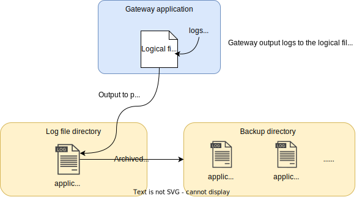

# Package `kernel/io`

## Summary

This is the design document of `kernel/io` package.

`kernel/io` package provides io utility of reading and writing files, reading environmental variables and so on.

## Motivation

IO is one of the most basic utility features many applications have.
kernel/io make the io functions re-usable.

- Read write files.
- File management.
- Load environmental variables.

### Goals

- Provides file io utilities.
- Provides file management functions.
- Provides function reading environmental variables.

### Non-Goals

- kernel/io package does not aim to provide io functions that will be used for any specific use cases.

## Technical Design

### Environmental variables

IO package provides some functions to load environmental variables.

LoadEnv function is defined to load environmental variables from `[]byte` data.
Each line must in the fomrat of `(\w+)\s*=\s*(.*)`.
Lines starts with `#` is ignored as the comment line.

For example,
following env file which contains `key=value` lines can be load by LoadEnv.

```txt
# This is comment line.
FOO=BAR
ALICE = BOB
```

LoadEnv is defined with this signature.

```go
func LoadEnv(overwrite bool, bs ...[]byte) error
```

`ResolveEnv` function resolves environmental variables embedded in documents.
Supported formats are listed below.
These expressions are basically borrowed from [Bash Shell Parameter Expansion](https://man7.org/linux/man-pages/man1/bash.1.html#EXPANSION).

- `${FOO}` : environmental variable FOO is used.
- `${FOO:-bar}` : bar is used if FOO is empty or is not defined.
- `${FOO-bar}` : bar is used if FOO is not defined.
- `${FOO+bar}` : bar is used if FOO is defined.
- `${#FOO}` : the length of FOO.

Inner variables are allowed.
For example,

- `${${INNER_ENV}}`
- `${OUTER_ENV:-${INNER_ENV}}`
- `${${INNER_ENV}:-default}`
- `${OUTER_ENV-${INNER_ENV}}`
- `${${INNER_ENV}-default}`
- `${OUTER_ENV+${INNER_ENV}}`
- `${${INNER_ENV}+default}`
- `${#${INNER_ENV}}`

ResolveEnv is defined with this signature.

```go
func ResolveEnv(b []byte) []byte
```

### Logical files

Logical files is the logical file, not physical or file system file, that is used in the gateway.
Its purpose is mainly for managing log files.
The underlying concept of the logical file is borrowed from linux LVM (Logical Volume Manager).

This figure shows the concept of logical file.



One of the typical usages of the logical file is file logging.
It works like this.

- Gateway application output logs to the logical file.
- Logical file manages physical file and output to the physical file.
- File rotation and managing archive files

### Reading files

IO package provides the reading files functions that meet following requirements.

- Read files with given file path or directory path.
- Files can be read recursively in the given directory.
- Files can be read from FileSystem interface.

ReadFile can read single file at the given path.

```go
func ReadFile(path string) ([]byte, error)
```

ReadFiles can read multiple files at the given paths.
The paths can be directory paths or file paths.
It can read files recursively.

```go
func ReadFiles(recursive bool, paths ...string) (map[string][]byte, error)
```

## Test Plan

### Unit Tests

Unit tests are implemented and passed.

- All functions and methods are covered.
- Coverage objective 98%.

### Integration Tests

Not planned.

### e2e Tests

Not planned.

### Fuzz Tests

Not planned.

### Benchmark Tests

Not planned.

### Chaos Tests

Not planned.

## Future works

Not planned.

## References

- [https://github.com/joho/godotenv](https://github.com/joho/godotenv)
- [https://github.com/go-co-op/gocron](https://github.com/go-co-op/gocron)
- [Bash Shell Parameter Expansion](https://man7.org/linux/man-pages/man1/bash.1.html#EXPANSION)
