# Package `kernel/log`

## Summary

This is the technical design document of kernel/log package.
kernel/log provides log utilities.
Note that this package does not provide logger utilities.

## Motivation

Logging is a basic feature for any applications.
Log is one of the basic telemetry signals of observability which consists of logging, metrics and tracing.
So, it is important to provide the common way of logging because it will be used in anywhere in the entire application.

kernel/log and kernel/logger packages are expected to be used together.

### Goals

- Provide log utilities.

### Non-Goals

## Technical Design

### Log concepts

This figure shows the basic concepts of logging.

- `LogCreator` creates `Log`s.
- `Log` is an object that have information of a single log line.
- `Logger` accepts `Log`s  and output them to stdout, stderr or files.



### Log data definition

- `Entry` : is a log data which corresponds to a single log line.
- `Message` : is the log message in a log entry.
- `Attributes` : is additional information of a log entry.
    - `Name` : is the name of the attributes.
    - `Attribute` : is the key-value data in the attributes.

An `Attribute` can be represented as key-value data like below.

```json
{
  "foo": "bar",
  "alice": "bob"
}
```

An `Attributes` has a `Name` in addition to the `Attribute` like below.

```json
{
  "name":{
    "foo": "bar",
    "alice": "bob"
  }
}
```

As a result, by considering that an `Entry` has a `Message`, log entries can be represented like below.
Note that this is just an data model held in a log entry objects in program.
Final format of log output will be determined by loggers.

```json
{
  "msg": "log message",
  "name":{
    "foo": "bar",
    "alice": "bob"
  }
}
```

### Structured/Unstructured log

Log output format is not defined in this kernel/log package.
It will be determined by the loggers.

### Interface

This diagram shows the interface and important structs in the package.
3 basic attributes LocationAttrs, DatetimeAttrs, CustomAttrs are defined for logging.
MessageLog is the log entry struct defined by default and it can be created using MessageLogCreator.



**LocationAttrs**

LocationAttrs contains the information about the location in the program where the log entry was created.
The following json-like data shows the models of the location attributes.

```json
{
  "location": {
    "file": "foo.go", // filename where this log entry was created
    "line": 123,      // line number where this log entry was created
    "func": "bar"     // function name where this log entry was created
  }
}
```

**DatetimeAttrs**

DatetimeAttrs contains the information about the date and time when the log entry was created.
The following json-like data shows the models of the datetime attributes.

```json
{
  "datetime": {
    "date": "2006-01-02",   // date when this log entry was created
    "time": "15:04:05.000", // time when this log entry was created
    "zone": "Asia/Tokyo"    // locale of the time
  }
}
```

**CustomAttrs**

CustomAttrs contains the custom information that the users of this package defined.
The following json-like data shows the models of the custom attributes.

```json
{
  "custom-name": {
    "custom-key1": "val1", 
    "custom-key2": "val2",
    "custom-key3": "val3"
  }
}
```

## Test Plan

### Unit Tests

Unit tests are implemented and passed.

- All functions and methods are targeted.
- Coverage objective 98%.

### Integration Tests

Not planned.

### e2e Tests

Not planned.

### Fuzz Tests

Not planned.

### Benchmark Tests

Not planned.

### Chaos Tests

Not planned.

## Future works

- [ ] Ability to suppress or append attributes to/from output.

## References

- [OpenTelemetry Logging](https://opentelemetry.io/docs/specs/otel/logs/)
- [Logging Control In W3C httpd - W3C](https://www.w3.org/Daemon/User/Config/Logging.html)
- [Extended Log File Format - W3C](https://www.w3.org/TR/WD-logfile.html)
- [The Syslog Protocol - RFC 5424](https://datatracker.ietf.org/doc/rfc5424/)
- [Log Files - Apache HTTP Server](https://httpd.apache.org/docs/2.4/logs.html)
- [Logging in Tomcat](https://tomcat.apache.org/tomcat-9.0-doc/logging.html)
- [Apache Tomcat 9 Configuration Reference](https://tomcat.apache.org/tomcat-9.0-doc/config/valve.html#Access_Logging)
