# Package `kernel/logger`

## Summary

This is the technical design document of `kernel/logger` package.

`kernel/logger` provides logger utilities.
Note that this package does not provide log utilities.
It is the responsibility of kernel/log package.

## Motivation

Logging is a basic feature for any applications.
Log is one of the basic telemetry signals of observability which consists of logging, metrics and tracing.
So, it is important to provide the common way of logging because it will be used in anywhere in the entire application.

kernel/log and kernel/logger packages are expected to be used together.

### Goals

- Provide logger utilities.

### Non-Goals

## Technical Design

### Logging concepts

This figure shows the basic concept of logging.

- `LogCreator` creates `Log`s.
- `Log` is an object that have information of a single log line.
- `Logger` accepts `Log`s  and output them to stdout, stderr or files.

### LogLevel

Log levels are designed to follow the [OpenTelemetry SeverityNumber](https://opentelemetry.io/docs/specs/otel/logs/data-model/#severity-fields) specification.

| Level | Text  | Number Range | Meaning                                                                                            |
| ----- | ----- | ------------ | -------------------------------------------------------------------------------------------------- |
| Trace | TRACE | -4           | A fine-grained debugging event. Typically disabled in default configurations.                      |
| Debug | DEBUG | 5-8          | A debugging event. Typically disabled on production environments.                                  |
| Info  | INFO  | 9-12         | An informational event.                                                                            |
| Warn  | WARN  | 13-16        | A warning event. Not an error but is likely more important than an informational event.            |
| Error | ERROR | 17-20        | An error event. Something went wrong. Investigations required in most cases.                       |
| Fatal | FATAL | 21-          | A fatal error such as application or system crash. Better not to be used except for start-up time. |

### Interface

This diagram shows the interface and important structs in the package.
2 built-in logger noopLogger and SLogger are defined.

- **noopLogger** : is a logger that do nothing. This logger can be used when discarding logs.
- **SLogger** : is a logger using [log/slog](https://pkg.go.dev/log/slog) package.

## Test Plan

### Unit Tests

Unit tests are implemented and passed.

- All functions and methods are covered.
- Coverage objective 98%.

### Integration Tests

Not planned.

### e2e Tests

Not planned.

### Fuzz Tests

Not planned.

### Benchmark Tests

Not planned.

### Chaos Tests

Not planned.

## Future works

None.

## References

- [OpenTelemetry Logging](https://opentelemetry.io/docs/specs/otel/logs/)
