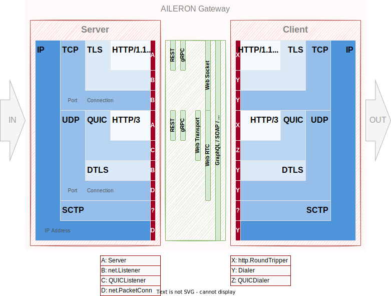
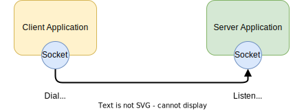

# Package `kernel/network`

## Summary

This is the design document of `kernel/network` package.

`kernel/network` package provides networking utility.
TCP, UDP, TLS and HTTP are main target of this package.

## Motivation

Make the networking features re-usable and stable by providing it as utility.
Networking must be stable and robust as much as possible for API gateways.

### Goals

- Provides stable and  reliable networking utilities.
- Make the networking utility re-usable.
- Provide TCP, UDP, TLS and HTTP utilities.

### Non-Goals

- Support various protocols.
- Implement networking specifications from scratch.
- Provides some features used for specific used cased.

## Technical Design

### Protocols overview

This figure shows the list of widely used networking protocols and their layers.
The kernel/network package is targeting to provide utility functions from IP to HTTP layer.



Listening and dialing is the initial operations when connecting applications over networks.
As shown in the figure below, client dials to server and the server accept (or decline) the request.
These operations are done through network sockets.
Connection will be established and applications can start communicating once the server accepted requests.
Note that the accepting requests is not required for connection-less protocols such as UDP.



### Dialer (Network dialing)

Dialer dials from client to server to establish a connection.
This package defines common interface for dialers.

Dialers for **IP, TCP, UDP, TLS (TLS over TCP), DTLS (TLS over UDP)**.

Following package are used and wrapped to meets the Dialer interface.

- [net#Dialer](https://pkg.go.dev/net#Dialer): `IP`, `TCP`, `UDP`
- [tls#Dialer](https://pkg.go.dev/crypto/tls#Dialer): `TLS (TLS over TCP)`
- [pion/dtls/v3](https://pkg.go.dev/github.com/pion/dtls/v3): `DTLD (TLS over UDP)`

```go
// Dialer is the dialer for IP, TCP, UDP, TLS (TLS over TCP) protocols.
// This is the 
type Dialer interface {
  Dial(network string, address string) (net.Conn, error)
  DialContext(ctx context.Context, network string, address string) (net.Conn, error)
}
```

Dialers can be created through NewDialerFromSpec or NewDialer functions.

```go
func NewDialerFromSpec(*kernel.DialConfig) (Dialer, error)

func NewDialer(*DialConfig) (Dialer, error)
```

Dialers can be called like this.
This is just an example to dial to to a server "127.0.0.2" in TCP.

```go
conn, err := dialer.Dial("tcp", "127.0.0.2")

or with context

conn, err := dialer.DialContext(context.Background(), "tcp", "127.0.0.2")
```

Dialers for **QUIC**.

Following package are used and wrapped to meets the Dialer interface.
Dialers for QUIC are just under active development.
Note that the

- [quic#Endpoint.Dial](https://pkg.go.dev/golang.org/x/net/quic#Endpoint.Dial): `QUIC`
- [quic-go/quic-go#Transport](https://pkg.go.dev/github.com/quic-go/quic-go#Transport): `QUIC`

```go
// QUICDialer is the dialer for QUIC protocol using "golang.org/x/net/quic".
type QUICDialer interface {
  Dial(network string, address string) (*quic.Conn, error)
  DialContext(ctx context.Context, network string, address string) (*quic.Conn, error)
}
```

```go
// QDialer is the dialer for QUIC protocol using "github.com/quic-go/quic-go".
type QDialer interface {
  Dial(network string, address string) (quic.Connection, error)
  DialContext(ctx context.Context, network string, address string) (quic.Connection, error)
}
```

### Listener (Network listening)

Listener listens network through sockets.
[net.Listener](https://pkg.go.dev/net#Listener) and [net.PacketConn](https://pkg.go.dev/net#PacketConn) interfaces are defined for this purpose.

Listener for

```go
type Listener interface {
  Accept() (net.Conn, error)
  Close() error
  Addr() Addr
}
```

```go
type QUICListener interface {
  Accept(context.Context) (*quic.Conn, error)
  Close(context.Context) error
  LocalAddr() netip.AddrPort
}
```

kernel/network package provides functions to instantiate the listener.

net.Listener can be instantiated through these functions from config or proto spec.

```go
func NewListenerFromSpec(*kernel.ListenConfig) (net.Listener, error)

func NewListener(*ListenConfig) (net.Listener, error)
```

net.PacketConn can be instantiated through these functions from config.
PackeConn is not configurable with proto spec for now.
This is just under active development.

```go
func NewPacketConn(*PacketConnConfig) (net.PacketConn, error)
```

### Socket options

Socket options are configurable when listening or dialing.
Supported options depends on the platforms.

- **Linux**
    - `SO_BINDTODEVICE`
    - `SO_DEBUG`
    - `SO_INCOMING_CPU`
    - `SO_KEEPALIVE`
    - `SO_LINGER`
    - `SO_MARK`
    - `SO_RCVBUF`
    - `SO_RCVBUFFORCE`
    - `SO_RCVTIMEO`
    - `SO_SNDTIMEO`
    - `SO_REUSEADDR`
    - `SO_REUSEPORT`
    - `SO_SNDBUF`
    - `SO_SNDBUFFORCE`
    - `IP_BIND_ADDRESS_NO_PORT`
    - `IP_FREEBIND`
    - `IP_LOCAL_PORT_RANGE`
    - `IP_LOCAL_PORT_RANGE`
    - `IP_TRANSPARENT`
    - `IP_TTL`
    - `TCP_CORK`
    - `TCP_DEFER_ACCEPT`
    - `TCP_KEEPCNT`
    - `TCP_KEEPIDLE`
    - `TCP_KEEPINTVL`
    - `TCP_LINGER2`
    - `TCP_MAXSEG`
    - `TCP_NODELAY`
    - `TCP_QUICKACK`
    - `TCP_SYNCNT`
    - `TCP_USER_TIMEOUT`
    - `TCP_WINDOW_CLAMP`
    - `TCP_FASTOPEN`
    - `TCP_FASTOPEN_CONNECT`
    - `UDP_CORK`
    - `UDP_SEGMENT`
    - `UDP_GRO`
- **Windows**
    - `SO_DEBUG`
    - `SO_KEEPALIVE`
    - `SO_LINGER`
    - `SO_RCVBUF`
    - `SO_REUSEADDR`
    - `SO_SNDBUF`
    - `IP_TTL`
    - `TCP_NODELAY`
- **Others**
    - Not supported

### TLS

Securing networking with TLS is required for connecting other services.
kernel/network package provides a utility function that instantiate a TLS config.

TLSConfig configure [tls.Config](https://pkg.go.dev/crypto/tls#Config) from the given proto spec.

```go
func TLSConfig(spec *kernel.TLSConfig) (*tls.Config, error) {
    // Instantiate TLS config
}
```

### HTTP

kernel/network package provides functions to configure transport layers.
HTTP 1/2/3 are supported currently.

Transport configurations for **HTTP 1/2** uses [http.Transport](https://pkg.go.dev/net/http#Transport).

```go
func HTTPTransport(*kernel.HTTPTransportConfig) (*http.Transport, error) {
    // Instantiate HTTP 1/2 transport
    // Default transport will be returned if nil was given
}
```

Transport configurations for **HTTP 2** uses [http2.Transport](https://pkg.go.dev/golang.org/x/net/http2#Transport).
This is different from the http.Transport in the point of that the http2.Transport is only for HTTP 2 and not include HTTP 1.

```go
func HTTP2Transport(*kernel.HTTP2TransportConfig) (*http2.Transport, error) {
    // Instantiate HTTP 2 transport
    // Default transport will be returned if nil was given
}
```

Transport configurations for **HTTP 3** uses [http3.RoundTripper](https://pkg.go.dev/github.com/lucas-clemente/quic-go/http3#RoundTripper).

```go
func HTTP3Transport(*kernel.HTTP3TransportConfig) (*http3.RoundTripper, error) {
    // Instantiate HTTP 3 transport
    // Default transport will be returned if nil was given
}
```

## Test Plan

### Unit Tests

Unit tests are implemented and passed.

- All functions and methods are covered.
- Coverage objective 98%.

### Integration Tests

Not planned.

### e2e Tests

Not planned.

### Fuzz Tests

Not planned.

### Benchmark Tests

Not planned.

### Chaos Tests

Not planned.

## Future works

- [ ] Make PacketConn available through proto specs.
- [ ] DTL (TLS over UDP) supports of listener and dialer.
- [ ] QUIC supports of listener and dialer.

## References

- [socket(2)](https://man7.org/linux/man-pages/man2/socket.2.html)
- [socket(7)](https://man7.org/linux/man-pages/man7/socket.7.html)
- [ip(7)](https://man7.org/linux/man-pages/man7/ip.7.html)
- [ipv6(7)](https://man7.org/linux/man-pages/man7/ipv6.7.html)
- [tcp(7)](https://man7.org/linux/man-pages/man7/tcp.7.html)
- [udp(7)](https://man7.org/linux/man-pages/man7/udp.7.html)
- [IEEE Std 1003.1-2017 (Revision of IEEE Std 1003.1-2008)](https://pubs.opengroup.org/onlinepubs/9699919799/basedefs/sys_socket.h.html)
