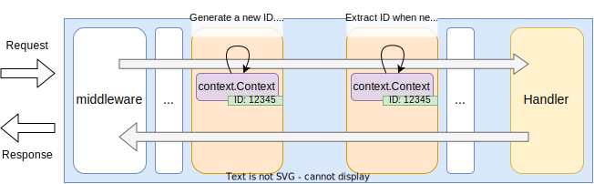

# Package `kernel/uid`

## Summary

This is the design document of `kernel/uid` package.

`kernel/uid` package provides unique IDs generating functions and related features.

## Motivation

API Gateways use unique IDs for various purpose.
For example,

- Session ID
- Request ID
- Trace ID
- Idempotent key
- CSRF token

### Goals

- Provides common interface to generate unique IDs.
- Provides unique ID generation functions.

### Non-Goals

- Support various ID algorithms.

## Technical Design

### Unique IDs

Standardized unique IDs such as UUIDv4 are widely adopted.
Following table show the general availability unique IDs on Go.

Unique IDs that contains time bits are basically sortable,
IDs that contains random bits are difficult to guess.

This list shows the UUIDv7 or ULID are the candidate IDs
that are sortable and difficult to guess.
But, thing about the large systems, they are not enough to be used as
 session IDs, request IDs or other IDs.
This package provides another option to generate unique IDs.

| ID Type | Byte Length | Time bits | Random bits | Available Package                                                   |
| ------- | ----------- | --------- | ----------- | ------------------------------------------------------------------- |
| UUID v1 | 16          | 48-60     | 0           | [github.com/google/uuid](https://pkg.go.dev/github.com/google/uuid) |
| UUID v2 | 16          | 48        | 0           | [github.com/google/uuid](https://pkg.go.dev/github.com/google/uuid) |
| UUID v3 | 16          | 0         | 0           | [github.com/google/uuid](https://pkg.go.dev/github.com/google/uuid) |
| UUID v4 | 16          | 0         | 122         | [github.com/google/uuid](https://pkg.go.dev/github.com/google/uuid) |
| UUID v5 | 16          | 0         | 0           | [github.com/google/uuid](https://pkg.go.dev/github.com/google/uuid) |
| UUID v6 | 16          | 48-60     | 0           | [github.com/google/uuid](https://pkg.go.dev/github.com/google/uuid) |
| UUID v7 | 16          | 48        | 62          | [github.com/google/uuid](https://pkg.go.dev/github.com/google/uuid) |
| XID     | 12          | 32        | 0           | [github.com/rs/xid](https://github.com/rs/xid)                      |
| ULID    | 16          | 48        | 80          | [github.com/oklog/ulid](https://github.com/oklog/ulid)              |

### Original unique ID

This package provides original ID generation functions.
They are relatively long but have much higher entropy than any other unique IDs listed in the previous section.
That means the IDs are less likely to collide and difficult to guess.
Futhermore, they are sortable.

According to the [Session Management Cheat Sheet - OWASP](https://cheatsheetseries.owasp.org/cheatsheets/Session_Management_Cheat_Sheet.html#session-id-length),
session IDs are recommended to have **at least 128 bits** of length and **at least 64 bits** of entropy.

**30 Bytes ID.**

This package provides 30 bytes unique ID which is intended to be used as Request IDs, Session IDs and so on.
The length is fixed and cannot be changed.

It consists of timestamp and random value as shown below.
This ID is sortable and have higher entropy than UUIDv4.

- 8 bytes: Timestamp in unix microseconds.
  - Big endian
  - Valid until January 10th, 294247.
- 22 bytes: random value read from crypt/rand.

IDs consists of the following bytes.

```txt
0                   1                   2                   3
0 1 2 3 4 5 6 7 8 9 0 1 2 3 4 5 6 7 8 9 0 1 2 3 4 5 6 7 8 9 0 1
+-+-+-+-+-+-+-+-+-+-+-+-+-+-+-+-+-+-+-+-+-+-+-+-+-+-+-+-+-+-+-+-+
|                         timestamp_high                        |
+-+-+-+-+-+-+-+-+-+-+-+-+-+-+-+-+-+-+-+-+-+-+-+-+-+-+-+-+-+-+-+-+
|                         timestamp_low                         |
+-+-+-+-+-+-+-+-+-+-+-+-+-+-+-+-+-+-+-+-+-+-+-+-+-+-+-+-+-+-+-+-+
|                             random                            |
+-+-+-+-+-+-+-+-+-+-+-+-+-+-+-+-+-+-+-+-+-+-+-+-+-+-+-+-+-+-+-+-+
|                             random                            |
+-+-+-+-+-+-+-+-+-+-+-+-+-+-+-+-+-+-+-+-+-+-+-+-+-+-+-+-+-+-+-+-+
|                             random                            |
+-+-+-+-+-+-+-+-+-+-+-+-+-+-+-+-+-+-+-+-+-+-+-+-+-+-+-+-+-+-+-+-+
|                             random                            |
+-+-+-+-+-+-+-+-+-+-+-+-+-+-+-+-+-+-+-+-+-+-+-+-+-+-+-+-+-+-+-+-+
|                             random                            |
+-+-+-+-+-+-+-+-+-+-+-+-+-+-+-+-+-+-+-+-+-+-+-+-+-+-+-+-+-+-+-+-+
|             random            |
+-+-+-+-+-+-+-+-+-+-+-+-+-+-+-+-+
```

NewID is provided to generate a new 30 bytes ID.
It return error when failed to read random value from the entropy source.

```go
// func NewID() ([]byte, error)
uid, err := uid.NewID()
```

**30 Bytes Hosted ID.**

kernel/uid package provides another 30 bytes unique ID
which is intended to be used as Request IDs, Session IDs and so on.
It consists of timestamp and hash of the hostname and random value as shown below.
This ID is sortable.

- 8 bytes: Timestamp in unix microseconds.
  - Big endian
  - Valid until January 10th, 294247.
- 8 bytes: 64-bit FNV-1 hash of the hostname.
- 14 bytes: random value read from crypt/rand.

```txt
0                   1                   2                   3
0 1 2 3 4 5 6 7 8 9 0 1 2 3 4 5 6 7 8 9 0 1 2 3 4 5 6 7 8 9 0 1
+-+-+-+-+-+-+-+-+-+-+-+-+-+-+-+-+-+-+-+-+-+-+-+-+-+-+-+-+-+-+-+-+
|                         timestamp_high                        |
+-+-+-+-+-+-+-+-+-+-+-+-+-+-+-+-+-+-+-+-+-+-+-+-+-+-+-+-+-+-+-+-+
|                         timestamp_low                         |
+-+-+-+-+-+-+-+-+-+-+-+-+-+-+-+-+-+-+-+-+-+-+-+-+-+-+-+-+-+-+-+-+
|                     FNV1_64(hostname)_high                    |
+-+-+-+-+-+-+-+-+-+-+-+-+-+-+-+-+-+-+-+-+-+-+-+-+-+-+-+-+-+-+-+-+
|                     FNV1_64(hostname)_low                     |
+-+-+-+-+-+-+-+-+-+-+-+-+-+-+-+-+-+-+-+-+-+-+-+-+-+-+-+-+-+-+-+-+
|                             random                            |
+-+-+-+-+-+-+-+-+-+-+-+-+-+-+-+-+-+-+-+-+-+-+-+-+-+-+-+-+-+-+-+-+
|                             random                            |
+-+-+-+-+-+-+-+-+-+-+-+-+-+-+-+-+-+-+-+-+-+-+-+-+-+-+-+-+-+-+-+-+
|                             random                            |
+-+-+-+-+-+-+-+-+-+-+-+-+-+-+-+-+-+-+-+-+-+-+-+-+-+-+-+-+-+-+-+-+
|             random            |
+-+-+-+-+-+-+-+-+-+-+-+-+-+-+-+-+
```

NewHostedID is provided to generate a new 30 bytes hosted ID.
It return error when failed to read random value from the entropy source.

```go
// func NewHostedID() ([]byte, error)
uid, err := uid.NewHostedID()
```

**Encoding original UID**.

Because the IDs generated by the NewID() and NewHostedID() are `[]byte` type,
encoding is required to convert them from `[]byte` into `string`.
Following table shows the encoded IDs pattern.

Because the original IDs have 30 bytes length, padding character `=` does not appear in the string.
Regular expressions represents the IDs string pattern.
`Base32Escaped` and `Base32HexEscaped` are  defined in the `kernel/encoder`.

| Encode method    | Regular expression    | Notes                         |
| ---------------- | --------------------- | ----------------------------- |
| Base16 (Hex)     | `^[0-9a-fA-F]{60}$`   | -                             |
| Base32           | `^[2-7A-Z]{48}$`      | There is no padding char `=`. |
| Base32Hex        | `^[0-9A-V]{48}$`      | There is no padding char `=`. |
| Base32Escaped    | `^[0-9A-Z^AEIO]{48}$` | There is no padding char `=`. |
| Base32HexEscaped | `^[0-9A-Z^AEIO]{48}$` | There is no padding char `=`. |
| Base64           | `^[0-9a-zA-Z+/]{40}$` | There is no padding char `=`. |
| Base64Raw        | `^[0-9a-zA-Z+/]{40}$` | -                             |
| Base64URL        | `^[0-9a-zA-Z-_]{40}$` | There is no padding char `=`. |
| Base64RawURL     | `^[0-9a-zA-Z-_]{40}$` | -                             |

### Propagate IDs with contexts

[context.Context](https://pkg.go.dev/context) is used to propagate values in servers written in Go.
IDs such as request IDs or trace IDs may also be propagated across middleware, tripperware and handlers.

This package provides "save" and "extract" functions as shown below.
Saving function saves IDs in the given context and extracting function extracts IDs from the given context.
They can be used for transferring the ID across middleware, tripperware and handlers.

```go
func ContextWithID(ctx context.Context, id string) context.Context {
  // Save the given ID in the given context.
}

func IDFromContext(ctx context.Context) string {
  // Return the ID extracted from the given context if any.
  // Return an empty string if not found.
}
```

This image shows how to propagate and there an ID between middleware, tripperware and handlers.
Because the `http.Request` has its own context, IDs can be share through the context.



### Entropy source

Random values to generate unique IDs are required to have enoughth entropy,
or randomness.
AILERON Gateway use the [crypt/rand](https://pkg.go.dev/crypto/rand) package to generate the randdom value.
Enropy source becomes below based on the document.
On linux, `/dev/urandom` is used.
Even there is `/dev/random` which provides higher entropy than `/dev/urandom`,
it provides non-blocking read and generate enough entropy for most cases.

> - On Linux, FreeBSD, Dragonfly, and Solaris, Reader uses getrandom(2) if available, and /dev/urandom otherwise.
> - On macOS and iOS, Reader uses arc4random_buf(3).
> - On OpenBSD and NetBSD, Reader uses getentropy(2).
> - On other Unix-like systems, Reader reads from /dev/urandom.
> - On Windows, Reader uses the ProcessPrng API.
> - On js/wasm, Reader uses the Web Crypto API.
> - On wasip1/wasm, Reader uses random_get from wasi_snapshot_preview1.

## Benchmarks

```text
goos: linux
goarch: amd64
cpu: Intel(R) Core(TM) i7-10870H CPU @ 2.20GHz

BenchmarkNewID            3533654     351.9 ns/op      32 B/op     1 allocs/op
BenchmarkNewHostedID      3211572     359.8 ns/op      32 B/op     1 allocs/op
BenchmarkNewUUIDv1        9725796     115.2 ns/op      48 B/op     1 allocs/op
BenchmarkNewUUIDv6        8855176     115.1 ns/op      48 B/op     1 allocs/op
BenchmarkNewUUIDv7        2713765     450.1 ns/op      64 B/op     2 allocs/op
BenchmarkNewXID          15140803      81.24 ns/op     24 B/op     1 allocs/op
BenchmarkNewULID          2995784     399.2 ns/op      48 B/op     2 allocs/op
```

## Test Plan

### Unit Tests

Unit tests are implemented and passed.

- All functions and methods are covered.
- Coverage objective 98%.

### Integration Tests

Not planned.

### e2e Tests

Not planned.

### Fuzz Tests

Fuzz tests are supposed to be implemented for

- functions that accepts `[]byte` data.

### Benchmark Tests

Fuzz tests are supposed to be implemented for

- ID generation functions.

### Chaos Tests

Not planned.

## Future works

None.

## References

- [RFC 9562 Universally Unique IDentifiers (UUIDs)](https://datatracker.ietf.org/doc/rfc9562/)
- [RFC 4122 A Universally Unique IDentifier (UUID) URN Namespace](https://datatracker.ietf.org/doc/rfc4122/)
- [New UUID Formats draft-peabody-dispatch-new-uuid-format-04](https://datatracker.ietf.org/doc/draft-peabody-dispatch-new-uuid-format/)
- [https://github.com/ulid/spec](https://github.com/ulid/spec)
- [Session Management Cheat Sheet - OWASP](https://cheatsheetseries.owasp.org/cheatsheets/Session_Management_Cheat_Sheet.html#session-id-length)
- [/dev/random - Wikipedia](https://en.wikipedia.org/wiki//dev/random)
