## Overview

This example shows access logging.
Access logging is the feature to log server-side requests and responses and client-side requests and responses.

In the AILERON Gateway, HTTP requests and response logging is done by `HTTPLogger` API.
Because `HTTPLogger` works both as server-side middleware and client-side middleware, it can be used for both server-side and client-side access logger.
Because `HTTPLogger` works both as server-side middleware and client-side middleware, it can be used for both server-side and client-side access logger.

This image shows the `HTTPLogger` works in the gateway as middleware or tripperware.

```mermaid
block-beta
  columns 8
  Downstream:1
  space:1
  block:aileron:4
    HTTPServer["🟪</br>HTTP</br>Server"]
    HTTPLoggerM["🟩</br>HTTPLogger</br>(Middleware)"]
    ReverseProxyHandler["🟥</br>ReverseProxy</br>Handler"]
    HTTPLoggerT["🟦</br>HTTPLogger</br>(Tripperware)"]
  end
  space:1
  Upstream:1

HTTPServer --> Downstream
Downstream --"request"--> HTTPServer
Upstream --> HTTPLoggerT
HTTPLoggerT --"Proxy request"--> Upstream

style Downstream stroke:#888
style Upstream stroke:#888
style ReverseProxyHandler stroke:#ff6961,stroke-width:2px
style HTTPLoggerM stroke:#77dd77,stroke-width:2px
style HTTPLoggerT stroke:#89CFF0,stroke-width:2px
```



**Legend**:

- 🟥 `#ff6961` Handler resources.
- 🟩 `#77dd77` Middleware resources (Server-side middleware).
- 🟦 `#89CFF0` Tripperware resources (Client-side middleware).
- 🟪 `#9370DB` Other resources.

In this example, following directory structure and files are supposed.
If you need a pre-built binary, download from [GitHub Releases](https://github.com/aileron-gateway/aileron-gateway/releases).

```txt
access-logging/  ----- Working directory.
├── aileron      ----- AILERON Gateway binary (aileron.exe on windows).
└── config.yaml  ----- AILERON Gateway config file.
```

## Config

Configuration yaml to run a server with access logging becomes as follows.

```yaml
# config.yaml

apiVersion: core/v1
kind: Entrypoint
spec:
  runners:
    - apiVersion: core/v1
      kind: HTTPServer

---
apiVersion: core/v1
kind: HTTPServer
spec:
  addr: ":8080"
  virtualHosts:
    - middleware:
        - apiVersion: core/v1 # Use as server-side middleware
          kind: HTTPLogger
      handlers:
        - handler:
            apiVersion: core/v1
            kind: ReverseProxyHandler

---
apiVersion: core/v1
kind: ReverseProxyHandler
spec:
  tripperwares:
    - apiVersion: core/v1 # Use as client-side middleware
      kind: HTTPLogger
  loadBalancers:
    - pathMatcher:
        match: "/"
        matchType: Prefix
      upstreams:
        - url: http://httpbin.org

---
apiVersion: core/v1
kind: HTTPLogger
spec:
  request:
    headers:
      - name: "*" # Log all request headers.
  response:
    headers:
      - name: "*" # Log all response headers.
```

The config tells:

- Start a `HTTPServer` with port 8080.
- ReverseProxy is applied for the path having prefix `/`.
  - Upstream service is [http://httpbin.org](http://httpbin.org).
- Use `HTTPLogger` with all request and response header logging.
  - Apply `HTTPLogger` as server-side middleware.
  - Apply `HTTPLogger` as client-side middleware (tripperware) .

Note that the HTTPLogger is used as both middleware and tripperware here.
Defined two HTTPLogger if different configuration is necessary for middleware and tripperware.

This graph shows the resource dependencies of the configuration above.

```mermaid
graph TD
  Entrypoint["🟪 **Entrypoint**</br>default/default"]
  HTTPServer["🟪 **HTTPServer**</br>default/default"]
  ReverseProxyHandler["🟥 **ReverseProxyHandler**</br>default/default"]
  HTTPLogger["🟩🟦 **HTTPLogger**</br>default/default"]

  Entrypoint --> HTTPServer
  HTTPServer --> ReverseProxyHandler
  HTTPServer --"🟩 Use as middleware"--> HTTPLogger
  ReverseProxyHandler --"🟦 Use as tripperware"--> HTTPLogger

style ReverseProxyHandler stroke:#ff6961,stroke-width:2px
```



## Run

Just run the following command to start the AILERON Gateway.

```bash
./aileron -f ./config.yaml
```

## Check

After starting up the server, send HTTP requests like below.
Access logs will be output on the terminal.

Make sure the internet access is available because this examples uses [http://httpbin.org/](http://httpbin.org/) as proxy upstream.
Use `http_proxy` and `https_proxy` environmental variable as described in [ProxyFromEnvironment](https://pkg.go.dev/net/http#ProxyFromEnvironment) if you are working behind a http proxy.

```bash
$ curl http://localhost:8080/get

{
  "args": {},
  "headers": {
    "Accept": "*/*",
    "Accept-Encoding": "gzip",
    "Forwarded": "for=\"127.0.0.1\";host=\"localhost:8080\";proto=http",
    "Host": "httpbin.org",
    "User-Agent": "curl/7.68.0",
    "X-Amzn-Trace-Id": "Root=1-669bf9d7-570ac10959cfd49c16a68f3c",
    "X-Forwarded-Host": "localhost:8080"
  },
  "origin": "127.0.0.1, 106.73.5.65",
  "url": "http://localhost:8080/get"
}
```

These json are the example of formatted access logs.

4 json entries are output for a single request.

1. Server-side (middleware) request
2. Server-side (middleware) response
3. Client-side (tripperware) request
4. Client-side (tripperware) response

They are associated to the request with an unique id `"id":"LbdZiWgwJJ4AAAAAAAAC"`.

```json
{
   "time":"2025-05-23 16:32:46",
   "level":"INFO",
   "msg":"server",
   "datetime":{
      "date":"2025-05-23",
      "time":"16:32:46.496",
      "zone":"Local"
   },
   "location":{
      "file":"httplogger/base.go",
      "func":"httplogger.(*baseLogger).logOutput",
      "line":175
   },
   "request":{
      "header":{
         "Accept":"*/*",
         "User-Agent":"curl/8.12.1"
      },
      "host":"localhost:8080",
      "id":"LbdZiWgwJJ4AAAAAAAAC",
      "method":"GET",
      "path":"/get",
      "proto":"HTTP/1.1",
      "query":"",
      "remote":"[::1]:45658",
      "size":0,
      "time":"2025-05-23 16:32:46.496"
   }
}

{
   "time":"2025-05-23 16:32:46",
   "level":"INFO",
   "msg":"client",
   "datetime":{
      "date":"2025-05-23",
      "time":"16:32:46.496",
      "zone":"Local"
   },
   "location":{
      "file":"httplogger/base.go",
      "func":"httplogger.(*baseLogger).logOutput",
      "line":175
   },
   "request":{
      "header":{
         "Accept":"*/*",
         "User-Agent":"curl/8.12.1",
         "X-Forwarded-For":"::1",
         "X-Forwarded-Host":"localhost:8080",
         "X-Forwarded-Port":"45658",
         "X-Forwarded-Proto":"http"
      },
      "host":"httpbin.org",
      "id":"LbdZiWgwJJ4AAAAAAAAC",
      "method":"GET",
      "path":"/get",
      "proto":"HTTP/1.1",
      "query":"",
      "remote":"[::1]:45658",
      "size":0,
      "time":"2025-05-23 16:32:46.496"
   }
}

{
   "time":"2025-05-23 16:32:46",
   "level":"INFO",
   "msg":"client",
   "datetime":{
      "date":"2025-05-23",
      "time":"16:32:46.689",
      "zone":"Local"
   },
   "location":{
      "file":"httplogger/base.go",
      "func":"httplogger.(*baseLogger).logOutput",
      "line":175
   },
   "response":{
      "duration":193022,
      "header":{
         "Access-Control-Allow-Credentials":"true",
         "Access-Control-Allow-Origin":"*",
         "Connection":"keep-alive",
         "Content-Length":"303",
         "Content-Type":"application/json",
         "Date":"Fri, 23 May 2025 07:32:47 GMT",
         "Server":"gunicorn/19.9.0"
      },
      "id":"LbdZiWgwJJ4AAAAAAAAC",
      "size":303,
      "status":200,
      "time":"2025-05-23 16:32:46.689"
   }
}

{
   "time":"2025-05-23 16:32:46",
   "level":"INFO",
   "msg":"server",
   "datetime":{
      "date":"2025-05-23",
      "time":"16:32:46.689",
      "zone":"Local"
   },
   "location":{
      "file":"httplogger/base.go",
      "func":"httplogger.(*baseLogger).logOutput",
      "line":175
   },
   "response":{
      "duration":193340,
      "header":{
         "Access-Control-Allow-Credentials":"true",
         "Access-Control-Allow-Origin":"*",
         "Content-Length":"303",
         "Content-Type":"application/json",
         "Date":"Fri, 23 May 2025 07:32:47 GMT",
         "Server":"gunicorn/19.9.0"
      },
      "id":"LbdZiWgwJJ4AAAAAAAAC",
      "size":303,
      "status":200,
      "time":"2025-05-23 16:32:46.689"
   }
}
```

## Customizing

### Use custom logger

A custom logger can be set for the HTTPLogger.
Define a new logger and set the resource reference to the HTTPLogger as shown below.

```yaml
apiVersion: core/v1
kind: HTTPLogger
spec:
  logger:
    apiVersion: core/v1
    kind: SLogger
    name: access-logger
  request:
    headers:
      - name: "*" # Log all request headers.
  response:
    headers:
      - name: "*" # Log all response headers.

---
apiVersion: core/v1
kind: SLogger
metadata:
  name: access-logger
spec:
  level: Debug
  unstructured: false
  noLocation: true
  noDatetime: true
```
