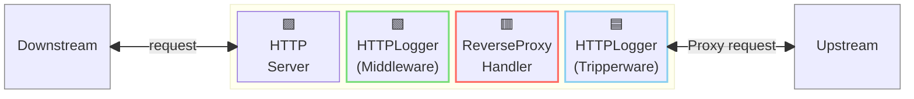
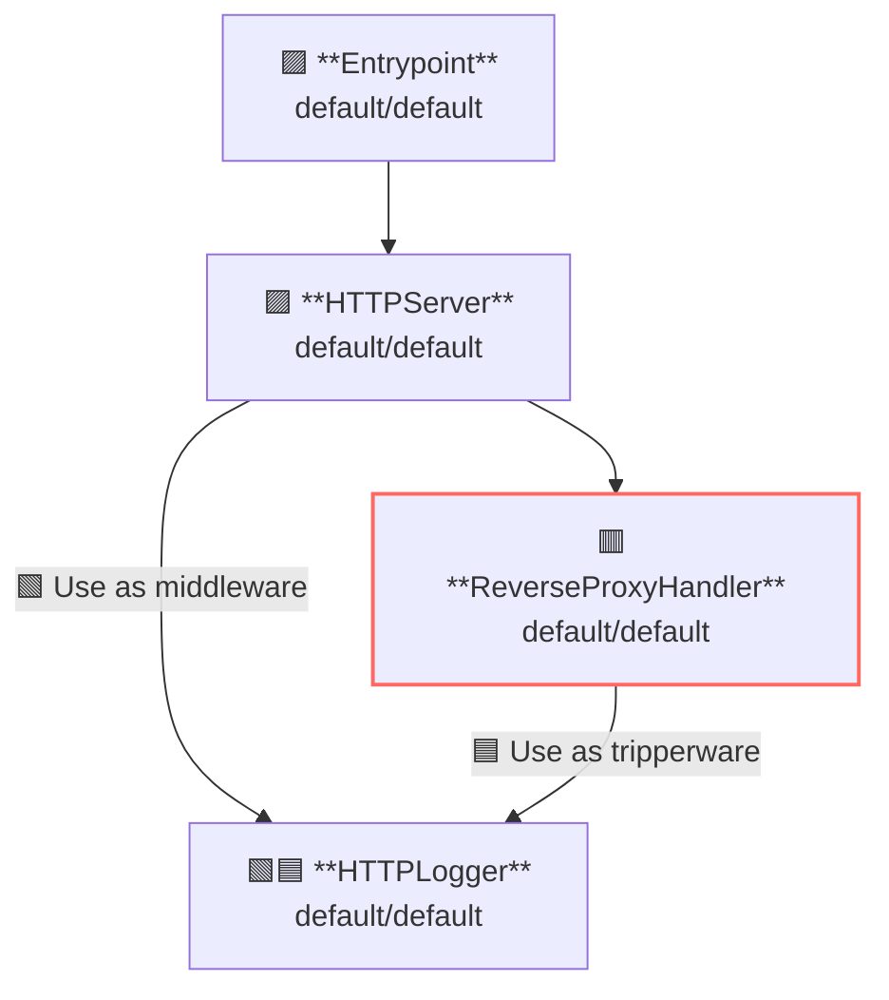

## 概要

この例ではアクセスログの記録方法を示します。  
アクセスログとは、サーバー側のリクエストおよびレスポンス、クライアント側のリクエストおよびレスポンスを記録する機能です。

AILERON Gateway では、HTTPリクエストおよびレスポンスのログ記録は `HTTPLogger` API によって行われます。  
`HTTPLogger` はサーバー側のミドルウェアとしても、クライアント側のミドルウェアとしても動作するため、サーバーおよびクライアント両方のアクセスロガーとして使用できます。

この図は、`HTTPLogger` がゲートウェイ内でミドルウェアまたはトリッパーウェアとして動作する様子を示しています。



**凡例**:

- 🟥 `#ff6961` ハンドラーリソース
- 🟩 `#77dd77` ミドルウェアリソース（サーバー側ミドルウェア）
- 🟦 `#89CFF0` トリッパーウェアリソース（クライアント側ミドルウェア）
- 🟪 `#9370DB` その他のリソース

この例では、以下のディレクトリ構成とファイルが想定されています。  
ビルド済みのバイナリが必要な場合は、[GitHub Releases](https://github.com/aileron-gateway/aileron-gateway/releases) からダウンロードしてください。

```txt
access-logging/  ----- 作業ディレクトリ
├── aileron      ----- AILERON Gateway バイナリ (Windowsではaileron.exe)
└── config.yaml  ----- AILERON Gateway configファイル
```

## Config

アクセスログ付きでサーバーを実行するための設定 YAML は次のようになります。

```yaml
# config.yaml

apiVersion: core/v1
kind: Entrypoint
spec:
  runners:
    - apiVersion: core/v1
      kind: HTTPServer

---
apiVersion: core/v1
kind: HTTPServer
spec:
  addr: ":8080"
  virtualHosts:
    - middleware:
        - apiVersion: core/v1 # Use as server-side middleware
          kind: HTTPLogger
      handlers:
        - handler:
            apiVersion: core/v1
            kind: ReverseProxyHandler

---
apiVersion: core/v1
kind: ReverseProxyHandler
spec:
  tripperwares:
    - apiVersion: core/v1 # Use as client-side middleware
      kind: HTTPLogger
  loadBalancers:
    - pathMatcher:
        match: "/"
        matchType: Prefix
      upstreams:
        - url: http://httpbin.org

---
apiVersion: core/v1
kind: HTTPLogger
spec:
  request:
    headers:
      - name: "*" # Log all request headers.
  response:
    headers:
      - name: "*" # Log all response headers.
```

この設定は次の内容を示しています：

- ポート8080で `HTTPServer` を起動します。
- `/` プレフィックスを持つパスに対して ReverseProxy を適用します。
  - アップストリームサービスは [http://httpbin.org](http://httpbin.org) です。
- `HTTPLogger` を使用して、すべてのリクエストおよびレスポンスヘッダーをログ出力します。
  - `HTTPLogger` をサーバー側ミドルウェアとして適用します。
  - `HTTPLogger` をクライアント側ミドルウェア（トリッパーウェア）として適用します。

ここでは、`HTTPLogger` をミドルウェアとトリッパーウェアの両方として使用している点に注意してください。  
ミドルウェアとトリッパーウェアで異なる設定が必要な場合は、`HTTPLogger` をそれぞれ別に定義します。

このグラフは、上記の設定におけるリソースの依存関係を示しています。



## Run

次のコマンドを実行するだけで、AILERON Gateway を起動できます。

```bash
./aileron -f ./config.yaml
```

## Check

サーバーの起動後、以下のように HTTP リクエストを送信してください。  
アクセスログはターミナル上に出力されます。

この例ではプロキシのアップストリームとして [http://httpbin.org/](http://httpbin.org/) を使用しているため、実行環境でインターネット接続が有効であることを確認してください。  
HTTP プロキシ下で作業している場合は、[ProxyFromEnvironment](https://pkg.go.dev/net/http#ProxyFromEnvironment) に記載されているように、`http_proxy` および `https_proxy` 環境変数を使用してください。

```bash
$ curl http://localhost:8080/get

{
  "args": {},
  "headers": {
    "Accept": "*/*",
    "Accept-Encoding": "gzip",
    "Forwarded": "for=\"127.0.0.1\";host=\"localhost:8080\";proto=http",
    "Host": "httpbin.org",
    "User-Agent": "curl/7.68.0",
    "X-Amzn-Trace-Id": "Root=1-669bf9d7-570ac10959cfd49c16a68f3c",
    "X-Forwarded-Host": "localhost:8080"
  },
  "origin": "127.0.0.1, 106.73.5.65",
  "url": "http://localhost:8080/get"
}
```

これらの JSON は、整形されたアクセスログの例です。

1 回のリクエストにつき、4 つの JSON エントリが出力されます。

1. サーバー側（ミドルウェア）のリクエスト  
2. サーバー側（ミドルウェア）のレスポンス  
3. クライアント側（トリッパーウェア）のリクエスト  
4. クライアント側（トリッパーウェア）のレスポンス  

これらのログは、`"id":"LbdZiWgwJJ4AAAAAAAAC"` のような一意の ID によってリクエストと関連付けられています。

```json
{
   "time":"2025-05-23 16:32:46",
   "level":"INFO",
   "msg":"server",
   "datetime":{
      "date":"2025-05-23",
      "time":"16:32:46.496",
      "zone":"Local"
   },
   "location":{
      "file":"httplogger/base.go",
      "func":"httplogger.(*baseLogger).logOutput",
      "line":175
   },
   "request":{
      "header":{
         "Accept":"*/*",
         "User-Agent":"curl/8.12.1"
      },
      "host":"localhost:8080",
      "id":"LbdZiWgwJJ4AAAAAAAAC",
      "method":"GET",
      "path":"/get",
      "proto":"HTTP/1.1",
      "query":"",
      "remote":"[::1]:45658",
      "size":0,
      "time":"2025-05-23 16:32:46.496"
   }
}

{
   "time":"2025-05-23 16:32:46",
   "level":"INFO",
   "msg":"client",
   "datetime":{
      "date":"2025-05-23",
      "time":"16:32:46.496",
      "zone":"Local"
   },
   "location":{
      "file":"httplogger/base.go",
      "func":"httplogger.(*baseLogger).logOutput",
      "line":175
   },
   "request":{
      "header":{
         "Accept":"*/*",
         "User-Agent":"curl/8.12.1",
         "X-Forwarded-For":"::1",
         "X-Forwarded-Host":"localhost:8080",
         "X-Forwarded-Port":"45658",
         "X-Forwarded-Proto":"http"
      },
      "host":"httpbin.org",
      "id":"LbdZiWgwJJ4AAAAAAAAC",
      "method":"GET",
      "path":"/get",
      "proto":"HTTP/1.1",
      "query":"",
      "remote":"[::1]:45658",
      "size":0,
      "time":"2025-05-23 16:32:46.496"
   }
}

{
   "time":"2025-05-23 16:32:46",
   "level":"INFO",
   "msg":"client",
   "datetime":{
      "date":"2025-05-23",
      "time":"16:32:46.689",
      "zone":"Local"
   },
   "location":{
      "file":"httplogger/base.go",
      "func":"httplogger.(*baseLogger).logOutput",
      "line":175
   },
   "response":{
      "duration":193022,
      "header":{
         "Access-Control-Allow-Credentials":"true",
         "Access-Control-Allow-Origin":"*",
         "Connection":"keep-alive",
         "Content-Length":"303",
         "Content-Type":"application/json",
         "Date":"Fri, 23 May 2025 07:32:47 GMT",
         "Server":"gunicorn/19.9.0"
      },
      "id":"LbdZiWgwJJ4AAAAAAAAC",
      "size":303,
      "status":200,
      "time":"2025-05-23 16:32:46.689"
   }
}

{
   "time":"2025-05-23 16:32:46",
   "level":"INFO",
   "msg":"server",
   "datetime":{
      "date":"2025-05-23",
      "time":"16:32:46.689",
      "zone":"Local"
   },
   "location":{
      "file":"httplogger/base.go",
      "func":"httplogger.(*baseLogger).logOutput",
      "line":175
   },
   "response":{
      "duration":193340,
      "header":{
         "Access-Control-Allow-Credentials":"true",
         "Access-Control-Allow-Origin":"*",
         "Content-Length":"303",
         "Content-Type":"application/json",
         "Date":"Fri, 23 May 2025 07:32:47 GMT",
         "Server":"gunicorn/19.9.0"
      },
      "id":"LbdZiWgwJJ4AAAAAAAAC",
      "size":303,
      "status":200,
      "time":"2025-05-23 16:32:46.689"
   }
}
```

## Customizing

### カスタムロガーの使用

`HTTPLogger` にはカスタムロガーを設定することができます。  
新しいロガーを定義し、以下のように `HTTPLogger` にリソース参照として設定してください。

```yaml
apiVersion: core/v1
kind: HTTPLogger
spec:
  logger:
    apiVersion: core/v1
    kind: SLogger
    name: access-logger
  request:
    headers:
      - name: "*" # Log all request headers.
  response:
    headers:
      - name: "*" # Log all response headers.

---
apiVersion: core/v1
kind: SLogger
metadata:
  name: access-logger
spec:
  level: Debug
  unstructured: false
  noLocation: true
  noDatetime: true
```
