# Access Logging Middleware/Tripperware

## Overview

This example shows how to apply access logging.

```mermaid
block-beta
  columns 8
  Downstream:1
  space:1
  block:aileron:4
    HTTPServer["🟪</br>HTTP</br>Server"]
    HTTPLoggerM["🟩</br>HTTPLogger</br>(Middleware)"]
    ReverseProxyHandler["🟥</br>ReverseProxy</br>Handler"]
    HTTPLoggerT["🟦</br>HTTPLogger</br>(Tripperware)"]
  end
  space:1
  Upstream:1

Downstream --> HTTPServer
HTTPServer --> Downstream
Upstream --> HTTPLoggerT
HTTPLoggerT --> Upstream

style Downstream stroke:#888
style Upstream stroke:#888
style ReverseProxyHandler stroke:#ff6961,stroke-width:2px
style HTTPLoggerM stroke:#77dd77,stroke-width:2px
style HTTPLoggerT stroke:#89CFF0,stroke-width:2px
```



**Legend**:

- 🟥 `#ff6961` Handler resources.
- 🟩 `#77dd77` Middleware resources (Server-side middleware).
- 🟦 `#89CFF0` Tripperware resources (Client-side middleware).
- 🟪 `#9370DB` Other resources.

In this example, following directory structure and files are supposed.

Resources are available at [examples/access-logging/]({}).
If you need a pre-built binary, download from [GitHub Releases](https://github.com/aileron-gateway/aileron-gateway/releases).

```txt
access-logging/    ----- Working directory.
├── aileron        ----- AILERON Gateway binary (aileron.exe on windows).
└── config.yaml    ----- AILERON Gateway config file.
```

## Config

Configuration yaml to run a server with access logging becomes as follows.

```yaml
# config.yaml

{}
```

The config tells:

- Start a `HTTPServer` with port 8080.
- ReverseProxy is applied for the path having prefix `/` (matches all).
- Upstream service is [http://httpbin.org](http://httpbin.org).
- Apply `HTTPLogger` as middleware for server-side.
- Apply `HTTPLogger` as tripperware for client-side.

Note that the HTTPLogger is used as both middleware and tripperware here.
Defined two HTTPLogger if different configuration is necessary for middleware and tripperware.

This graph shows the resource dependencies of the configuration.

```mermaid
graph TD
  Entrypoint["🟪 **Entrypoint**</br>default/default"]
  HTTPServer["🟪 **HTTPServer**</br>default/default"]
  ReverseProxyHandler["🟥 **ReverseProxyHandler**</br>default/default"]
  HTTPLogger["🟩🟦 **HTTPLogger**</br>default/default"]

  Entrypoint --> HTTPServer
  HTTPServer --> ReverseProxyHandler
  HTTPServer --"🟩 Use as middleware"--> HTTPLogger
  ReverseProxyHandler --"🟦 Use as tripperware"--> HTTPLogger

style ReverseProxyHandler stroke:#ff6961,stroke-width:2px
```



## Run

Just run the following command.

```bash
./aileron -f ./config.yaml
```

## Check

After running the server, send a HTTP requests like below.
Access logs will be output on the terminal.

```bash
$ curl http://localhost:8080/get

{
  "args": {},
  "headers": {
    "Accept": "*/*",
    "Accept-Encoding": "gzip",
    "Forwarded": "for=\"127.0.0.1\";host=\"localhost:8080\";proto=http",
    "Host": "httpbin.org",
    "User-Agent": "curl/7.68.0",
    "X-Amzn-Trace-Id": "Root=1-669bf9d7-570ac10959cfd49c16a68f3c",
    "X-Forwarded-Host": "localhost:8080"
  },
  "origin": "127.0.0.1, 106.73.5.65",
  "url": "http://localhost:8080/get"
}
```

These json are the example of formatted access logs.

4 json entries are output for a single request.

1. Server-side (middleware) request
2. Server-side (middleware) response
3. Client-side (tripperware) request
4. Client-side (tripperware) response

They are associated to the request with an unique id `"id":"LbdZiWgwJJ4AAAAAAAAC"`.

```json
{
   "time":"2025-05-23 16:32:46",
   "level":"INFO",
   "msg":"server",
   "datetime":{
      "date":"2025-05-23",
      "time":"16:32:46.496",
      "zone":"Local"
   },
   "location":{
      "file":"httplogger/base.go",
      "func":"httplogger.(*baseLogger).logOutput",
      "line":175
   },
   "request":{
      "header":{
         "Accept":"*/*",
         "User-Agent":"curl/8.12.1"
      },
      "host":"localhost:8080",
      "id":"LbdZiWgwJJ4AAAAAAAAC",
      "method":"GET",
      "path":"/get",
      "proto":"HTTP/1.1",
      "query":"",
      "remote":"[::1]:45658",
      "size":0,
      "time":"2025-05-23 16:32:46.496"
   }
}

{
   "time":"2025-05-23 16:32:46",
   "level":"INFO",
   "msg":"client",
   "datetime":{
      "date":"2025-05-23",
      "time":"16:32:46.496",
      "zone":"Local"
   },
   "location":{
      "file":"httplogger/base.go",
      "func":"httplogger.(*baseLogger).logOutput",
      "line":175
   },
   "request":{
      "header":{
         "Accept":"*/*",
         "User-Agent":"curl/8.12.1",
         "X-Forwarded-For":"::1",
         "X-Forwarded-Host":"localhost:8080",
         "X-Forwarded-Port":"45658",
         "X-Forwarded-Proto":"http"
      },
      "host":"httpbin.org",
      "id":"LbdZiWgwJJ4AAAAAAAAC",
      "method":"GET",
      "path":"/get",
      "proto":"HTTP/1.1",
      "query":"",
      "remote":"[::1]:45658",
      "size":0,
      "time":"2025-05-23 16:32:46.496"
   }
}

{
   "time":"2025-05-23 16:32:46",
   "level":"INFO",
   "msg":"client",
   "datetime":{
      "date":"2025-05-23",
      "time":"16:32:46.689",
      "zone":"Local"
   },
   "location":{
      "file":"httplogger/base.go",
      "func":"httplogger.(*baseLogger).logOutput",
      "line":175
   },
   "response":{
      "duration":193022,
      "header":{
         "Access-Control-Allow-Credentials":"true",
         "Access-Control-Allow-Origin":"*",
         "Connection":"keep-alive",
         "Content-Length":"303",
         "Content-Type":"application/json",
         "Date":"Fri, 23 May 2025 07:32:47 GMT",
         "Server":"gunicorn/19.9.0"
      },
      "id":"LbdZiWgwJJ4AAAAAAAAC",
      "size":303,
      "status":200,
      "time":"2025-05-23 16:32:46.689"
   }
}

{
   "time":"2025-05-23 16:32:46",
   "level":"INFO",
   "msg":"server",
   "datetime":{
      "date":"2025-05-23",
      "time":"16:32:46.689",
      "zone":"Local"
   },
   "location":{
      "file":"httplogger/base.go",
      "func":"httplogger.(*baseLogger).logOutput",
      "line":175
   },
   "response":{
      "duration":193340,
      "header":{
         "Access-Control-Allow-Credentials":"true",
         "Access-Control-Allow-Origin":"*",
         "Content-Length":"303",
         "Content-Type":"application/json",
         "Date":"Fri, 23 May 2025 07:32:47 GMT",
         "Server":"gunicorn/19.9.0"
      },
      "id":"LbdZiWgwJJ4AAAAAAAAC",
      "size":303,
      "status":200,
      "time":"2025-05-23 16:32:46.689"
   }
}
```
