# OpenID Connect: Authorization Code Flow

## Overview

This example shows how to authenticate client with authentication middleware.

```mermaid
block-beta
  columns 7
  Client:1
  space:1
  block:aileron:3
    HTTPServer["🟪</br>HTTP</br>Server"]
    AuthenticationMiddleware["🟩</br>Authentication</br>Middleware"]
    ReverseProxyHandler["🟥</br>ReverseProxy</br>Handler"]
  end
  space:1
  Upstream:1
  space:7
  space:3
  Keycloak["Authorization</br>Server</br>(Keycloak)"]

Client --> HTTPServer
HTTPServer --> Client
ReverseProxyHandler --> Upstream
Upstream --> ReverseProxyHandler
Client --> Keycloak
Keycloak --> Client
AuthenticationMiddleware --> Keycloak
Keycloak --> AuthenticationMiddleware

style Client stroke:#888
style Upstream stroke:#888
style Keycloak stroke:#888
style ReverseProxyHandler stroke:#ff6961,stroke-width:2px
style AuthenticationMiddleware stroke:#77dd77,stroke-width:2px
```



**Legend**:

- 🟥 `#ff6961` Handler resources.
- 🟩 `#77dd77` Middleware resources (Server-side middleware).
- 🟦 `#89CFF0` Tripperware resources (Client-side middleware).
- 🟪 `#9370DB` Other resources.

In this example, following directory structure and files are supposed.

Example resources are available at [examples/authn-authorization-code/]({}).
If you need a pre-built binary, download from [GitHub Releases](https://github.com/aileron-gateway/aileron-gateway/releases).

```txt
authn-authorization-code/  ----- Working directory.
├── aileron                ----- AILERON Gateway binary (aileron.exe on windows).
├── config.yaml            ----- AILERON Gateway config file.
├── docker-compose.yaml    ----- docker-compose file to start [keycloak](https://hub.docker.com/r/keycloak/keycloak).
└── keycloak/*             ----- Resources for keycloak.
```

## Config

Configuration yaml to run a server with authentication middleware.

```yaml
# config.yaml

{}
```

The config tells:

- Start a `HTTPServer` with port 8080.
  - Server must be accessed by `http://localhost:8080` because the keycloak is configured to use it.
- ReverseProxy is applied for the path having prefix `/` (matches all).
  - Proxy upstream service is [http://httpbin.org](http://httpbin.org).
  - [http://httpbin.org/anything](http://httpbin.org/anything) is used as login success path.
- Apply `AuthenticationMiddleware`.
  - Use `OAuthAuthenticationHandler` with authorization code flow.

This graph shows the resource dependencies of the configuration.

```mermaid
graph TD
  Entrypoint["🟪 **Entrypoint**</br>default/default"]
  HTTPServer["🟪 **HTTPServer**</br>default/default"]
  ReverseProxyHandler["🟥 **ReverseProxyHandler**</br>default/default"]
  AuthenticationMiddleware["🟩 **Authentication</br>Middleware**</br>default/default"]
  OAuthAuthenticationHandler["🟪 **OAuth</br>AuthenticationHandler**</br>default/default"]

  Entrypoint --"Runner"--> HTTPServer
  HTTPServer --"HTTP Handler"--> ReverseProxyHandler
  HTTPServer --"Middleware"--> AuthenticationMiddleware
  AuthenticationMiddleware --"AuthN Handler"--> OAuthAuthenticationHandler

style ReverseProxyHandler stroke:#ff6961,stroke-width:2px
style AuthenticationMiddleware stroke:#77dd77,stroke-width:2px
style OAuthAuthenticationHandler stroke:#9370DB,stroke-width:2px
```



## Run

First, start keycloak using [docker compose](https://docs.docker.com/compose/).

```bash
# The command uses docker-compose.yaml by default.
docker compose up
```

Once the keycloak successfully started, a message that tells the server is listening on `localhost:8080` will be shown up.

```text
keycloak  | 2025-05-31 15:54:25,508 INFO  [io.quarkus] (main) Keycloak 26.2.4 on JVM (powered by Quarkus 3.20.0) started in 6.817s. Listening on: http://0.0.0.0:8080
```

Keycloak admin console should be accessible at [http://localhost:18080/admin](http://localhost:18080/admin).
Admin console can be logged in with `ID: admin` and `Password: password`.
See [keycloak/README.md]({}) for more detail about the keycloak.

{}

Next, start the AILERON Gateway.

```bash
./aileron -f ./config.yaml
```

## Check

Access to the AILERON Gateway with some path such as [http://localhost:8080/example](http://localhost:8080/example) from a browser.

Make sure the internet access is available because this examples uses [http://httpbin.org/](http://httpbin.org/) as proxy upstream.
Browser will be redirected to the upstream server after login succeeded.
Use `http_proxy` and `https_proxy` environmental variable as described in [ProxyFromEnvironment](https://pkg.go.dev/net/http#ProxyFromEnvironment) if you are working behind a http proxy.

It will shows

{}

Then, sing in with one of the pre-configured users.

| Username | Password | Email |
| - | - | - |
| test1 | password1 | <test1@example.com> |
| test2 | password2 | <test2@example.com> |

Page will be redirected to the path `/anything` if authentication succeeded.

{}
