# Casbin Authorization Middleware

## Overview

This example apply authorization using [Casbin](https://casbin.org/).

```mermaid
block-beta
  columns 5
  Downstream:1
  space:1
  block:aileron:3
    HTTPServer["🟪</br>HTTP</br>Server"]
    CasbinAuthzMiddleware["🟩</br>CasbinAuthz</br>Middleware"]
    EchoHandler["🟥</br>Echo</br>Handler"]
  end

Downstream --> HTTPServer
HTTPServer --> Downstream

style Downstream stroke:#888
style EchoHandler stroke:#ff6961,stroke-width:2px
style CasbinAuthzMiddleware stroke:#77dd77,stroke-width:2px
```



**Legend**:

- 🟥 `#ff6961` Handler resources.
- 🟩 `#77dd77` Middleware resources (Server-side middleware).
- 🟦 `#89CFF0` Tripperware resources (Client-side middleware).
- 🟪 `#9370DB` Other resources.

In this example, following directory structure and files are supposed.

Resources are available at [examples/authz-casbin/](https://github.com/aileron-gateway/aileron-gateway/tree/main/examples/authz-casbin).
If you need a pre-built binary, download from [GitHub Releases](https://github.com/aileron-gateway/aileron-gateway/releases).

```txt
access-casbin/     ----- Working directory.
├── aileron        ----- AILERON Gateway binary (aileron.exe on windows).
├── config.yaml    ----- AILERON Gateway config file.
└── Taskfile.yaml  ----- (Optional) Config file for the go-task.
```

## Config

Configuration yaml to run a server with casbin authorization middleware becomes as follows.

```yaml
# config.yaml

apiVersion: core/v1
kind: Entrypoint
spec:
  runners:
    - apiVersion: core/v1
      kind: HTTPServer

---
apiVersion: core/v1
kind: HTTPServer
spec:
  addr: ":8080"
  virtualHosts:
    - middleware:
        - apiVersion: app/v1
          kind: CasbinAuthzMiddleware
      handlers:
        - handler:
            apiVersion: app/v1
            kind: EchoHandler

---
apiVersion: app/v1
kind: EchoHandler

---
apiVersion: app/v1
kind: CasbinAuthzMiddleware
spec:
  enforcers:
    - modelPath: ./model/abac_model.conf
      policyPath: ./model/abac_policy.csv
  explain: true
```

The config tells:

- Start a `HTTPServer` with port 8080.
- A echo handler is applied.
- Requests are authorized with CasbinAuthzMiddleware.

This graph shows the resource dependencies of the configuration.

```mermaid
graph TD
  Entrypoint["🟪 **Entrypoint**</br>default/default"]
  HTTPServer["🟪 **HTTPServer**</br>default/default"]
  EchoHandler["🟥 **EchoHandler**</br>default/default"]
  CasbinAuthzMiddleware["🟩 **CasbinAuthzMiddleware**</br>default/default"]

Entrypoint --> HTTPServer
HTTPServer --> EchoHandler
HTTPServer --> CasbinAuthzMiddleware

style EchoHandler stroke:#ff6961,stroke-width:2px
style CasbinAuthzMiddleware stroke:#77dd77,stroke-width:2px
```



## Run

### (Option 1) Directory run the binary

```bash
./aileron -f ./config.yaml
```

### (Option 2) Use taskfile

`Taskfile.yaml` is available to run the example.
Install [go-task](https://taskfile.dev/) and run the following command.

```bash
task
```

or with arbitrary binary path.

```bash
task AILERON_CMD="./path/to/aileron/binary"
```

## Check

After running a server, send HTTP requests.

`GET` requests for `/foo` are allowed.
Other paths are forbidden.

```bash
$ curl -XGET http://localhost:8080/foo

---------- Request ----------

~~~ output omitted ~~~

--------------------------
```

```bash
$ curl -XGET http://localhost:8080/bar

{"status":403,"statusText":"Forbidden"}
```

`POST` requests for `/bar/*` are allowed.

```bash
curl -XPOST http://localhost:8080/bar

---------- Request ----------

~~~ output omitted ~~~

--------------------------
```

Post for other paths are forbidden.

```bash
$ curl -XPOST http://localhost:8080/baz

{"status":403,"statusText":"Forbidden"}
```
