# OPA Authorization Middleware

## Overview

This example shows authorization using [OPA: Open Policy Agent](https://www.openpolicyagent.org/).
WIth the AILERON Gateway, authorization using OPA can be applied without authentication.

Note that this example does not use http proxy but uses the built-in `EchoHandler` instead.

```mermaid
block-beta
  columns 5
  Downstream:1
  space:1
  block:aileron:3
    HTTPServer["🟪</br>HTTP</br>Server"]
    OPAAuthzMiddleware["🟩</br>OPAAuthz</br>Middleware"]
    EchoHandler["🟥</br>Echo</br>Handler"]
  end

Downstream --> HTTPServer
HTTPServer --> Downstream

style Downstream stroke:#888
style EchoHandler stroke:#ff6961,stroke-width:2px
style OPAAuthzMiddleware stroke:#77dd77,stroke-width:2px
```



**Legend**:

- 🟥 `#ff6961` Handler resources.
- 🟩 `#77dd77` Middleware resources (Server-side middleware).
- 🟦 `#89CFF0` Tripperware resources (Client-side middleware).
- 🟪 `#9370DB` Other resources.

In this example, following directory structure and files are supposed.
If you need a pre-built binary, download from [GitHub Releases](https://github.com/aileron-gateway/aileron-gateway/releases).

```txt
access-logging/  ----- Working directory.
├── aileron      ----- AILERON Gateway binary (aileron.exe on windows).
└── config.yaml  ----- AILERON Gateway config file.
```

## Config

Configuration yaml to run a server with access logging becomes as follows.

```yaml
# config.yaml

apiVersion: core/v1
kind: Entrypoint
spec:
  runners:
    - apiVersion: core/v1
      kind: HTTPServer

---
apiVersion: core/v1
kind: HTTPServer
spec:
  addr: ":8080"
  virtualHosts:
    - middleware:
        - apiVersion: app/v1
          kind: OPAAuthzMiddleware
      handlers:
        - handler:
            apiVersion: app/v1
            kind: EchoHandler

---
apiVersion: app/v1
kind: EchoHandler

---
apiVersion: app/v1
kind: OPAAuthzMiddleware
spec:
  regos:
    - queryParameter: "data.example.authz.allow"
      policyFiles:
        - ./policy.rego
```

The config tells:

- Start a `HTTPServer` with port 8080.
- A echo handler is applied.
- Requests are authorized with OPAAuthzMiddleware.
  - policy.rego is used.

In the policy.rego, POST requests with a header `Foo: bar` is allowed.
Otherwise, forbidden.

```opa
# policy.rego

package example.authz

import future.keywords.if

default allow := false

allow if {
    input.header["Foo"][0] == "bar"
    input.method == "POST"
}
```

This graph shows the resource dependencies of the configuration.

```mermaid
graph TD
  Entrypoint["🟪 **Entrypoint**</br>default/default"]
  HTTPServer["🟪 **HTTPServer**</br>default/default"]
  EchoHandler["🟥 **EchoHandler**</br>default/default"]
  OPAAuthzMiddleware["🟩 **OPAAuthzMiddleware**</br>default/default"]

Entrypoint --"Runner"--> HTTPServer
HTTPServer --"HTTP Handler"--> EchoHandler
HTTPServer --"Middleware"--> OPAAuthzMiddleware

style EchoHandler stroke:#ff6961,stroke-width:2px
style OPAAuthzMiddleware stroke:#77dd77,stroke-width:2px
```



## Run

Run the AILEROn Gateway with the command.

You don't need to run a OPA server because the AILERON Gateway contains OPA in itself.

```bash
./aileron -f ./config.yaml
```

## Check

After running a server, send HTTP requests.

`POST` requests with a header `Foo: bar` are allowed.

```bash
$ curl -XPOST -H "Foo: bar" http://localhost:8080

---------- Request ----------
Proto   : HTTP/1.1
Host   : localhost:8080
Method : POST

~~~ output omitted ~~~

--------------------------
```

`GET` requests are forbidden.

```bash
$ curl -XGET -H "Foo: bar" http://localhost:8080

{"status":403,"statusText":"Forbidden"}
```

Requests without a header `Foo: bar` are forbidden.

```bash
$ curl -XPOST -H "Foo: baz" http://localhost:8080

{"status":403,"statusText":"Forbidden"}
```
