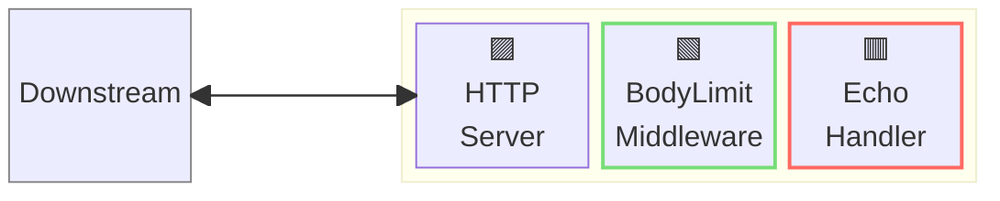
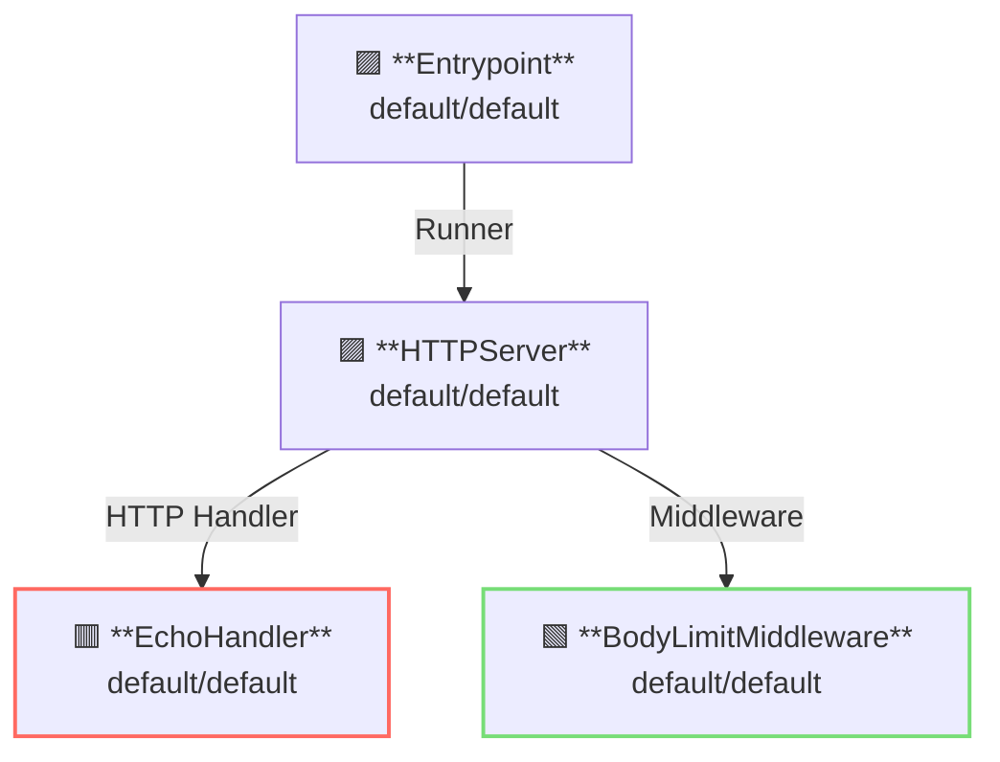

# Body Limit Middleware

## 概要

この例では、リクエストボディのサイズ制限を示します。



**凡例**:

- 🟥 `#ff6961` ハンドラーリソース
- 🟩 `#77dd77` ミドルウェアリソース（サーバーサイドミドルウェア）
- 🟦 `#89CFF0` トリッパーウェアリソース（クライアントサイドミドルウェア）
- 🟪 `#9370DB` その他のリソース

この例では、以下のディレクトリ構成とファイルを想定しています。  
事前ビルド済みバイナリが必要な場合は、[GitHub Releases](https://github.com/aileron-gateway/aileron-gateway/releases)からダウンロードしてください。

```txt
bodylimit/       ----- Working directory.
├── aileron      ----- AILERON Gateway binary (aileron.exe on windows).
└── config.yaml  ----- AILERON Gateway config file.
```

## Config

ボディサイズ制限を有効にしたサーバーを起動するための設定yamlは以下のようになります。

```yaml
# config.yaml

apiVersion: core/v1
kind: Entrypoint
spec:
  runners:
    - apiVersion: core/v1
      kind: HTTPServer

---
apiVersion: core/v1
kind: HTTPServer
spec:
  addr: ":8080"
  virtualHosts:
    - middleware:
        - apiVersion: app/v1
          kind: BodyLimitMiddleware
      handlers:
        - handler:
            apiVersion: app/v1
            kind: EchoHandler

---
apiVersion: app/v1
kind: EchoHandler

---
apiVersion: app/v1
kind: BodyLimitMiddleware
spec:
  maxSize: 10 # bytes
  memLimit: 5 # bytes
  tempPath: "./"
```

この設定は以下を示しています：

- ポート8080で `HTTPServer` を起動する。
- Echoハンドラーが適用される。
- BodyLimitMiddlewareでリクエストボディのサイズを制限する。

この図は設定のリソース依存関係を示しています。



## Run

AILERON Gatewayを以下のコマンドで起動します：

```bash
./aileron -f ./config.yaml
```

## Check

まず、`memLimit (5バイト)` 以下のサイズのボディを持つHTTPリクエストを送信します。  
ボディサイズがmemLimit以下のため、実際のボディサイズはメモリ上で読み取りながらチェックされます。

```bash
$ curl http://localhost:8080 -d "12345"

~~~ omit output ~~~

---------- Body ----------
12345
--------------------------
```

次に、`memLimit < サイズ <= maxSize (10バイト)` のボディを持つHTTPリクエストを送信します。  
ボディサイズがmemLimitを超えるため、実際のボディサイズはファイル上で読み取りながらチェックされます（一次ファイルがtempPathに出力されます）。

```bash
$ curl http://localhost:8080 -d "1234567890"

~~~ omit output ~~~

---------- Body ----------
1234567890
--------------------------
```

最後に、`maxSize (10バイト) < サイズ` のボディを持つHTTPリクエストを送信します。  
実際のボディサイズがmaxSizeを超えているため、リクエストは許可されません。

```bash
$ curl http://localhost:8080 -d "12345678901"

{"status":413,"statusText":"Request Entity Too Large"}
```
