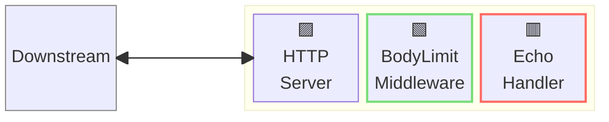
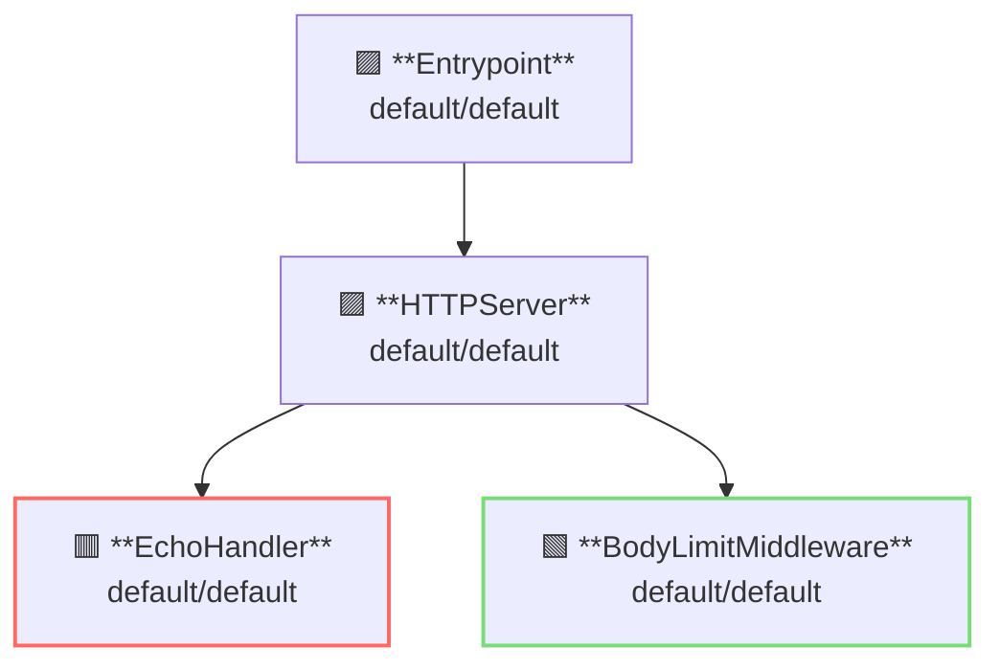

# Body Limit Middleware

## Overview

This example shows request body size limiting.



**Legend**:

- 🟥 `#ff6961` Handler resources.
- 🟩 `#77dd77` Middleware resources (Server-side middleware).
- 🟦 `#89CFF0` Tripperware resources (Client-side middleware).
- 🟪 `#9370DB` Other resources.

In this example, following directory structure and files are supposed.

Resources are available at [examples/bodylimit/](https://github.com/aileron-gateway/aileron-gateway/tree/main/examples/bodylimit).
If you need a pre-built binary, download from [GitHub Releases](https://github.com/aileron-gateway/aileron-gateway/releases).

```txt
access-logging/    ----- Working directory.
├── aileron        ----- AILERON Gateway binary (aileron.exe on windows).
├── config.yaml    ----- AILERON Gateway config file.
└── Taskfile.yaml  ----- (Optional) Config file for the go-task.
```

## Config

Configuration yaml to run a server with access logging becomes as follows.

```yaml
# config.yaml

{}
```

The config tells:

- Start a `HTTPServer` with port 8080.
- A echo handler is applied.
- Limit requests body size with BodyLimitMiddleware.

This graph shows the resource dependencies of the configuration.



## Run

### (Option 1) Directory run the binary

```bash
./aileron -f ./config.yaml
```

### (Option 2) Use taskfile

`Taskfile.yaml` is available to run the example.
Install [go-task](https://taskfile.dev/) and run the following command.

```bash
task
```

or with arbitrary binary path.

```bash
task AILERON_CMD="./path/to/aileron/binary"
```

## Check

First, send HTTP requests with body `size <= memLimit (5 bytes)`.
Actual body size will be checked by reading the body on the memory because the body size is less than memLimit.

```bash
$ curl http://localhost:8080 -d "12345"

~~~ omit output ~~~

---------- Body ----------
12345
--------------------------
```

Next, send HTTP requests with body `memLimit < size <= maxSize (10 bytes)`.
Actual body size will be checked by reading the body on a file (temporal file will be output to the tempPath).

```bash
$ curl http://localhost:8080 -d "1234567890"

~~~ omit output ~~~

---------- Body ----------
1234567890
--------------------------
```

Lastrly, send HTTP requests with body `maxSize (10 bytes) < size`.
Because the actual body size exceeds the maxSize, requests should not be allowed.

```bash
$ curl http://localhost:8080 -d "12345678901"

{"status":413,"statusText":"Request Entity Too Large"}
```
