# Body Limit Middleware

## Overview

This example shows request body size limiting.

```mermaid
block-beta
  columns 5
  Downstream:1
  space:1
  block:aileron:3
    HTTPServer["🟪</br>HTTP</br>Server"]
    BodyLimitMiddleware["🟩</br>BodyLimit</br>Middleware"]
    EchoHandler["🟥</br>Echo</br>Handler"]
  end

Downstream --> HTTPServer
HTTPServer --> Downstream

style Downstream stroke:#888
style EchoHandler stroke:#ff6961,stroke-width:2px
style BodyLimitMiddleware stroke:#77dd77,stroke-width:2px
```



**Legend**:

- 🟥 `#ff6961` Handler resources.
- 🟩 `#77dd77` Middleware resources (Server-side middleware).
- 🟦 `#89CFF0` Tripperware resources (Client-side middleware).
- 🟪 `#9370DB` Other resources.

In this example, following directory structure and files are supposed.
If you need a pre-built binary, download from [GitHub Releases](https://github.com/aileron-gateway/aileron-gateway/releases).

```txt
access-logging/  ----- Working directory.
├── aileron      ----- AILERON Gateway binary (aileron.exe on windows).
└── config.yaml  ----- AILERON Gateway config file.
```

## Config

Configuration yaml to run a server with access logging becomes as follows.

```yaml
# config.yaml

apiVersion: core/v1
kind: Entrypoint
spec:
  runners:
    - apiVersion: core/v1
      kind: HTTPServer

---
apiVersion: core/v1
kind: HTTPServer
spec:
  addr: ":8080"
  virtualHosts:
    - middleware:
        - apiVersion: app/v1
          kind: BodyLimitMiddleware
      handlers:
        - handler:
            apiVersion: app/v1
            kind: EchoHandler

---
apiVersion: app/v1
kind: EchoHandler

---
apiVersion: app/v1
kind: BodyLimitMiddleware
spec:
  maxSize: 10 # bytes
  memLimit: 5 # bytes
  tempPath: "./"
```

The config tells:

- Start a `HTTPServer` with port 8080.
- A echo handler is applied.
- Limit requests body size with BodyLimitMiddleware.

This graph shows the resource dependencies of the configuration.

```mermaid
graph TD
  Entrypoint["🟪 **Entrypoint**</br>default/default"]
  HTTPServer["🟪 **HTTPServer**</br>default/default"]
  EchoHandler["🟥 **EchoHandler**</br>default/default"]
  BodyLimitMiddleware["🟩 **BodyLimitMiddleware**</br>default/default"]

Entrypoint --"Runner"--> HTTPServer
HTTPServer --"HTTP Handler"--> EchoHandler
HTTPServer --"Middleware"--> BodyLimitMiddleware

style EchoHandler stroke:#ff6961,stroke-width:2px
style BodyLimitMiddleware stroke:#77dd77,stroke-width:2px
```



## Run

Run the AILEROn Gateway with the command:

```bash
./aileron -f ./config.yaml
```

## Check

First, send HTTP requests with body `size <= memLimit (5 bytes)`.
Actual body size will be checked by reading the body on the memory because the body size is less than memLimit.

```bash
$ curl http://localhost:8080 -d "12345"

~~~ omit output ~~~

---------- Body ----------
12345
--------------------------
```

Next, send HTTP requests with body `memLimit < size <= maxSize (10 bytes)`.
Actual body size will be checked by reading the body on a file (temporal file will be output to the tempPath).

```bash
$ curl http://localhost:8080 -d "1234567890"

~~~ omit output ~~~

---------- Body ----------
1234567890
--------------------------
```

Lastly, send HTTP requests with body `maxSize (10 bytes) < size`.
Because the actual body size exceeds the maxSize, requests should not be allowed.

```bash
$ curl http://localhost:8080 -d "12345678901"

{"status":413,"statusText":"Request Entity Too Large"}
```
