# Compression Middleware

## Overview

This example shows response compression.

```mermaid
block-beta
  columns 7
  Downstream:1
  space:1
  block:aileron:3
    HTTPServer["🟪</br>HTTP</br>Server"]
    CompressionMiddleware["🟩</br>Compression</br>Middleware"]
    ReverseProxyHandler["🟥</br>ReverseProxy</br>Handler"]
  end
  space:1
  Upstream:1

Downstream --> HTTPServer
HTTPServer --> Downstream
Upstream --> ReverseProxyHandler
ReverseProxyHandler --> Upstream

style Downstream stroke:#888
style Upstream stroke:#888
style ReverseProxyHandler stroke:#ff6961,stroke-width:2px
style CompressionMiddleware stroke:#77dd77,stroke-width:2px
```



**Legend**:

- 🟥 `#ff6961` Handler resources.
- 🟩 `#77dd77` Middleware resources (Server-side middleware).
- 🟦 `#89CFF0` Tripperware resources (Client-side middleware).
- 🟪 `#9370DB` Other resources.

In this example, following directory structure and files are supposed.
If you need a pre-built binary, download from [GitHub Releases](https://github.com/aileron-gateway/aileron-gateway/releases).

```txt
compression/     ----- Working directory.
├── aileron      ----- AILERON Gateway binary (aileron.exe on windows).
└── config.yaml  ----- AILERON Gateway config file.
```

## Config

Configuration yaml to run a server with access logging becomes as follows.

```yaml
# config.yaml

apiVersion: core/v1
kind: Entrypoint
spec:
  runners:
    - apiVersion: core/v1
      kind: HTTPServer

---
apiVersion: core/v1
kind: HTTPServer
spec:
  addr: ":8080"
  virtualHosts:
    - middleware:
        - apiVersion: app/v1
          kind: CompressionMiddleware
      handlers:
        - handler:
            apiVersion: core/v1
            kind: ReverseProxyHandler

---
apiVersion: core/v1
kind: ReverseProxyHandler
spec:
  loadBalancers:
    - pathMatcher:
        match: "/"
        matchType: Prefix
      upstreams:
        - url: http://httpbin.org

---
apiVersion: app/v1
kind: CompressionMiddleware
spec:
  minimumSize: 10 # bytes
```

The config tells:

- Start a `HTTPServer` with port 8080.
- A ReverseProxy handler is applied.
- Response compression is applied with CompressionMiddleware.
  - Minimum compression size is 10 bytes.

This graph shows the resource dependencies of the configuration.

```mermaid
graph TD
  Entrypoint["🟪 **Entrypoint**</br>default/default"]
  HTTPServer["🟪 **HTTPServer**</br>default/default"]
  ReverseProxyHandler["🟥 **ReverseProxyHandler**</br>default/default"]
  CompressionMiddleware["🟩 **CompressionMiddleware**</br>default/default"]

Entrypoint --> HTTPServer
HTTPServer --> ReverseProxyHandler
HTTPServer --> CompressionMiddleware

style ReverseProxyHandler stroke:#ff6961,stroke-width:2px
style CompressionMiddleware stroke:#77dd77,stroke-width:2px
```



## Run

Run the command to start AILERON Gateway.

```bash
./aileron -f ./config.yaml
```

## Check

Send HTTP requests with `Accept-Encoding` header.
**gzip** and **br** are allowed.

If response body size is known and the size is larger than the minimumSize, response body will be returned in compressed.

```bash
$ curl -H "Accept-Encoding: gzip" http://localhost:8080/get --compressed -v

> GET /get HTTP/1.1
> Host: localhost:8080
> User-Agent: curl/8.12.1
> Accept: */*
> Accept-Encoding: gzip

< HTTP/1.1 200 OK
< Access-Control-Allow-Credentials: true
< Access-Control-Allow-Origin: *
< Content-Encoding: gzip
< Content-Type: application/json
< Date: Fri, 23 May 2025 08:54:21 GMT
< Server: gunicorn/19.9.0
< Vary: Accept-Encoding
< Content-Length: 243

{
  "args": {},
  "headers": {
    "Accept": "*/*",
    "Accept-Encoding": "gzip",
    "Host": "httpbin.org",
    "User-Agent": "curl/8.12.1",
    "X-Amzn-Trace-Id": "Root=1-683037bd-00743c0b507b2b1b1d6ba521",
    "X-Forwarded-Host": "localhost:8080"
  },
  "origin": "::1, 106.73.5.65",
  "url": "http://localhost:8080/get"
}
```
