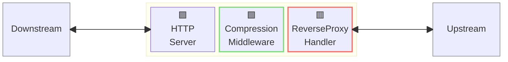
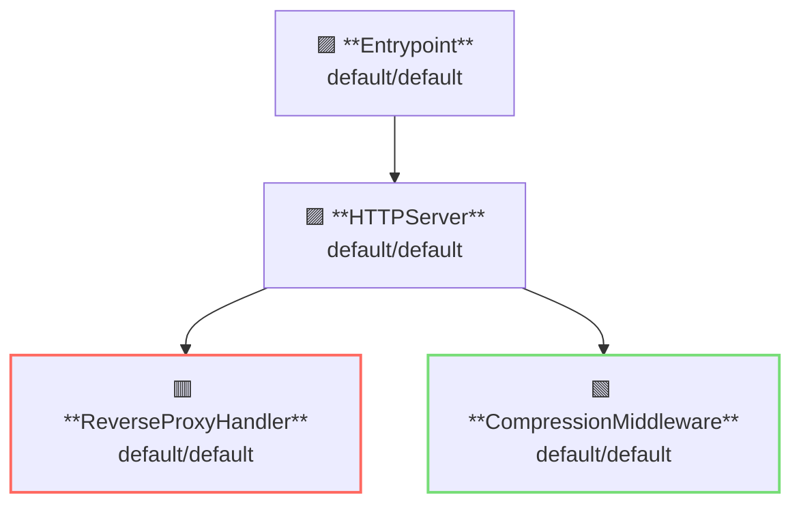

# Compression Middleware

## 概要

この例ではレスポンス圧縮を行う例を示します。



**凡例**:

- 🟥 `#ff6961` ハンドラーリソース
- 🟩 `#77dd77` ミドルウェアリソース（サーバーサイドミドルウェア）
- 🟦 `#89CFF0` トリッパーウェアリソース（クライアントサイドミドルウェア）
- 🟪 `#9370DB` その他のリソース

この例では、以下のディレクトリ構成とファイルを想定しています。  
事前ビルド済みバイナリが必要な場合は、[GitHub Releases](https://github.com/aileron-gateway/aileron-gateway/releases)からダウンロードしてください。

```txt
compression/     ----- 作業ディレクトリ
├── aileron      ----- AILERON Gateway バイナリ（Windowsでは aileron.exe）
└── config.yaml  ----- AILERON Gateway 設定ファイル
```

## Config

アクセスログを有効にしたサーバーを実行するための設定ファイルは以下のようになります。

```yaml
# config.yaml

apiVersion: core/v1
kind: Entrypoint
spec:
  runners:
    - apiVersion: core/v1
      kind: HTTPServer

---
apiVersion: core/v1
kind: HTTPServer
spec:
  addr: ":8080"
  virtualHosts:
    - middleware:
        - apiVersion: app/v1
          kind: CompressionMiddleware
      handlers:
        - handler:
            apiVersion: core/v1
            kind: ReverseProxyHandler

---
apiVersion: core/v1
kind: ReverseProxyHandler
spec:
  loadBalancers:
    - pathMatcher:
        match: "/"
        matchType: Prefix
      upstreams:
        - url: http://httpbin.org

---
apiVersion: app/v1
kind: CompressionMiddleware
spec:
  minimumSize: 10 # bytes
```

この設定は以下を示しています：

- ポート8080で`HTTPServer`を起動
- ReverseProxyハンドラーを適用
- CompressionMiddlewareによるレスポンス圧縮を適用
  - 圧縮の最小サイズは10バイト

この図は設定のリソース依存関係を示しています。



## Run

AILERON Gatewayを起動するコマンドは以下の通りです。

```bash
./aileron -f ./config.yaml
```

## Check

`Accept-Encoding` ヘッダーを付けて HTTP リクエストを送信してください。  
**gzip** と **br** が許可されています。

レスポンスボディのサイズが分かっていて、かつ最小サイズ（minimumSize）より大きい場合は、  
レスポンスボディが圧縮された状態で返されます。

```bash
$ curl -H "Accept-Encoding: gzip" http://localhost:8080/get --compressed -v

> GET /get HTTP/1.1
> Host: localhost:8080
> User-Agent: curl/8.12.1
> Accept: */*
> Accept-Encoding: gzip

< HTTP/1.1 200 OK
< Access-Control-Allow-Credentials: true
< Access-Control-Allow-Origin: *
< Content-Encoding: gzip
< Content-Type: application/json
< Date: Fri, 23 May 2025 08:54:21 GMT
< Server: gunicorn/19.9.0
< Vary: Accept-Encoding
< Content-Length: 243

{
  "args": {},
  "headers": {
    "Accept": "*/*",
    "Accept-Encoding": "gzip",
    "Host": "httpbin.org",
    "User-Agent": "curl/8.12.1",
    "X-Amzn-Trace-Id": "Root=1-683037bd-00743c0b507b2b1b1d6ba521",
    "X-Forwarded-Host": "localhost:8080"
  },
  "origin": "::1, 106.73.5.65",
  "url": "http://localhost:8080/get"
}
```
